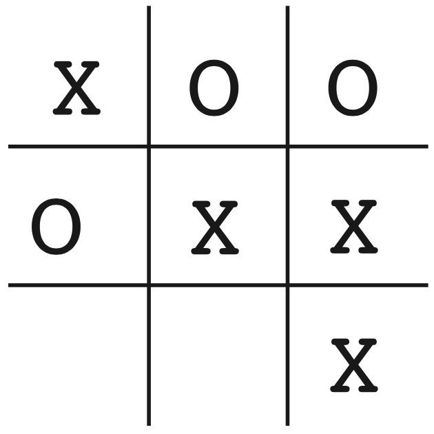
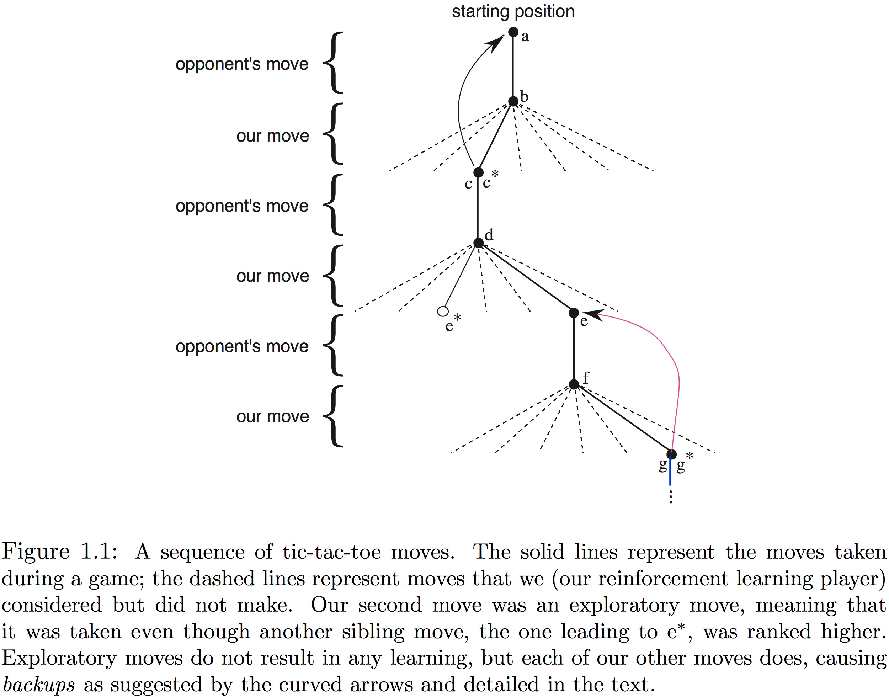

当提到学习的本质时，从与环境的互动中（感觉就是马哲中的**实践**）学习，是几乎所有学习和智能的基本思想。本书探讨从交互中学习的计算方法，探究理想化的学习状态以及评估多种学习方法的影响，也就是强化学习的方法。

##### 1.1 强化学习

强化学习（reinforcement learning，以下简称**RL**）是一个问题，也是一类解决此类问题的方法，以及研究这类问题、寻找此类问题解决方法的领域。它有三个最显著的特征：

1. RL本质上这是闭环问题，因为学习系统的行为会影响后续的输入；
2. 没有直接的指导来采取何种行为，学习代理必须通过遍试所有行为来找到产生最大激励的行为；
3. 行为可能不仅影响即时激励(reward)，也影响所有后来的奖励。

强化学习的代理（agent，这里都译为代理）必须能在某种程度上感知环境的状态，能够采取行为来改变环境，以及有一个与环境状态相关的目标。任何适于解决此类问题的方法都可以认为是强化学习方法。它与监督学习和非监督学习都不相同，是机器学习中的第三种范式。

探索与开发的权衡是强化学习中特有的难题。要获得很多的激励，学习代理就必须偏向选择已经试过并且能很好地产生激励的行为；但发现这样的行为又必须尝试还未选择的行为。即代理必须发掘(exploit)已知的来获得激励，也必须探索可能更好的行为。

强化学习的另一个关键特征是它明确地考虑整个的目标导向代理与未知环境互动的问题。以一个完整的、交互的、搜寻目标的代理开始，代理能感知环境，能选择行为影响环境，并且从开始就假定代理必须处理关于环境很大的不确定性。学习研究要获得进展，就必须隔离并研究重要的子问题，但必须是在代理中发挥清晰作用的子问题。

在这里代理并不总指机体组织或机器人这类事物，也可以是行为系统的组件。在这种情况下，代理直接与系统的其余部分互动，并与系统的环境间接互动。现代强化学习最令人激动的一面是与其它工程和科学学科的实质而多产的结合，也是人工智能回归简单通用原则大趋势的一部分。

##### 1.2 强化学习问题示例

强化学习问题的例子很多，比如：

- 象棋大师做出一次移动；
- 调制控制器实时调整石油精炼厂操作的参数。
- 幼犊在出生后几分钟内挣扎着站立。
- 移动机器人决定是进入新房间搜寻更多垃圾或者返回到充电站。

##### 1.3 RL中的元素

除了代理和环境，可以确定强化学习系统的有四个主要子元素：策略、激励信号、价值函数以及可选的环境模型。

**策略**：简单地说就是从感知到的环境状态到此状态下选择的行为的映射，它

- 定义了学习代理在给定时间的行为方式；
- 可以是简单的函数或查询表，也可以是海量计算的比如搜寻这样的过程。
- 是RL代理的**核心**，因其单独便足以决定行为；
- 通常情况下，策略是随机的。

**激励信号**：在每个时间步，**环境**给学习代理发送的数字，它

- 定义了强化学习问题中的目标；
- 代理唯一的目标就是最大化长期接收的总激励；
- 定义了对代理而言什么是好、什么是坏的事件；
- 是代理面临问题的即时和决定性的特征，是环境状态即时、本质的期望；
- 代理无法改变产生激励信号的函数，也就是说不能改变其面临的问题；
- 是改变策略的首要基础；
- 通常而言是环境状态和采取行为的随机函数。

**价值函数**：状态的价值是从这个状态开始到未来，代理能期待获得的累计的总激励。

- 指明了从长期来看什么是好的；
- 表明在考虑到其后可能的状态以及那些状态能够得到的激励后，状态的长期期望；

激励在某种意义上是第一位的，而价值，作为激励的预测，是第二位的。然而，在作出和评估决策时最关心的是价值。行为选择是基于价值判断作出的。我们寻求带来最大价值状态的行为。然而判定价值远远难于判定激励，必须由代理从穷其一生观察到的序列中反复地估计。实际上，几乎所有的强化学习算法必须考虑的最重要部分就是有效评估价值的方法。

**环境模型**：是模拟环境行为的事物。

- 允许对环境如何行为的推理，比如给定状态和行为，模型能预测接下来的状态和激励；
- 模型用于规划，即在真正经历前通过考虑未来可能的状态形势决定一些列行为；
- 使用模型和规划的方法称为基于模型的方法，与之相对的是明确使用尝试-犯错的无模型方法；

现代强化学习关注的范围从低层次、尝试-犯错学习到高层次、慎重规划。

##### 1.4 局限与视野

这里所考虑的大多数方法都是围绕**评估价值函数**所构造的，不过也有其它方法解决此类问题，比如遗传算法、遗传规划、模拟退火等，都没有使用到价值函数。这些方法被称为进化方法，它们评估许多非学习代理的一生的行为，每个代理都使用不同的策略来与环境互动，然后选择那些获得最多激励的代理。如果策略空间足够小、或者能被很好组织起来使得策略很普通或很好找、或者有很多的时间来搜索，则进化方法是有效的。此外，进化方法在代理无法精确感知环境状态的问题中具有优势。

但是遗传方法忽视了很多RL问题中的有用结构：没有使用策略是从状态到行为函数的事实；没有关注个体一生经历的状态或选择的行为。很多情况下这些信息能带来高效的搜索，因此尽管进化和学习有很多共同特征，并能很自然地一起运作，但进化本身并不特别适合强化学习问题。

也有其它一些不使用价值函数的方法。它们搜索由一系列数值参数定义的策略空间，在代理与环境交互中评估为能最快改善这些策略行为参数的调整方向。这些方法称为*策略梯度方法*，已经在许多问题上证明十分有效。事实上，一些策略梯度方法也会使用价值函数来改进对梯度估计。策略梯度方法与其它强化学习方法并非是严格区分的。

要注意的是，强化学习代理的目标是最大化数值激励信号时，但并非必须实现这个目标。*尝试*最大化一个数值并非意味着这个数值已经是最大的，即最优化并等同于最优性。这里的关键是代理总是尝试增加其获得的激励量。

##### 1.5 扩展示例：Tic-Tac-Toe

所谓的Tic-Tac-Toe游戏就是双方轮流放X和O，直到有一方连成线，水平、垂直或对角的。若格子填满还未成线，就是平局，这里假设平局和失败同样地糟糕。如下图：

尽管问题很简单，却没有合适的经典方法来解决。比如，博弈论中的经典的“最小化最大化“方法在这里并不正确，因为它假定了对手详细的玩法；序列决策问题的经典方法，比如动态规划，可以为每个对手计算最优解法，但需要输入对手完整的说明，包括对手在每个状态每一步移动的概率，通常这些信息实现并不可知；进化算法会直接在策略空间搜索大概率能获胜的策略（策略指选手每个状态下移动的规则），而每个策略获胜概率的评估则要与对手进行一些次数的游戏后得到。

考虑强化学习中使用价值函数的方法来解决这个问题。首先设定一个数字表，每张表都表示该游戏每个可能的状态，每个数字都是在此状态下获胜概率的评估(estimate)。将这种评估认为是状态的价值，而整张表就是学到的价值函数。若在当前评估中的从A获胜的概率高于B，就认为状态A比状态B有更高的值或者更好。假设本方持X，则所有三个X成线的状态赢的概率是1，而所有三个O成线或者格子填满的状态，正确的概率是0。设置所有其它的状态的初始值为0.5，即假定有50%的获胜概率。

与对手进行多次游戏。在选择移动时，测试每个可能移动导致的状态，并查看表中当前的价值。大多数时候贪心地移动，即选择导向最大值状态的移动，也即最高的获胜概率评估；但偶尔会随意地移动，这种行为称为探索，因为它会导向若非如此永远不可能见到的状态。移动的一个序列如图1.1所示：

在进行游戏时，改变发现的状态的值，尝试使它们更准确地评估获胜的概率。为此，需要讲每次贪心移动后的状态备份到移动前的状态，更准确地说就是，**将前一个状态的当前价值调整到更靠近后一个状态的价值**，这可以通过将前一个状态的价值向后一个状态价值的方向移动一小部分来实现。令$s$表示贪心移动前的状态，$s'$表示之后的状态，则$s$估计值的更新可以写为：
$$
V(s) \leftarrow V(s) + \alpha \left[ V(s') - V(s) \right]
$$
$\alpha$是很小的正的步长参数，会影响到学习的速率。这种更新规则属于*时差(temporal-difference)*学习方法。前面描述的方法在这个任务上表现得很好。若果步长随时间适当地减小，则对任意固定的对手都能收敛到每个状态获胜的真实概率，实际上，之后所采取的移动（除了探索移动）都是针对此对手的最优移动，即方法面对此对手收敛到了最优策略；若步长始终不减小到0，则选手会缓慢地改变方法与对手游戏，也表现不错。