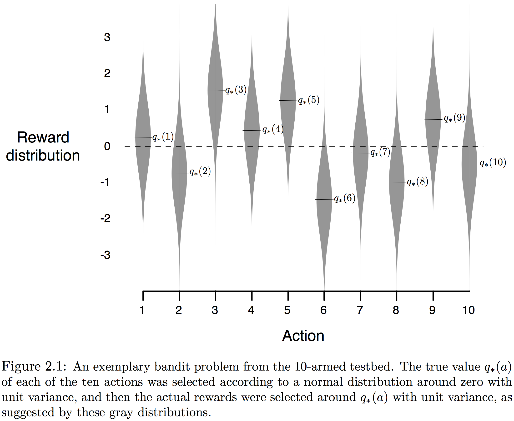
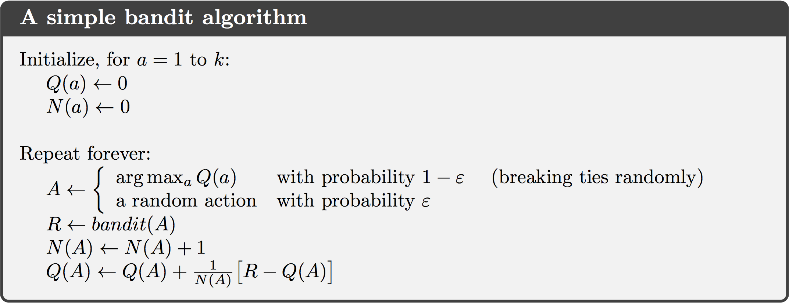

强化学习最明显的特征是使用训练信息来评估采取的行为，而非给出正确行为的指导，这就产生了积极探索的需求。对于一个使用试错行为的搜索，纯粹的评估回馈可以表示行为好的程度，但不能确定是最好还是最坏；纯粹的指导回馈指示要采取的正确行为，与实际采取的行为无关。在纯粹形式中，这两种回馈截然不同：评估回馈完全依赖于采取的行为，而指导回馈与采取的行为无关也有一些将两者混合的中间例子。本章在简化设定中学习RL的评估方面，这个特定的非结合、评估回馈问题是$k$臂老虎机的简化版本。

##### 2.1 *k*臂老虎机(bandit)问题

假设面临反复一个有$k$个不同行为的选择，每次选择后收到一个与选择行为相关、由固定概率分布产生的数字激励（这里是每个行为都有自己的概率分布），目标是最大化一段时间，比如在1000个行为选择或*时间步(time step)*后，期望的总奖励。选定行为后，每个行为都有一个期望或平均激励，称之为*行为价值*。记在时间$t$选中的行为为$A_t$，获得的激励为$R_t$，任意一个行为*a*的价值记为$q_*(a)$，是选中*a*的期望激励：
$$
q_*(a) \dot{=} \mathbb E[R_t | A_t=a]
$$
行为的价值一般需要估计，记行为$a$在时间步$t$的估计价值为$Q_t(a) \approx q_*(a)$。在每一步都至少存在一个行为的估计价值是最大的*贪婪(greedy)行为*，每次都选择贪婪行为被称为*开发(exploit)*当前行为价值的知识。相反选择非贪婪行为则被称为*探索(exploring)*，因为能改善非贪婪行为价值的评估。开发(exploitation)最大化即时激励，但探索(exploration)会产生更好的长期总价值。每一步不可能兼顾探索和开发，这称为探索和开发之间的“冲突”。在实际应用中，探索和开发的选择取决于精确的价值估计、不确定量和剩余的时间步。

##### 2.2 行为价值方法

行为的价值是选择它时获得的平均激励。一种评估方法是平均实际收到的激励：
$$
Q_t(a) \dot= \frac{\text{迄时间t采取a获得激励的总和}}{\text{迄时间t采取a的次数}} = \frac{\sum_{i=1}^{t-1} R_i \bullet\mathbf 1_{A_i=a}}{\sum_{i=1}^{t=1} \mathbf 1_{A_i=a}} \tag{2.1}
$$
其中$\mathbf 1_{predicate}$表示*预测(predicate)*为真时为1否则0的随机变量。如果分母为0，可以将$Q_t(a)$设为一个默认值，比如$Q_1(a) = 0$。当分母趋于无穷时，由大数定律，$Q_t(a)$收敛于$q_*(a)$。这个为估计行为价值的方法被称为*采样-平均(sample-average)*方法。

贪婪方法每次都选择贪婪行为$A_t^*$，其中$Q_t(A_t^*) = \max_aQ_(a)$，即：
$$
A_t \dot= \text{arg}\max_a Q_t(a) \tag{2.2}
$$
为平衡探索和开发，可以在大多数时间表现得贪婪，但每一段时间，即以小概率$\varepsilon$，随机地选择。这种*近似贪婪(near-greedy)*方法称为为*$\varepsilon$-贪婪($\varepsilon-greedy$)*方法。它的一个优点是**在极限情况下，随着步数增长，每个行为都会被无限次地采样，因此保证了所有的$Q_t(a)$收敛于$q_*(a)$**；并且保证了选择贪婪行为的概率收敛于大于$1-\varepsilon$的值，即几乎是确定事件。

##### 2.3 10臂试验台

为大致评估贪婪和$\varepsilon$贪婪的有效性，在一个2000个的$k=10$老虎机问题上量化地对比它们。每个老虎机如图2.1所示，**行为价值$q_*(a), a=1,\dots,10$由均值为0方差为1的正态分布产生**。其后，在时间$t$步选择行为$A_t$后，**激励值$R_t$由均值为$q_*(A_t)$方差为1的正态分布产生**，即图中灰色的分布。这个测试套件就是10臂试验台(testbed)，对每个学习方法，在一个老虎机问题可以进行1000步的交互来改善和测试其性能和行为，这组成一次运行(run)。用不同问题独立地重复2000次，可以获得学习算法平均行为的度量。

图2.2在实验台上用两种$\varepsilon$贪婪（$\varepsilon=0.01$和$\varepsilon=0.1$）与贪婪方法作了对比，都使用采样-平均技术估计行价值。上半部图表展示了随经验激励期望的增长。初始时贪婪方法改进得比其它方法都快，但随后在一个较低的水平趋平，因其经常陷于执行次优行为。下半部图表表明，贪婪方法仅在约1/3的任务上找到了最优行为。$\varepsilon$贪婪则因持续地探索和改善识别最优行为的机会而表现更好。$\varepsilon=0.1$的方法探索得更多，并且通常更早得发现最优行为，但超过$91\%$的时间并未选择它；而$\varepsilon=0.01$方法改进得较慢，但逐渐在两个性能测量中都优于$\varepsilon=0.1$。也可以使$\varepsilon$逐渐减小来改善。

$\varepsilon$贪婪相对于贪婪方法的优点取决于任务。假如激励的方差变大，则对于嘈杂的激励代理需花更多时间探索以找到最优行为，$\varepsilon$贪婪方法就会表现得很好。但如果激励方差为0，则贪婪方法在试过一次后就能知道每个行为的真值，因此表现更好。不过即使是这种确定的情况，弱化其它假设，探索也会变得有优势。例如，如果老虎机任务是非平稳的(nonstationary，有效的非平稳性(nonstationarity)是大多数强化学习的情况），即行为的真值随时间改变，则即便是确定性的情况也需要用探索来确定某个非贪婪行为中并未变得优于贪婪。强化学习需要探索和开发的平衡。

##### 2.4 增量实现

令$R_i$表示第$i$次选择这个行为后收到的激励，$Q_n$表示在被选择$n-1$次后其行为价值的估计，即
$$
Q_n \dot= \frac{R_1 + R_2 + \cdots + R_{n-1}}{n-1}
$$
可以改为增量形式来提高效率：
$$
\begin{eqnarray*}
Q_{n+1}
&=& \frac{1}{n} \sum_{i=1}^n R_i \\
&=& Q_n + \frac{1}{n} \left[ R_n - Q_n \right] \tag{2.3}
\end{eqnarray*}
$$
在$n=1$时对任意的$Q_1$得到$Q_2=R_1$也成立。完整的使用增量计算样本均值和$\varepsilon$贪婪行为选择的老虎机算法如下图所示。假设函数$bandit(a)$输入行为输出相应激励。上面的更新形式十分常见，一般的形式是：
$$
NewEstimate \leftarrow OldEstimate + StepSize\left[ Target - OldEstimate \right] \tag{2.4}
$$
表达式$\left[ Target - OldEstimate \right]$是估计中的*误差(error)*，通过向“*目标(Target)*”走一步来减小。目标被假定为指向移动的正确方向，虽然可能是噪音。本书通过符号$\alpha$、或者更一般的$\alpha_t(a)$表示步幅参数(step-size)，有时使用非正式的缩写$\alpha = \frac{1}{n}$表示这种情况。

##### 2.5 处理非平稳问题

上面讨论的平均方法仅适用于平稳环境。在随时间变化的非平稳环境中，很合理想法是对近期的激励比很久以前的赋予更多权重，最普遍的做法之一是使用固定的步长参数。这时上面平均激励增量更新规则改为：
$$
Q_{n+1} \dot= Q_n + \alpha \left[ R_n - Q_n \right] \tag{2.5}
$$
其中步长参数$\alpha \in (0,1]^1$为常量。这就使得$Q_{n+1}$是过去激励和初始估计$Q_1$的加权平均：
$$
\begin{eqnarray*}
Q_{n+1} &\dot=&
Q_n + \alpha\left[ R_n-Q_n \right] \\
&=& \alpha R_n + (1-\alpha)Q_n \\
&=& \alpha R_n + (1-\alpha)[\alpha R_{n-1} + (1-\alpha)Q_{n-1}] \\
&=& 
\begin{split}
\alpha R_n + (1-&\alpha)\alpha R_{n-1} + (1-\alpha)^2\alpha R_{n-2} +\\
&\cdots + (1-\alpha)^{n-1}\alpha R_1 + (1-\alpha)^nQ_1
\end{split}\\
&=& (1-\alpha)^nQ_1 + \sum_{i=1}^n \alpha(1-\alpha)^{n-i}R_i \tag{2.6}
\end{eqnarray*}
$$
我们称这个为加权平均，因为权重之和$(1-\alpha)^n + \sum_{i=1}^n \alpha(1-\alpha)^{n-i}=1$，证明如下：
$$
\begin{aligned}
&\ \ \ \ \ (1-\alpha)^n + \sum_{i=1}^n \alpha(1-\alpha)^{n-i} \\
&= (1-\alpha)^n +\alpha(1-\alpha)^{n-1}\bullet\frac{1-\frac{1}{(1-\alpha)^n}}{1-\frac{1}{1-\alpha}} \\
&= (1-\alpha)^n + \alpha(1-\alpha)^{n-1} \bullet \frac{(1-\alpha)^n-1}{(1-\alpha)^n} \bullet \frac{1-\alpha}{-\alpha} \\
&= (1-\alpha)^n + 1 - (1-\alpha)^n \\ \\
&= 1
\end{aligned}
$$
注意权重$\alpha(1-\alpha)^{n-i}$，给定激励，$R_i$取决于观察到它之前的激励次数，即$n-i$。因$0<1-\alpha<1$，权重呈指数衰减（若$1-\alpha=0$，则所有的权重落在最近一次激励$R_n$上，因$0^0=1$），也称之为*指数新近加权均值*。

有时需要步长参数随步改变，令$\alpha_n(a)$表示$n$次选择行为$a$后用于处理激励的步长参数。选择$\alpha_n(a) = \frac{1}{n}$导致采样-平均方法，大数定律保证了它收敛于真实行为价值。但并非所有$\alpha_n(a)$序列的选择能保证收敛。在随机逼近理论中，保证以概率1收敛的条件是：
$$
\sum_{n=1}^\infty \alpha_n(a) = \infty\ \ \ \ \ \ \ \ \text{and}\ \ \ \ \ \ \ \ \sum_{n=1}^\infty \alpha_n^2(a) < \infty \tag{2.7}
$$
第一个条件保证了步长足够大能逐渐克服任何初始条件或随机波动，这二个条件保证了步长逐渐变得足够小能够收敛。采样-平均的步长参数$\alpha_n(a) = \frac{1}{n}$两个收敛条件都满足；常量步长$\alpha_n(a)=\alpha$不满足第二个条件，表明这个估计永远不完全收敛，但对最近收到的激励持续变化，这实际上正是非平稳环境所想要的。此外，满足上述收敛条件的步长参数通常收敛很慢或需要大量调试以获得适当收敛速率，尽管经常在理论工作中用到，但在应用或经验研究中应用极少。

##### 2.6 最优初始值

前面讨论的所有方法都以某种程度依赖于初始行为-价值的估计，$Q_1(a)$。在统计学语言中，这些方法偏向初始估计。对采样-平均方法而言，一旦所有的行为都至少被选中一次以后，偏差就消失；但对$\alpha$为常量的方法，偏差是永久的，尽管随时间逐渐减小。实际上，这种偏差通常并不是问题，而且有时会十分有用。它的缺点是初始估计必须由用户挑选的参数集给定，如果仅仅将其所有都设为0；优点是提供一种简单的方法来提供某种关于能期待的激励层次的先验知识。

初始值也能作为一种简单鼓励探索的方法。若将10臂试验台的所有行为的初始估计都设为+5。问题中的$q_*(a)$是从均值为0方差为1的正态分布中选出，因此+5这样的初始估计过于乐观，它激励行为-价值方法去探索。无论最初选择了哪种行为，激励都会小于初始估计；学习者会对收到的激励失望，转向其它行为。结果就是所有的行为都被在价值估计收敛之前都会被尝试几次。即便是贪婪方法，系统也会做大量的探索。

图2.3展示了对所有$a$都使用$Q_1(a)=+5$、贪婪方法的在10臂老虎机试验台的性能；也展示了$Q_1(a)=0$的$\varepsilon$贪婪方法作为对比。开始时，乐观方法表现较差，因其探索很多；但随着时间增长其减少，因此性能逐渐表现得更好。这种鼓励探索的技术被称为*乐观初始价值(optimistic initial values)*。它是一种简单的在平稳问题上非常有效的技巧，但不通用，对非平稳问题就不适用。事实上，任何以特殊方式关注初始状态的方法都不可能有助于非平稳情况的解决，这也适用于将开始时间作为特殊事件的采样-平均方法。不过虽然是这样，所有这些方法都十分简单，它们中的一个或几个的组合在实际中经常是够用的。

##### 2.7 置信区间(upper confidence bound)行为选择

探索的需求源于行为的价值估计的不确定。$\varepsilon$贪婪选择强制尝试非贪婪行为，但却是盲目的，并未偏向那些接近贪婪行为或特别不确定的行为。按照实际成为最优的可能性，既考虑评估与最优值的距离也考虑其不确定性，以此选择非贪婪行为会更好。一种有效的选择行为的方法如下：
$$
A_t \dot= \text{arg}\max_a \left[ Q_t(a) + c \sqrt{\frac{\log t}{N_t(a)}} \right] \tag{2.8}
$$
其中$\log t$表示$t$的自然对数，$N_t(a)$表示行为$a$在时间$t$之前被选择的次数，数字$c>0$控制探索的程度。如果$N_t(a)=0$，则认为$a$是最大化的行为。

其中置信区间上界(UCB)行为选择的体现是平方根项，是$a$价值估计的不确定性或方差的度量。最大之上的数因此就是行为$a$真实价值的一种上界，参数$c$则确定置信水平。每次行为$a$被选中，则$N_t(a)$增加，不确定项就会减小，不确定性会下降。另一方面，每次其它行为被选中，$t$增加了但$N_t(a)$并没有，$a$不确定的估计就会增大。使用自然对数因其增长随时间减小，但却是无界的；所有的行为都逐渐会被选中，不过随着时间的增长等待的时间会更长，因此对于那些价值估计更低或已被更多次选择的行为被选中的频率就会更低。

UCB在10臂试验台上的结果如图2.4所示，其表现地很好，但相对$\varepsilon$贪婪，难以扩展到更一般的强化学习设定中。一方面难以处理非平稳问题，需要应用比2.4节展示的更复杂的方法；另一方面也难以处理巨大状态空间，尤其是函数近似。在这些更高级的设定中，目前还没有利用UCB行为选择思想的实用方法。

##### 2.8 梯度老虎机算法

目前为止本章考虑了行为价值的评估和使用评估来选择行为的方法。这些方法通常很好，但不是唯一的。现在考虑为每个行为学习一种数值*偏好*$H_t(a)$。偏好越大，则被选中地越频繁；这里仅看中一个行为的偏好比另一个高。如果将1000加到所有的偏好上，则对行为的概率没有任何影响，行为的概率由如下的softmax分布决定（比如，Gibbs或Boltzman分布）：
$$
\text{Pr}\{A_t=a\} \dot=\frac{e^{H_t(a)}}{\sum_{b=1}^k e^{H_t(b)}} \dot= \pi_t(a) \tag{2.9}
$$
这里引入记号$\pi_t(a)$作为在时间$t$采取行为$a$的概率。所有初始偏好都相同（比如$H_1(a)=0, \forall a$），所以所有的行为都等可能被选中。使用基于随机梯度上升的学习算法。每一步在选择行为$A_t$并获得激励$R_t$后，如下列这样更新偏好：

$$
\begin{split}
H_{t+1}(A_t) &\dot= H_t({A_t}) + \alpha(R_t - \bar R_t) (1-\pi_t(A_t)),\ \ \ \ \ \ \ \ &\text{and} \\
H_{t+1}(a) &\dot= H_t(a) - \alpha(R_t - \bar R_t)\pi_t(a) &\forall a \neq A_t
\end{split} \tag{2.10}
$$
其中$\alpha>0$是步长参数，而$\bar R_t \in \mathbb R$是开始到现在（包括时间$t$）所有激励的均值，也可以增量的形式计算。$\bar R_t$项是激励比较的基准。若激励高于基准线，则后面采取行为$A_t$的概率就会增加，若低于基准线，则概率降低。未被选中的行为则朝相反的方向移动。

图2.5展示了梯度老虎机算法在10臂试验台、真实期望激励均值为+4（也是单位方差）的正态分布的结果。因为激励基准线项的存在，这种同时调整所有激励到新层次的移动在梯度老虎机算法上确实没有影响。但若省略基准线（也就是$R_t$为常数0），则表现会显著地下降，就如图中所示。

**作为随机梯度上升的梯度老虎机算法**：可以将梯度老虎机算法理解为梯度上升的随机近似。恰恰是梯度上升，每个偏好$H_t(a)$与增长在表现上的影响是成比例的：
$$
H_{t+1}(a) \dot=H_t(a) + \alpha \frac{\partial \mathbb E[R_t]}{\partial H_t(a)} \tag{ 2.11}
$$
这里性能的度量是期望激励：
$$
\mathbb E[R_t] \dot= \sum_b \pi_t(b) q_*(b)
$$
其中增长影响的度量是性能度量对应偏好的*偏导*。当然，因为在本例中$q_*(b)$未知的假设，这里不可能精确地实现梯度上升，但事实上$(2.10)$中的更新算法与$(2.11)$中的期望值是等价的，使得这种算法成为随机梯度上升的一个例子。首先更近一点地观察准确的性能梯度：
$$
\begin{eqnarray*}
\frac{\partial \mathbb E[R_t]}{\partial H_t(a)}
&=& \frac{\partial}{\partial H_t(a)} \left[ \sum_b \pi_t(b) q_*(b) \right] \\
&=& \sum_b q_*(b) \frac{\partial \pi_t(b)}{\partial H_t(a)} \\
&=& \sum_b \left( q_*(b) - X_t \right) \frac{\partial \pi_t(b)}{\partial H_t(a)}
\end{eqnarray*}
$$
其中$X_t$可以是任意不依赖于$b$的标量。这里包含它因为所有行为的梯度之和为0，即$\sum_b \frac{\partial \pi_t(b)}{\partial H_t(a)} = 0$。因为$H_t(a)$改变了，一些行为的概率变大，一些变小，**但变化的和必须为0，因为概率的和必须维持为1**。
$$
=\sum_b \pi_t(b) (q_*(b) - X_t) \frac{\partial \pi_t(b)}{\partial H_t(a)} / \pi_t(b)
$$
现在公式就是期望的形式，将随机变量$A_t$所有可能的$b$值相加，然后乘以取此值的概率。因此：
$$
\begin{eqnarray*}
&=& \mathbb E \left[ \left( q_*(A_t) - X_t \right) \frac{\partial \pi_t(A_t)}{\partial H_t(a)} /\pi_t(A_t) \right] \\
&=& \mathbb E\left[ (R_t-\bar R_t) \frac{\partial \pi_t(A_t)}{\partial H_t(a)} /\pi_t(A_t) \right]
\end{eqnarray*}
$$

这里选择了$X_t = \bar R_t$，并将$q_*(A_t)$替换为$R_t$，因$\mathbb E[R_t | A_t] = q_*(A_t)$，并且在给定$A_t$的情况下，$R_t$与其它无关。简而言之我们将会确立$\frac{\partial \pi_t(b)}{\partial H_t(a)} = \pi_t(b)(\mathbf 1_{a=b} - \pi_t(a))$，其中$\mathbf 1_{a=b}$在$a=b$时定义为1，否则0。现在假定其成立，怎有：
$$
\begin{eqnarray*}
&=& \mathbb E\left[ (R_t - \bar R_t) \pi_t(A_t) (\mathbf 1_{a=A_t} - \pi_t(a)) / \pi_t(A_t) \right] \\
&=& \mathbb E\left[ (R_t-\bar R_t)(\mathbf 1_{a=A_t} - \pi_t(a)) \right]
\end{eqnarray*}
$$
我们想要做的是将性能梯度写为我们在每步能采样的量的期望，就像刚才做的那样，然后在每步与样本成比例更新。在$(2.11)$中为性能梯度将上面的期望替换为样本产生：
$$
H_{t+1}(a) = H_t(a) + \alpha(R_t - \bar R_t) (\mathbf 1_{a=A_t} - \pi_t(a)), \ \ \ \ \ \ \ \ \forall a
$$
这与原始$(2.10)$的算法是等价的。现在还剩$\frac{\partial \pi_t(a)}{\partial H_t(a)} = \pi_t(b)\left( \mathbf 1_{a=b} - \pi_t(a) \right)$。由标准导数商的法则：
$$
\frac{\partial}{\partial x} \left[ \frac{f(x)}{g(x)} \right] = \frac{\frac{\partial f(x)}{\partial x}g(x) - f(x)\frac{\partial g(x)}{\partial x}}{g(x)^2}
$$
因此可以有：
$$
\begin{eqnarray*}
\frac{\partial \pi_t(b)}{\partial H_t(a)} 
&=& \frac{\partial}{\partial H_t(a)} \pi_t(b) \\
&=& \frac{\partial}{\partial H_t(a)} \left[ \frac{e^{H_t(b)}}{\sum_{c=1}^k e^{H_t(c)}} \right] \\
&=& \frac{\frac{\partial e^{H_t(b)}}{\partial H_t(a)}\sum_{c=1}^k e^{H_t(c)} - e^{H_t(b)}\frac{\partial \sum_{c=1}^k e^{H_t(c)}}{\partial H_t(a)}}{\left( \sum_{c=1}^k e^{H_t(c)} \right)^2} \\
&=& \frac{\mathbf 1_{a=b}e^{H_t(a)}\sum_{c=1}^k e^{H_t(c)} - e^{H_t(b)}e^{H_t(a)}}{\left( \sum_{c=1}^k e^{H_t(c)} \right)^2} \\
&=& \frac{\mathbf 1_{a=b}e^{H_t(b)}}{\sum_{c=1}^k e^{H_t(c)}} - \frac{e^{H_t(b)}e^{H_t(a)}}{\left( \sum_{c=1}^k e^{H_t(c)} \right)^2} \\
&=& \mathbf 1_{a=b}\pi_t(b) - \pi_t(b)\pi_t(a) \\
&=& \pi_t(b)\left( \mathbf 1_{a=b} - \pi_t(a) \right)
\end{eqnarray*}
$$
刚刚展示了梯度老虎机算法的期望更新等价于期望激励的梯度，因此算法是随机梯度上升的实例。这就保证了算法鲁棒的收敛特征。注意这里除了不依赖于选中的人行为并不要求任何激励基准线的特性。比如，可以设定其为0或1000，算法依然是随机梯度上升的实例。基准线的选择并不影响算法的期望更新，但影响更新的方差，进而影响收敛的速度。选择其为激励的平均可能并非最好的，但简单并且在实践非常有效。

##### 2.9 关联搜索（上下文老虎机）

目前仅考虑了非关联的任务，这种情况下无需将不同的状态与不同的行为结合起来。在这些任务中，学习者要么在平稳任务中找到单个最佳行为，要么在非平稳任务中追踪最佳行为因其会随着时间改变。但在一般的强化学习任务中，会有多个状态，目标是学习一个策略：一种从状态到最佳状态的行为的映射。下面用最简单的方法讨论将非关联任务扩展到关联的设定。

假设有一些$k$臂的老虎机任务，在每一步都面对随机在这些选择中的一个。因此，老虎机任务每步都随机变化。这似乎是真实行为价值在每一步随机变化的单个、非平稳的$k$臂老虎机任务。可以尝试使用本章中讨论的处理非平稳的方法，但除非真实行为价值改变得非常缓慢，这些方法并不十分有效。但现在假设，当选择好一个老虎机任务后，会给定一些关于期身份的独特线索（但不是行为价值）。可能实际面对的是随着其行为价值变化而改变其展示颜色的吃饺子老虎。现在可以学习一种结合每个任务，以所见的颜色为信号，当面临对应任务时采取相应最优行为的策略——比如，若是红色，选1；若绿，选择2。

这是一个*关联搜索*任务的例子，这样称呼是因为它涉及了搜寻最佳行为的试错学习和行为与在此情况下最佳的状态的结合。关联搜索是$k$臂老虎机与完全强化学习问题的媒介。它们很像完全强化学习是因为它们涉及学习一个人策略，但在每个行为仅影响一个中间激励方面也像我们版本的$k$臂老虎机。若行为也影响下一个状态与激励，则就是完全强化学习问题了。

##### 2.10 总结

本章展示了几种简单的平衡探索和开发的方法。$\varepsilon$贪婪随机选择小的时间片，而UCB方法选择确切的但通过在每步精巧的偏向目前获得更少获得采样的行为来实现探索。梯度老虎机算法估计的不是行为价值，而是行为偏好，并且喜欢使用softmax分布的分级、概率的行为。即便是贪婪方法，简单的优化初始估计就能使其显著地探索。

很自然要问到这些方法哪个最好，尽管一般难以回答，可以通过在10臂试验台上运行所有这些方法并比较它们的性能。比较复杂的是它们都有一个参数，为获得有意义的比较，必须将其性能作为参数的函数。