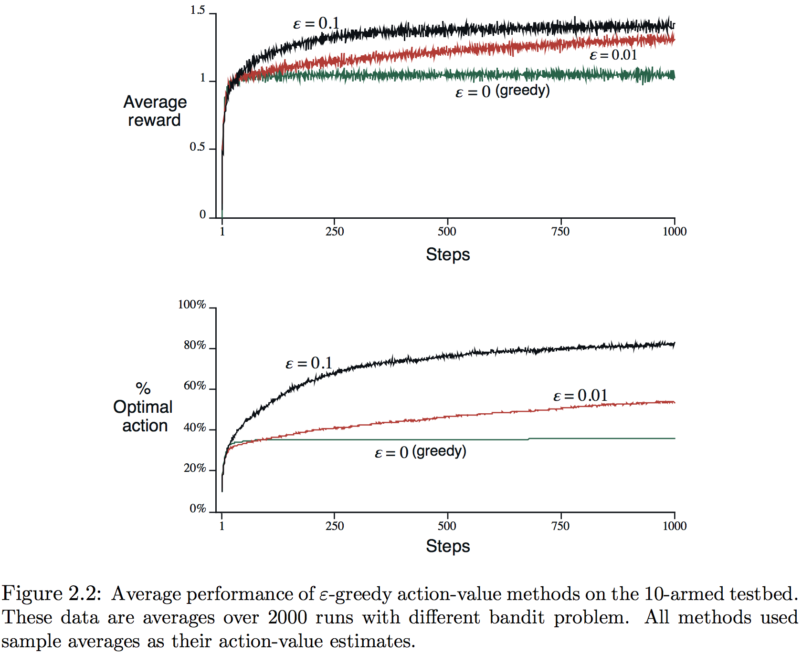

强化学习最明显的特征是使用训练信息来评估采取的行动，而非给出正确行为的指导，这就产生了积极探索的需求。对于一个使用试错行为的搜索，纯粹的评估回馈可以表示行动好的程度，但不能确定是最好还是最坏；纯粹的指导回馈指示要采取的正确行动，与实际所采取的无关。在纯粹形式中，这两种回馈截然不同：评估回馈完全依赖于采取的行动，而指导回馈与采取的行动无关，也有一些将两者混合的中间例子。本章在简化的设定中学习RL的评估方面，这个特定的非结合、评估回馈问题是$k$臂老虎机的简化版本。

##### 2.1 *k*臂老虎机(bandit)问题

假设反复面临一个有$k$个不同选项（或者行动）的选择，每次选择后收到一个与所选行动相关、由固定概率分布产生的数字激励（这里是每个行动都有自己的概率分布），目标是使一段时间——比如超过1000次行动选择或**时间步(time step)**——后期望的总激励最大。选定行动后，每个行动都有一个期望或平均激励，称之为此行动的**价值**。记在时间$t$选择的行动为$A_t$，相应的激励为$R_t$，则任意行动$a$的价值$q_*(a)$为选中行动$a$的期望激励：
$$
q_*(a) \dot{=} \mathbb E[R_t | A_t=a]
$$
一般需要估计行动的价值，记行动$a$在时间$t$的估计价值为$Q_t(a) \approx q_*(a)$。在任一步都至少存在一个行动的估计价值是最大的**贪婪(greedy)行动**。称选择贪婪行动为**开发(exploit)**当前行动价值的知识；选择非贪婪行动为**探索(exploring)**，能改善非贪婪行动价值的评估。开发(exploitation)使即时激励最大，但探索(exploration)能产生更大的长期总价值。每一步不可能兼顾探索和开发，这被称为探索和开发之间的“冲突”。在具体情况中，探索和开发的选择取决于精确的价值估计、不确定性和剩余的时间。

##### 2.2 行动-价值方法

行动的价值是选择它后获得的平均激励。一种评估方法是平均实际收到的激励：
$$
Q_t(a) \dot= \frac{\text{迄时间t采取a获得激励的总和}}{\text{迄时间t采取a的次数}} = \frac{\sum_{i=1}^{t-1} R_i \bullet\mathbf 1_{A_i=a}}{\sum_{i=1}^{t=1} \mathbf 1_{A_i=a}} \tag{2.1}
$$
其中$\mathbf 1_{predicate}$表示**预测(predicate)**为真时1否则0的随机变量。如果分母为0，则将$Q_t(a)$设为一个默认值，比如$Q_1(a) = 0$。当分母趋于无穷时，由大数定律，$Q_t(a)$收敛于$q_*(a)$。称此估计行为价值的方法为**采样-平均(sample-average)**方法。贪心方法每次都选择贪婪行为$A_t^*$，其中$Q_t(A_t^*) = \max_aQ_(a)$，即：

$$
A_t \dot= \text{arg}\max_a Q_t(a) \tag{2.2}
$$
为平衡探索和开发，可以使用在大多数时间贪婪、但每一段时间（即以小概率$\varepsilon$）随机选择的**近似贪婪(near-greedy)**方法，称这个方法为**$\varepsilon$-贪婪($\varepsilon-greedy$)**。它的一个优点是**在极限情况下，随着时间步数增长，每个行动都会被无限次采样，因此保证了所有的$Q_t(a)$收敛于$q_*(a)$**；并且保证了选择贪婪行为的概率收敛于大于$1-\varepsilon$的值，即几乎是确定事件。

**练习 2.1**  在$\varepsilon$-贪婪行为选择中，有两种行动并且$\varepsilon=0.5$，求贪婪行为被选中的概率。

**练习 2.2 老虎机示例**：考虑行为个数$k=4$（记为1，2，3，4）的多臂老虎机问题，应用一个行动选择为$\varepsilon$-贪婪、行动价值估计为抽样-平均的老虎机算法，且初始估计$Q_1(a)=0, \forall a$。若行动和激励的初始序列为$A_1=1, R_1=1, A_2=2, R_2=1, A_3=2, R_3=2, A_4=2, R_4=2, A_5=3, R_5=0$。其中某些时间$\varepsilon$情况可能发生了，使其选择的行为是随机的。求$\varepsilon$必然和可能分别发生在哪一步。

##### 2.3 10臂试验台

为粗略评测贪婪和$\varepsilon$贪婪的有效性，将它们在一个2000次随机生成$k=10$的老虎机问题上量化对比。每个老虎机如图2.1所示，**行动价值$q_*(a), a=1,\dots,10$由均值为0方差为1的正态分布产生**。在时间$t$选择行动$A_t$后，**激励值$R_t$由均值为$q_*(A_t)$方差为1的正态分布产生**，即图中灰色的分布。这个测试套件就是10臂试验台(testbed)，两种学习方法都在一个老虎机问题进行1000步的交互来改善和测试其性能和表现，这是一次运行(run)。用不同问题独立重复2000次就能获得学习算法的平均行为的衡量。

图2.2在实验台上用两种$\varepsilon$贪婪（$\varepsilon=0.01$和$\varepsilon=0.1$）与贪婪方法作了对比，都使用采样-平均来估计价值。上半部展示了期望激励随经验的增长。初始时贪婪方法比其它方法增长得略快，但随后在一个较低的水平趋平，因其经常陷于次优行动。图下半部表明，贪婪方法仅在约1/3的任务上找到了最优行为。$\varepsilon$贪婪则因持续探索和改善识别最优行动的机会最终表现更好。$\varepsilon=0.1$时探索得更多，且通常更早发现最优行为，但超过$91\%$的时间没有选择最优；而$\varepsilon=0.01$方法提高地更慢，但最终在两个性能衡量中都比$\varepsilon=0.1$好。可以通过使$\varepsilon$逐渐减小来改善。

$\varepsilon$贪婪相对贪婪方法的优势依赖于任务。若激励的方差变得更大，激励相应变得更嘈杂，代理就需要花更多时间探索才能找到最优行为，$\varepsilon$贪婪就能表现得很好。但如果激励的方差为0，则贪婪方法试过一次后就能知道每个行动的真值，这时表现得最好。不过即使是这种确定性的情况，弱化其它假设，探索也会有很大的优势。例如，假设老虎机任务是非平稳的(nonstationary，有效的非平稳性(nonstationarity)是大多数强化学习的情况），即行动的真值随时间改变，则即便是确定性的情况也需要探索以确保某个非贪婪行为并未变得比贪婪更好。强化学习需要探索和开发的平衡。

**练习 2.3**  在图2.2的比较中，就激励累积和最优行动选择概率累积而言，哪种方法的长期表现会最好？有多好？定量地表示答案。

##### 2.4 增量实现

令$R_i$表示第$i$次选择要评估的行动后收到的激励，$Q_n$表示在被选择$n-1$次后其行为价值的估计，即
$$
Q_n \dot= \frac{R_1 + R_2 + \cdots + R_{n-1}}{n-1}
$$
可以改为增量形式来提高效率：
$$
\begin{eqnarray*}
Q_{n+1}
&=& \frac{1}{n} \sum_{i=1}^n R_i \\
&=& Q_n + \frac{1}{n} \left[ R_n - Q_n \right] \tag{2.3}
\end{eqnarray*}
$$
$n=1$时任意$Q_1$得到$Q_2=R_1$也成立。假设函数$bandit(a)$输入行为输出相应激励。上面的更新形式十分常见，一般的形式是：
$$
NewEstimate \leftarrow OldEstimate + StepSize\left[ Target - OldEstimate \right] \tag{2.4}
$$
假定目标为指向移动的正确方向，表达式$\left[ Target - OldEstimate \right]$是估计中的**误差(error)**，通过向“**目标(target)**”走一步来减小。本书用符号$\alpha$、或更一般的$\alpha_t(a)$表示步幅(step-size)参数，有时使用非正式的缩写$\alpha = \frac{1}{n}$表示这种情况。使用增量计算样本均值和$\varepsilon$贪婪行为选择的完整老虎机算法如下。
$$
\bbox[25px,border:2px solid]
{\begin{aligned}
&\underline{\mathbf{A\space simple\space bandit\space algorithm}}\\
\\
&\text{Initialize, for }a=1\text{ to }k\text{:}\\
&\qquad Q(a) \leftarrow 0\\
&\qquad N(a) \leftarrow 0\\
\\
&\text{Repeat forever:}\\
&\qquad A \leftarrow 
\begin{cases}
\arg\max_a Q(a)&\qquad\text{with probability }1-\varepsilon\qquad(\text{breaking ties randomly})\\
\text{a random action}&\qquad\text{with probability }\varepsilon
\end{cases}\\
&\qquad R \leftarrow bandit(A)\\
&\qquad N(A) \leftarrow N(A) + 1\\
&\qquad Q(A) \leftarrow Q(A) + \frac{1}{N(A)}[R-Q(A)
\end{aligned}}
$$

##### 2.5 处理非平稳问题

上面讨论的方法仅适用于平稳环境。在随时间改变的非平稳环境中，一个合理的想法是给近期的激励赋予更多的权重，最普遍的一种做法是使用固定的步长参数。这时上面平均激励的增量更新规则变为：
$$
Q_{n+1} \dot= Q_n + \alpha \left[ R_n - Q_n \right] \tag{2.5}
$$
其中步长参数$\alpha \in (0,1]^1$为常量。这就使得$Q_{n+1}$是过去激励和初始估计$Q_1$的加权平均：
$$
\begin{eqnarray*}
Q_{n+1} &\dot=&
Q_n + \alpha\left[ R_n-Q_n \right] \\
&=& \alpha R_n + (1-\alpha)Q_n \\
&=& \alpha R_n + (1-\alpha)[\alpha R_{n-1} + (1-\alpha)Q_{n-1}] \\
&=& 
\begin{split}
\alpha R_n + (1-&\alpha)\alpha R_{n-1} + (1-\alpha)^2\alpha R_{n-2} +\\
&\cdots + (1-\alpha)^{n-1}\alpha R_1 + (1-\alpha)^nQ_1
\end{split}\\
&=& (1-\alpha)^nQ_1 + \sum_{i=1}^n \alpha(1-\alpha)^{n-i}R_i \tag{2.6}
\end{eqnarray*}
$$
称这种计算形式为加权平均，因为权重之和$(1-\alpha)^n + \sum_{i=1}^n \alpha(1-\alpha)^{n-i}=1$，证明如下：
$$
\begin{aligned}
&\ \ \ \ \ (1-\alpha)^n + \sum_{i=1}^n \alpha(1-\alpha)^{n-i} \\
&= (1-\alpha)^n +\alpha(1-\alpha)^{n-1}\bullet\frac{1-\frac{1}{(1-\alpha)^n}}{1-\frac{1}{1-\alpha}} \\
&= (1-\alpha)^n + \alpha(1-\alpha)^{n-1} \bullet \frac{(1-\alpha)^n-1}{(1-\alpha)^n} \bullet \frac{1-\alpha}{-\alpha} \\
&= (1-\alpha)^n + 1 - (1-\alpha)^n \\ \\
&= 1
\end{aligned}
$$
注意权重$\alpha(1-\alpha)^{n-i}$，给定激励，$R_i$取决于观察到它之前的激励个数即$n-i$。因$0<1-\alpha<1$，权重呈指数衰减（若$1-\alpha=0$，则所有的权重落在最近一次激励$R_n$上，因$0^0=1$），也称之为**指数新近加权均值**。

有时需要步长参数随步数改变，令$\alpha_n(a)$表示$n$次选择行动$a$后用于计算激励的步长参数。选择$\alpha_n(a) = \frac{1}{n}$导致采样-平均方法，大数定律保证了它收敛于真实行动价值。但并非所有$\alpha_n(a)$序列的选择能保证收敛。在随机逼近理论中，保证以概率1收敛的条件是：
$$
\sum_{n=1}^\infty \alpha_n(a) = \infty\ \ \ \ \ \ \ \ \text{and}\ \ \ \ \ \ \ \ \sum_{n=1}^\infty \alpha_n^2(a) < \infty \tag{2.7}
$$
第一个条件保证了步长足够大能逐渐克服任何初始条件或随机波动，这二个条件保证了步长逐渐变得足够小能够收敛。采样-平均的步长参数$\alpha_n(a) = \frac{1}{n}$两个收敛条件都满足；常量步长$\alpha_n(a)=\alpha$不满足第二个条件，表明这个估计永远不完全收敛，但对最近收到的激励持续变化，这实际上正是非平稳环境所想要的。此外，满足上述收敛条件的步长参数通常收敛很慢或需要大量调试以获得适当收敛速率，尽管经常在理论工作中用到，但在应用或经验研究中应用极少。

**练习2.4**  若步长参数$\alpha_n$不是常量，则$Q_n$估计的值是前面收到激励权值权重异于(2.6)的加权平均。求一般情况中类似(2.6)关于步长参数序列的每一个先前激励的权重。

**练习2.5**  设计并实施一个试验来展示采样-平均方法在非平稳问题上的困难。使用修改版的10臂测试床，其中所有的$q_*(a)$平等出发，然后采取独立随机的游走（即通过在每一步增加一个均值为0方差为0.01正态分布的增量到所有$q_*(a)$）。为一个行为价值方法使用增量计算的采样平均和另一个使用步长参数为$\alpha=0.1$的常量的行为价值方法来准备像2.2那样的图。使用$\varepsilon=0.01$，和更长的10000步运行。

##### 2.6 最优初始值

前面讨论的所有方法都以某种程度依赖于初始行为-价值的估计，$Q_1(a)$。在统计学语言中，这些方法偏向初始估计。对采样-平均方法而言，一旦所有的行为都至少被选中一次以后，偏差就消失；但对$\alpha$为常量的方法，偏差是永久的，尽管随时间逐渐减小。实际上，这种偏差通常并不是问题，而且有时会十分有用。它的缺点是初始估计必须由用户挑选的参数集给定，如果仅仅将其所有都设为0；优点是提供一种简单的方法来提供某种关于能期待的激励层次的先验知识。

初始值也能作为一种简单鼓励探索的方法。若将10臂试验台的所有行为的初始估计都设为+5。问题中的$q_*(a)$是从均值为0方差为1的正态分布中选出，因此+5这样的初始估计过于乐观，它激励行为-价值方法去探索。无论最初选择了哪种行为，激励都会小于初始估计；学习者会对收到的激励失望，转向其它行为。结果就是所有的行为都被在价值估计收敛之前都会被尝试几次。即便是贪婪方法，系统也会做大量的探索。

图2.3展示了对所有$a$都使用$Q_1(a)=+5$、贪婪方法的在10臂老虎机试验台的性能；也展示了$Q_1(a)=0$的$\varepsilon$贪婪方法作为对比。开始时，乐观方法表现较差，因其探索很多；但随着时间增长其减少，因此性能逐渐表现得更好。这种鼓励探索的技术被称为*乐观初始价值(optimistic initial values)*。它是一种简单的在平稳问题上非常有效的技巧，但不通用，对非平稳问题就不适用。事实上，任何以特殊方式关注初始状态的方法都不可能有助于非平稳情况的解决，这也适用于将开始时间作为特殊事件的采样-平均方法。不过虽然是这样，所有这些方法都十分简单，它们中的一个或几个的组合在实际中经常是够用的。

**练习2.6**  *神秘的尖峰*  图2.3展示的结果应该是相当可靠的，因其是超过2000次单独、随机从10臂老虎机任务中选择的。那么，在乐观方法早期部分的曲线是否存在振荡和尖峰，为什么？或者说，有可能是什么使得这种方法在平均上、在早期特定步骤表现得特别地好或差？

##### 2.7 置信区间(upper confidence bound)行为选择

探索的需求源于行为的价值估计的不确定。$\varepsilon$贪婪选择强制尝试非贪婪行为，但却是盲目的，并未偏向那些接近贪婪行为或特别不确定的行为。按照实际成为最优的可能性，既考虑评估与最优值的距离也考虑其不确定性，以此选择非贪婪行为会更好。一种有效的选择行为的方法如下：
$$
A_t \dot= \text{arg}\max_a \left[ Q_t(a) + c \sqrt{\frac{\log t}{N_t(a)}} \right] \tag{2.8}
$$
其中$\log t$表示$t$的自然对数，$N_t(a)$表示行为$a$在时间$t$之前被选择的次数，数字$c>0$控制探索的程度。如果$N_t(a)=0$，则认为$a$是最大化的行为。

其中置信区间上界(UCB)行为选择的体现是平方根项，是$a$价值估计的不确定性或方差的度量。最大之上的数因此就是行为$a$真实价值的一种上界，参数$c$则确定置信水平。每次行为$a$被选中，则$N_t(a)$增加，不确定项就会减小，不确定性会下降。另一方面，每次其它行为被选中，$t$增加了但$N_t(a)$并没有，$a$不确定的估计就会增大。使用自然对数因其增长随时间减小，但却是无界的；所有的行为都逐渐会被选中，不过随着时间的增长等待的时间会更长，因此对于那些价值估计更低或已被更多次选择的行为被选中的频率就会更低。

UCB在10臂试验台上的结果如图2.4所示，其表现地很好，但相对$\varepsilon$贪婪，难以扩展到更一般的强化学习设定中。一方面难以处理非平稳问题，需要应用比2.4节展示的更复杂的方法；另一方面也难以处理巨大状态空间，尤其是函数近似。在这些更高级的设定中，目前还没有利用UCB行为选择思想的实用方法。

##### 2.8 梯度老虎机算法

目前为止本章考虑了行为价值的评估和使用评估来选择行为的方法。这些方法通常很好，但不是唯一的。现在考虑为每个行为学习一种数值*偏好*$H_t(a)$。偏好越大，则被选中地越频繁；这里仅看中一个行为的偏好比另一个高。如果将1000加到所有的偏好上，则对行为的概率没有任何影响，行为的概率由如下的softmax分布决定（比如，Gibbs或Boltzman分布）：
$$
\text{Pr}\{A_t=a\} \dot=\frac{e^{H_t(a)}}{\sum_{b=1}^k e^{H_t(b)}} \dot= \pi_t(a) \tag{2.9}
$$
这里引入记号$\pi_t(a)$作为在时间$t$采取行为$a$的概率。所有初始偏好都相同（比如$H_1(a)=0, \forall a$），所以所有的行为都等可能被选中。

**练习2.7**  证明在两个行为的情况下，softmax分布和在统计学和人工神经网络中经常用到的logistic或sigmoid函数给定的分布相同。

使用基于随机梯度上升的学习算法。每一步在选择行为$A_t$并获得激励$R_t$后，如下列这样更新偏好：
$$
\begin{split}
H_{t+1}(A_t) &\dot= H_t({A_t}) + \alpha(R_t - \bar R_t) (1-\pi_t(A_t)),\ \ \ \ \ \ \ \ &\text{and} \\
H_{t+1}(a) &\dot= H_t(a) - \alpha(R_t - \bar R_t)\pi_t(a) &\forall a \neq A_t
\end{split} \tag{2.10}
$$
其中$\alpha>0$是步长参数，而$\bar R_t \in \mathbb R$是开始到现在（包括时间$t$）所有激励的均值，也可以增量的形式计算。$\bar R_t$项是激励比较的基准。若激励高于基准线，则后面采取行为$A_t$的概率就会增加，若低于基准线，则概率降低。未被选中的行为则朝相反的方向移动。

图2.5展示了梯度老虎机算法在10臂试验台、真实期望激励均值为+4（也是单位方差）的正态分布的结果。因为激励基准线项的存在，这种同时调整所有激励到新层次的移动在梯度老虎机算法上确实没有影响。但若省略基准线（也就是$R_t$为常数0），则表现会显著地下降，就如图中所示。

**作为随机梯度上升的梯度老虎机算法**：可以将梯度老虎机算法理解为梯度上升的随机近似。恰恰是梯度上升，每个偏好$H_t(a)$与增长在表现上的影响是成比例的：
$$
H_{t+1}(a) \dot=H_t(a) + \alpha \frac{\partial \mathbb E[R_t]}{\partial H_t(a)} \tag{ 2.11}
$$
这里性能的度量是期望激励：
$$
\mathbb E[R_t] \dot= \sum_b \pi_t(b) q_*(b)
$$
其中增长影响的度量是性能度量对应偏好的*偏导*。当然，因为在本例中$q_*(b)$未知的假设，这里不可能精确地实现梯度上升，但事实上$(2.10)$中的更新算法与$(2.11)$中的期望值是等价的，使得这种算法成为随机梯度上升的一个例子。首先更近一点地观察准确的性能梯度：
$$
\begin{eqnarray*}
\frac{\partial \mathbb E[R_t]}{\partial H_t(a)}
&=& \frac{\partial}{\partial H_t(a)} \left[ \sum_b \pi_t(b) q_*(b) \right] \\
&=& \sum_b q_*(b) \frac{\partial \pi_t(b)}{\partial H_t(a)} \\
&=& \sum_b \left( q_*(b) - X_t \right) \frac{\partial \pi_t(b)}{\partial H_t(a)}
\end{eqnarray*}
$$
其中$X_t$可以是任意不依赖于$b$的标量。这里包含它因为所有行为的梯度之和为0，即$\sum_b \frac{\partial \pi_t(b)}{\partial H_t(a)} = 0$。因为$H_t(a)$改变了，一些行为的概率变大，一些变小，**但变化的和必须为0，因为概率的和必须维持为1**。
$$
=\sum_b \pi_t(b) (q_*(b) - X_t) \frac{\partial \pi_t(b)}{\partial H_t(a)} / \pi_t(b)
$$
现在公式就是期望的形式，将随机变量$A_t$所有可能的$b$值相加，然后乘以取此值的概率。因此：
$$
\begin{eqnarray*}
&=& \mathbb E \left[ \left( q_*(A_t) - X_t \right) \frac{\partial \pi_t(A_t)}{\partial H_t(a)} /\pi_t(A_t) \right] \\
&=& \mathbb E\left[ (R_t-\bar R_t) \frac{\partial \pi_t(A_t)}{\partial H_t(a)} /\pi_t(A_t) \right]
\end{eqnarray*}
$$

这里选择了$X_t = \bar R_t$，并将$q_*(A_t)$替换为$R_t$，因$\mathbb E[R_t | A_t] = q_*(A_t)$，并且在给定$A_t$的情况下，$R_t$与其它无关。简而言之我们将会确立$\frac{\partial \pi_t(b)}{\partial H_t(a)} = \pi_t(b)(\mathbf 1_{a=b} - \pi_t(a))$，其中$\mathbf 1_{a=b}$在$a=b$时定义为1，否则0。现在假定其成立，怎有：
$$
\begin{eqnarray*}
&=& \mathbb E\left[ (R_t - \bar R_t) \pi_t(A_t) (\mathbf 1_{a=A_t} - \pi_t(a)) / \pi_t(A_t) \right] \\
&=& \mathbb E\left[ (R_t-\bar R_t)(\mathbf 1_{a=A_t} - \pi_t(a)) \right]
\end{eqnarray*}
$$
我们想要做的是将性能梯度写为我们在每步能采样的量的期望，就像刚才做的那样，然后在每步与样本成比例更新。在$(2.11)$中为性能梯度将上面的期望替换为样本产生：
$$
H_{t+1}(a) = H_t(a) + \alpha(R_t - \bar R_t) (\mathbf 1_{a=A_t} - \pi_t(a)), \ \ \ \ \ \ \ \ \forall a
$$
这与原始$(2.10)$的算法是等价的。现在还剩$\frac{\partial \pi_t(a)}{\partial H_t(a)} = \pi_t(b)\left( \mathbf 1_{a=b} - \pi_t(a) \right)$。由标准导数商的法则：
$$
\frac{\partial}{\partial x} \left[ \frac{f(x)}{g(x)} \right] = \frac{\frac{\partial f(x)}{\partial x}g(x) - f(x)\frac{\partial g(x)}{\partial x}}{g(x)^2}
$$
因此可以有：
$$
\begin{eqnarray*}
\frac{\partial \pi_t(b)}{\partial H_t(a)} 
&=& \frac{\partial}{\partial H_t(a)} \pi_t(b) \\
&=& \frac{\partial}{\partial H_t(a)} \left[ \frac{e^{H_t(b)}}{\sum_{c=1}^k e^{H_t(c)}} \right] \\
&=& \frac{\frac{\partial e^{H_t(b)}}{\partial H_t(a)}\sum_{c=1}^k e^{H_t(c)} - e^{H_t(b)}\frac{\partial \sum_{c=1}^k e^{H_t(c)}}{\partial H_t(a)}}{\left( \sum_{c=1}^k e^{H_t(c)} \right)^2} \\
&=& \frac{\mathbf 1_{a=b}e^{H_t(a)}\sum_{c=1}^k e^{H_t(c)} - e^{H_t(b)}e^{H_t(a)}}{\left( \sum_{c=1}^k e^{H_t(c)} \right)^2} \\
&=& \frac{\mathbf 1_{a=b}e^{H_t(b)}}{\sum_{c=1}^k e^{H_t(c)}} - \frac{e^{H_t(b)}e^{H_t(a)}}{\left( \sum_{c=1}^k e^{H_t(c)} \right)^2} \\
&=& \mathbf 1_{a=b}\pi_t(b) - \pi_t(b)\pi_t(a) \\
&=& \pi_t(b)\left( \mathbf 1_{a=b} - \pi_t(a) \right)
\end{eqnarray*}
$$
刚刚展示了梯度老虎机算法的期望更新等价于期望激励的梯度，因此算法是随机梯度上升的实例。这就保证了算法鲁棒的收敛特征。注意这里除了不依赖于选中的人行为并不要求任何激励基准线的特性。比如，可以设定其为0或1000，算法依然是随机梯度上升的实例。基准线的选择并不影响算法的期望更新，但影响更新的方差，进而影响收敛的速度。选择其为激励的平均可能并非最好的，但简单并且在实践非常有效。

##### 2.9 关联搜索（上下文老虎机）

目前仅考虑了非关联的任务，这种情况下无需将不同的状态与不同的行为结合起来。在这些任务中，学习者要么在平稳任务中找到单个最佳行为，要么在非平稳任务中追踪最佳行为因其会随着时间改变。但在一般的强化学习任务中，会有多个状态，目标是学习一个策略：一种从状态到最佳状态的行为的映射。下面用最简单的方法讨论将非关联任务扩展到关联的设定。

假设有一些$k$臂的老虎机任务，在每一步都面对随机在这些选择中的一个。因此，老虎机任务每步都随机变化。这似乎是真实行为价值在每一步随机变化的单个、非平稳的$k$臂老虎机任务。可以尝试使用本章中讨论的处理非平稳的方法，但除非真实行为价值改变得非常缓慢，这些方法并不十分有效。但现在假设，当选择好一个老虎机任务后，会给定一些关于期身份的独特线索（但不是行为价值）。可能实际面对的是随着其行为价值变化而改变其展示颜色的吃饺子老虎。现在可以学习一种结合每个任务，以所见的颜色为信号，当面临对应任务时采取相应最优行为的策略——比如，若是红色，选1；若绿，选择2。

这是一个*关联搜索*任务的例子，这样称呼是因为它涉及了搜寻最佳行为的试错学习和行为与在此情况下最佳的状态的结合。关联搜索是$k$臂老虎机与完全强化学习问题的媒介。它们很像完全强化学习是因为它们涉及学习一个人策略，但在每个行为仅影响一个中间激励方面也像我们版本的$k$臂老虎机。若行为也影响下一个状态与激励，则就是完全强化学习问题了。

##### 2.10 总结

本章展示了几种简单的平衡探索和开发的方法。$\varepsilon$贪婪随机选择小的时间片，而UCB方法选择确切的但通过在每步精巧的偏向目前获得更少获得采样的行为来实现探索。梯度老虎机算法估计的不是行为价值，而是行为偏好，并且喜欢使用softmax分布的分级、概率的行为。即便是贪婪方法，简单的优化初始估计就能使其显著地探索。

很自然要问到这些方法哪个最好，尽管一般难以回答，可以通过在10臂试验台上运行所有这些方法并比较它们的性能。比较复杂的是它们都有一个参数，为获得有意义的比较，必须将其性能作为参数的函数。