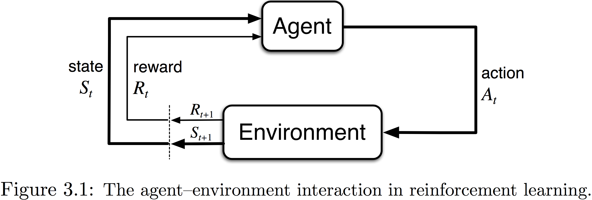
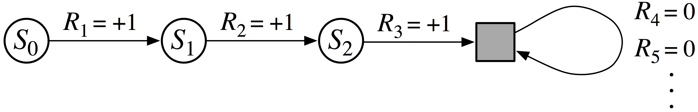
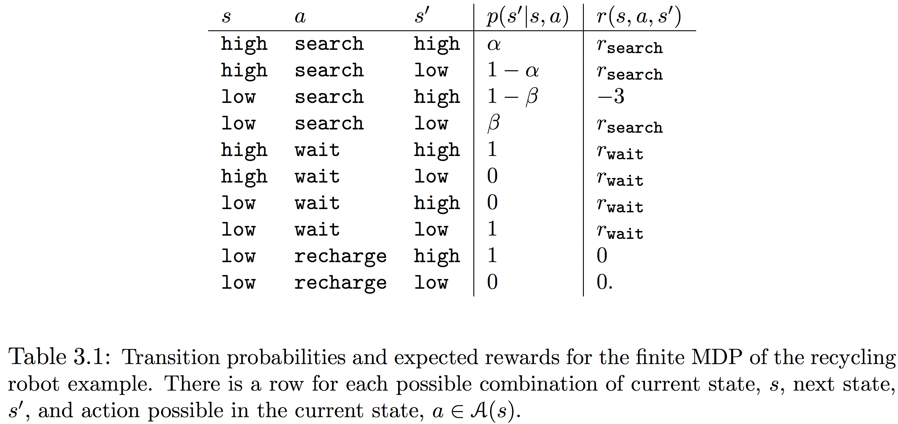
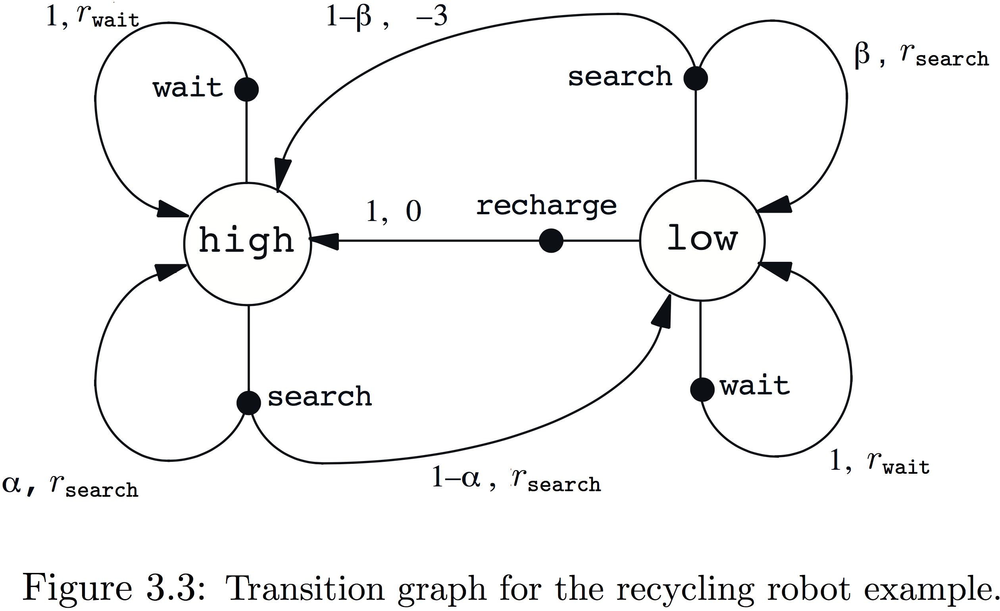
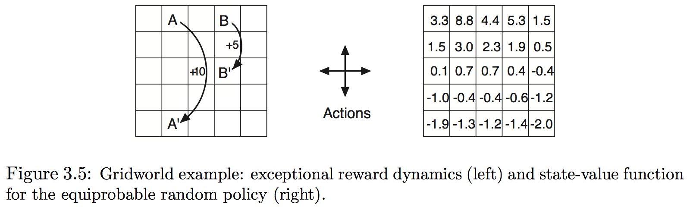
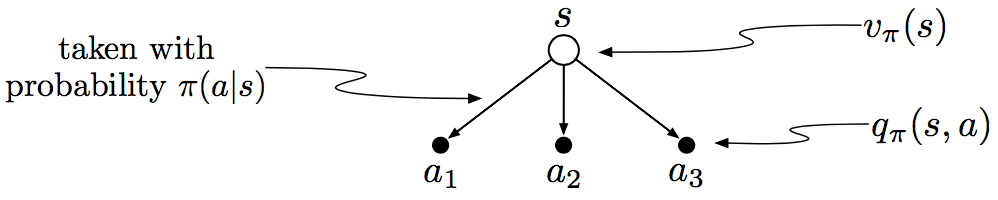
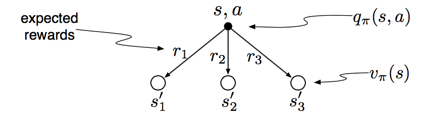

[TOC]

本章介绍本书剩余部分所要解决的问题。可以认为这个问题定义了强化学习的领域：任何适于解决此问题的方法都认为是一种强化学习方法。

##### 3.1 代理-环境接口

学习者和决策者称为**代理(agent)**， 与它互动的、代理以外的所有的事物统称为 **环境(enviroment)**。一个完整的环境明细(specification)包括激励(reward)机制、任务定义，和一个强化学习问题实例。代理和环境在离散的时间步序列$t=0,1,2,3,\cdots$上互动。在每个时间步$t$，代理获得一个环境**状态(state)** 的表示，$S_t \in \mathcal S$，（$\mathcal S$是所有可能的状态）；然后以状态为基础选择一个**行为(action)**，$A_t \in \mathcal A(S_t)$（$\mathcal A(S_t)$表示在状态$S_t$能获得的行为集）。一个时间步后，代理收到一个数值激励$R_{t+1} \in \mathcal R \subset \mathbb R$，并进入新状态$S_{t+1}$中。下图展示了这种代理-环境的互动。

在每个时间步，代理执行被称为**策略(policy)**的从状态到选择每个行为概率的映射，并记为$\pi_t$，其中$\pi_t(a|s)$表示若状态$S_t=s$行为$A_t=a$的概率。作为经验（经验应该是指代理过去学得的内容）的结果，强化学习方法指定了改变策略的方式。代理的目标就是最大化其长期的激励总量。

这个框架非常抽象和灵活，可以以不同的方式应用到不同的问题。比如，时间步不必是真实时间的固定间隔，可以是任意决策或行为的连续状态；行为和状态都可以采用非常多的形式；特别是，代理和环境的边界并非如机器人或动物身体的物理边界那样，通用的原则是任何无法被代理随意改变的事物都认为是环境的一部分，也可以因为不同的原因设置在不同位置。

**示例3.1：生物反应器**

**示例3.2：挑选和定位机器人**

**示例3.3：回收机器人**    一个在办公环境回收金属罐的移动机器人，有检测传感器、拾取臂爪和存放箱子，由充电电池驱动，搜寻金属罐的决策则由基于当前电池电量水平的RL代理制定。代理需决定机器人是否要：(1)在特定时间段积极搜寻金属罐，(2)保持静止等待别人带来，(3)回到基座充电。这些决策必须周期性或者特定事件发生（比如找到空罐）时做出，代理因此有三种行为，状态由电池状态决定。激励大多时候为0，在弄到空罐时为正，或电量一直下降为大负数。这里的RL代理并非整个机器人，其监测的状态描述机器人内部情形，因此代理的环境包含机器人的其余部分，以及机器人的外部环境。

**练习3.1** 设计三个适用于强化学习框架的任务，确定每一个的状态、任务和激励。使得它们尽可能地不同。

**练习3.2** 强化学习框架是否足够能有效地表示所有目标导向的学习任务？能举出任何反例吗？

**练习3.3** 考虑驾驶问题，可定义行为是加速器、方向盘、刹车，即身体接触机器的地方；也可以是轮胎扭矩，即远离身体的外部；或者是肌肉扭动控制身体，即深入身体的内部；还可以是驶向何方的选择。什么才是正确的层次？基于何种基础相比其它更好？是否有解释一个位置比另一个更好的基本理由，或只是自由选择？

##### 3.2 目标和激励

代理的目标是最大化获得的总激励的数目，这表明不是即时激励，而是长期累积的激励。形式化的思想可以用**激励假设(reward hypothesis)**来清楚地阐述：

> 所有关于目标(goals)或目的(purposes)含义都可以认为是激励信号累积值期望的最大值。

使用激励信号来形式化目标的思想，是强化学习最独特的特征之一，并已经证明足够地灵活和有效。需要注意虽然大多数动物最终目标感知的计算都发生在机体内，但仍然认为目标和激励处于代理之外，属于环境。因为**将学习代理的边界置于其控制的极限而非物理身体的极限非常方便**，而这并不会妨碍代理为自己定义内部激励。

##### 3.3 回报

那如何正式地定义代理的目标呢？假设时间步$t$后的激励序列为$R_{t+1}, R_{t+2}, R_{t+3},\cdots$,通常会寻求最大化**期望的回报(expected return)**，其中的回报(return)定义为激励序列的特定函数。最简单的方式就是定义为激励之和：
$$
G_t \dot=R_{t+1} + R_{t+2} + \cdots + R_T \tag{3.1}
$$

其中$T$是结束的时间步。这种方法在时间步会自动结束的应用有效，即代理-环境的互动可以明显地分为称之为**节(episodes)**的子序列，比如比赛、迷宫旅行以及任何其它重复的互动形式，每一节以特殊的**终止状态(terminal state)**结束，然后重置为标准的开始状态或开始状态分布的采样，即便以不同的方式结束，下一节的开始依然与前一节的结束方式无关，因此所有的节都可以认为是以相同的终结状态结束，只是不同的结果有不同的激励。有节的任务都被认为是**分节任务(episodic tasks)**，有时这种任务需要从所有状态$\mathcal S^+$中区分出所有非终结状态$\mathcal S$。

但也有很多无限运行的**持续任务(continuing task)**就无法使用(3.1)的回报公式，因$T = \infty$，要最大化的回报也很易是无限大。这里引入**折扣(discounting)**的概念，即代理尝试选择使得以后折扣激励之和最大的行为。特别地，它选择$A_t$来最大化期望的折扣回报：
$$
G_t \dot=R_{t+1} + \gamma R_{t+2} + \gamma^2R_{t+3} + \cdots  = \sum_{k=0}^\infty \gamma^k R_{t+k+1} \tag{3.2}
$$

其中参数$\gamma \in [0,1]$称为折扣速率，它决定了未来激励的当前值：即**未来$k$步获得的激励仅是其即时获得的$\gamma^{k-1}$倍**。若$k<1$，则只要激励序列$R_k$是有界的，这个无限的和就有有限的值。若$\gamma=0$，则代理就是近视的，仅关心最大的即时激励；若代理的所有行为仅影响即时利益，则近视代理就能通过分别最大化每个激励来最大化(3.2)；但在一般情况下，这样就减少了获得未来激励的机会，因此事实上的回报会减小；随着$\gamma$接近1，目标就越来越重视未来的激励，代理就变得越来越有远见。

**示例3.4  平衡杆**：图3.2的目标是对沿车辙移动的小车施力，阻止铰在车上的杆掉落。若杆偏离沿垂直线超过一定角度或者小车驶离车辙，则任务失败，在每次失败后杆重设为直立。此任务可视为分段任务，每一节就是使杆平衡的重复尝试。这时每一个未失败时间步的激励就是+1，因此每次的回报就是失败前的步数。或者，也可以使用折扣将其视为连续任务。这时每个失败的激励就是-1，其余为0。每次的回报会就与$-\gamma^K$有关，$K$是失败前的步数。每种情况下，回报由尽可能长地保持杆平衡来最大化。

**练习3.4** 假设视平衡杆为分节任务，但依然使用失败为-1其余为0激励的折扣。则每次的回报是什么？与此任务的连续折扣形式的区别是什么？

**练习3.5** 设计一个走迷宫机器人，给逃出迷宫激励为+1，其余为0。任务似乎自然分节——每次成功逃脱——目标就是最大化总激励的期望。在运行学习代理一段时间后发现对逃出迷宫没有任何改进，问题出在哪里？与代理有效沟通了需要实现的目标了吗？

连续时间步的回报以对强化学习理论和算法重要的方式相互联系：
$$
\begin{eqnarray*}
G_t
&=& R_{t+1} + \gamma R_{t+2} + \gamma^2 R_{t+3} + \gamma^4 R_{t+4} + \cdots \\
&=& R_{t+1} + \gamma\left(R_{t+2} + \gamma R_{t+3} + \gamma^2 R_{t+4} + \cdots \right) \\
&=& R_{t+1} + \gamma G_{t+1} \tag{3.3}
\end{eqnarray*}
$$
若定义$G_T=0$，这就适用于所有$t<T$的时间步，即使在$t+1$步发生终结。这通常能方便从激励序列计算回报。

**练习3.6** 假设$\gamma=0.5$，并接收到如下激励序列：$R_1=-1, R_2=2, R_3=6, R_4=3, R_5=2$，其中$T=5$。则$G_0, G_1, \cdots, G_5$分别是什么？提示：回溯。

注意，尽管(3.2)的回报是无穷项之和，但若激励非0且不变，其值依然有界。如激励恒为+1，则回报为：
$$
G_t = \sum_{k=0}^\infty \gamma^k = \frac{1}{1-\gamma} \tag{3.4}
$$
**练习3.7** 假设$\gamma=0.9$，激励序列是$R_1=2$后接无穷的7，则$G_1$、$G_0$是什么？

##### 3.4 统一记号

前面说到强化学习任务有分节任务和连续任务两种，但在讨论分节任务时并不会区分不同的节，因此可以将每一节的结束视为进入特殊的只会转移到自身且激励为0的终止状态，比如：

这样就能将两者统一起来，甚至在引入折扣的时候也正确，因此回报可以写为：
$$
G_t \dot= \sum_{k=0}^{T-t-1} \gamma^k R_{t+k+1} \tag{3.5}
$$
包括了$T = \infty$和$\gamma=1$的情况（但不同时成立）。

##### 3.5 马尔科夫性质

本书中，“状态”表示任何代理能获得的信息，并假定由环境给出；即这里主要关注如何用获得的激励做决策而非设计状态信号。状态的表达可以是原始感知的高度处理版，也可以是从感知序列按时间建立的复杂结构。另一方面，也不应该期待状态信号包含关于环境的所有信息，即便对决策有用。理想的状态信号应该是能简洁归纳过去感知、还能保留所有相关信息。成功地包含所有相关信息的状态信号称为是马尔科夫的，或者具有马尔科夫特性。

对于一般的环境，在时间$t+1$对时间对时间$t$采取的行为$a$的反应，仅能由整个联合概率分布给出，即对所有的$r$，$s'$和所有过去事件$S_0,A_0,R_1,\cdots,S_{t-1}, A_{t-1},R_t,S_t,A_t$可能的值，有
$$
\text{Pr}\{S_{t+1}=s', R_{t+1}=r | S_0, A_0, R_1,\cdots,S_{t-1}, A_{t-1}, R_t,  s_t, A_t\} \tag{3.6}
$$
若状态信号具有马尔科夫特性，环境在时间$t+1$的反映仅依赖于在时间$t$状态和行为的表达，即对所有$r$，$s'$，$s$和$a$，有：
$$
p(s',r|s,a) \dot = \text{Pr}\{S_{t+1}=s', R_{t+1}=r | S_t=s, A_t=a\}\tag{3.7}
$$
这种情况下，环境和任务也被称为具有马尔科夫特性。

在具有马尔科夫特性的环境中，单步动态（公式3.6）使得在给定当前状态和行为时能够预测下一个状态和下一个激励期望。迭代这个公式，仅以当前状态和可能给出的目前为止的历史，就可以预测所有未来的状态和激励期望。即便状态信号为非马尔可夫的，将强化学习中的状态视为马尔科夫状态的近似也很有用。

马尔可夫特性在强化学习中非常重要，因为决策和价值被假设为仅是当前状态的函数，因此状态必须具有信息价值。本书中所有的理论都假设了马尔可夫状态信号，即便马尔可夫特性并非严格满足的情况，马尔可夫情形依然能帮助理解应用在这些情况中的算法。

**示例3.5  平衡杆状态**：在平衡杆任务中，若确切定义或能重建为沿车辙小车的位置和速度、车杆间的角度、以及杆的角速度，则信号状态就具有马尔可夫特性。理想车杆系统中，给定控制器行为，这些信息都是充分的。但实际中不可能确切获知，因任何传感器都会引入变形和延迟，更何况还会有其他因素的影响。这就使得状态仅是车和杆的位置与速度违背马尔科夫特性。

但通常位置和速度表现得很好。一些早期平衡车杆的研究将车的位置粗略划分为三个区域：右、左和中，这种明显非马尔科夫的状态已足够使用强化学习来解决这个问题。实际上粗略表示可能迫使学习代理忽略对任务无用的无害差别使其能快速学习。

**示例3.6 打扑克牌**：每个玩家5张牌，有轮回押注，即每个玩家用手中一些牌换一些新的，然后有一个终极轮回押注。在每一回，每个玩家必须同等或超过其他玩家最高的押注，否则退出（失败）。在第二回押注后，还未失败并有最好手牌的玩家获胜并获得所有赌注。

每个玩家的状态信号不同，他们仅知自己手中的牌，并假设无法通过过去的观察推测其他人的牌。另外，状态还应包括其他玩家的押注和牌数。尽管观察到的关于其他玩家的每件事都会影响他们持有不同手牌的可能性，实际上大多数在预测和决策时并无明确影响。好的玩家善于记住关键线索，结果是人们用于扑克决策的状态表示无疑是非马尔科夫的，决策大概也有缺陷，但依然在此任务中作出很好的决策。总结下来就是无法获得马尔科夫特性的状态表达在强化学习中并非严重问题。

**练习3.8 破损视觉系统**：想象一个视觉系统，第一次打开时，图像洪流涌入摄像头中，可以看到很多事物，但并非全部，比如闭塞或身后的物体。在看到第一个场景后，系统是否能获得环境马尔科夫的状态？若那天摄像头破损并为获得任何图像，则还能获得马尔科夫状态吗？

##### 3.6 马尔科夫决策过程(MDP)

满足马尔科夫特性的强化学习任务称为*马尔科夫决策过程*，或*MDP*。若状态和行为空间都有限，则称为有限马尔可夫过程（有限MDP），它在强化学习理论中十分重要。特定的有限MDP由状态和行为空间以及环境的一步动态定义。给定任意状态$s$和行为$a$，每对可能的下步状态$s'$和激励$r$的概率记为：
$$
p(s',r|s,a) \dot= \text{Pr}\left\{ S_{t+1}=s', R_{t+1}=r | S_t=s, A_t=a \right\} \tag{3.8}
$$
这些量完全指定了一个有限MDP的动态。本书其余部分大多数理论都隐含假设环境是有限MDP。由(3.8)确定的动态可以计算有关环境的任何事物，比如状态-行为对激励的期望：
$$
r(s,a) \dot= \mathbb E\left[ R_{t+1} | S_t=s, A_t=a \right] = \sum_{r \in \mathcal R}r\sum_{s' \in \mathcal S} p(s',r|s,a) \tag{3.9}
$$
**状态转移概率**：
$$
p(s'|s,a) \dot= \text{Pr}\left\{ S_{t+1}=s' | S_t=s, A_t=a \right\} = \sum_{r \in \mathcal R} p(s',r|s,a) \tag{3.10}
$$
以及状态-行为-下个状态三元组的期望激励：
$$
r(s,a,s') \dot=\mathbb E\left[ R_{t+1} | S_t=s, A_t=a, S_{t+1}=s' \right] = \frac{\sum_{r\in \mathcal R} rp(s',r|s,a)}{p(s'|s,a)} \tag{3.11}
$$
**练习3.9**：若当前状态是$S_t$，行为由随机策略$\pi$选择，则$R_{t+1}$关于4参数函数$p$的期望是什么？

**示例3.7：回收机器人MDP**：通过简化和提供更多细节，回收机器人可转变为简单MDP例子。假定环境以如下方式运行：寻找金属罐最好方法是积极搜寻，但会消耗电量，而等待则不会。每当机器人搜寻时，电量都有耗尽的可能。这种情况下机器人必须关机等待重用（产生低的激励）。

代理将决策完全作为电池能量水平的函数，它能辨别两种层面：*高*和*低*，将可能决策记为：*等待*、*搜寻*和*充电*。代理的动作集就是：
$$
\begin{aligned}
\mathcal A(\text{high}) &\dot= \{\text{search}, \text{wait}\} \\
\mathcal A(\text{low}) &\dot= \{ \text{search}, \text{wait}, \text{recharge} \}
\end{aligned}
$$
若能量水平为高，则一段搜寻总能在不耗尽电量情况下完成；高能开始的搜寻后，电量以$\alpha$的概率为高，以$1-\alpha$的概率减为低。另一方面，低能开始的搜寻后，电量以$\beta$的概率为低，以$1-\beta$的概率耗尽。耗尽后，机器人被重用，电量充回高。每个收集的金属罐激励计为+1，每次重用的激励计为-3，记$r_{\text{search}}$和$r_{\text{wait}}$($r_{\text{search}}>r_{\text{wait}}$)分别为搜寻和等待时金属罐的期望数，且假设回去充电途中不会收集金属罐。这样这个系统就是一个有限MDP，其转移矩阵和期望激励为：

**转移图**便于总结有限MDP动态，图3.3为回收机器人的转移图，有状态和行为两种节点。每个状态有一个状态节点（大圆圈），每个状态-行为对由一个行为节点（小圆点）。从$s$开始采取行为$a$，到达行为节点$(s,a)$，每个箭头对应一个三元组$(s,s',a)$，标记箭头转移概率$p(s'|s,a)$，转移激励期望$r(s,a,s')$。

**练习3.10**：给出与3.1类似的表，除了$p(s',r|s,a)$，它应该有$s,a,s',r$列和$p(s',r|s,a)$，以及每个$p(s',r|s,a)>0$的四元组一行。

##### 3.7 价值函数(Value Function)

几乎所有的RL算法都会涉及评估代理处于给定状态（或在给定状态下执行给定行为）好坏的**价值函数**——状态（或状态-行为）的函数。这里的“好坏”依据期望的回报定义，未来可期的激励取决于其采取的行为，因此价值函数由相应特定策略定义。

策略是从每个状态$s \in \mathcal S$和行为$a \in \mathcal A(s)$到在状态$s$采取行为$a$概率的定义。在策略$\pi$下状态的价值，记为$v_{\pi}(s)$是从$s$开始一直遵循$\pi$的期望回报。对于MDP，$v_{\pi}(s)$定义为：
$$
v_{\pi}(s) \dot=\mathbb E_{\pi}[G_t | S_t=s] = \mathbb E \left[ \sum_{k=0}^\infty \gamma^kR_{t+k+1} \middle| S_t=s \right] \tag{3.12}
$$
其中$\mathbb E_{\pi}[\bullet]$表示代理遵循策略$\pi$随机变量的期望，$t$是任意时间步。注意任意终止状态的价值总是0。称函数$v_{\pi}(s)$为**策略$\pi$的状态-价值函数**。

同样定义策略$\pi$下在状态$s$采取行为$a$的价值$q_{\pi}(s,a)$为从状态$s$开始一直遵循策略$\pi$采取行为$a$的期望回报：
$$
q_{pi}(s,a) \dot= \mathbb E_{\pi}[G_t \mid  S_t=t, A_t=a] = \mathbb E_{\pi}\left[ \sum_{k=0}^\infty \gamma^kR_{t+k+1} \middle | S_t=s, A_t=a \right] \tag{3.13}
$$
称$q_{\pi}$为**策略$\pi$的行为-价值函数**。

价值函数$v_\pi$和$q_\pi$可以从经验中估计。如果一个代理遵循策略$\pi$且对遇到的每个状态，都维护一个此状态后实际回报的均值，则当状态$s$遇到的次数趋于无穷时，其均值就会收敛于其价值$v_\pi(s)$。如果对一个状态的每个行为保持单独的均值，则这些均值同样会收敛到行为价值函数$q_\pi(s,a)$。这种估计方法被称为**蒙特卡洛方法**，因其涉及了在实际回报的许多样本上平均。但若状态很多，则对每个状态维持独立的均值就很不实际，这样代理就不得不将$v_\pi$和$q_\pi$维护为参数化函数（参数个数少于状态数），并调整参数以更好地匹配观察到的回报。这也能产生精确的估计，但依赖于参数化函数估算子的性质。

贯穿价值函数在RL和DP使用的基础特性是其满足特定的递归关系。对任意策略$\pi$和状态$s$，下面$s$的价值和可能后继状态的价值之间始终满足下面的**相容条件(consistency condition)**：
$$
\begin{eqnarray*}
v_\pi (s)
&\dot=& \mathbb E_\pi [G_t \mid S_t=s] \\
&=& \mathbb E[R_t+\gamma G_{t+1} \mid S_t=s] \\
&=& \sum_a \pi(a \mid s) \sum_{s'}\sum_r p(s',r \mid s,a) \bigl[ r + \gamma\mathbb E_\pi[G_{t+1} \mid S_{t+1}=s'] \bigr] \\
&=& \sum_a \pi(a\mid s) \sum_{s',r} p(s',r \mid s,a) \bigl[ r+\gamma v_\pi(s') \bigr],\ \ \ \ \forall s \in \mathcal S, \tag{3.14}
\end{eqnarray*}
$$
注意最后等式将两个和，一个对所有$s'$的价值，另一个对所有$r$值，归并为一个对两者所有可能值的和，本书会经常会用到这种归并和的方式来简化公式。这样最后的表达式很容易读为期望值。实际上是三个变量$a,s'$和$r$所有值的求和，对每个三元组，计算其概率$\pi(a\mid s)p(s',r\mid s,a)$来权衡中括号内的量，最后将所有概率求和来获得期望值。

公式(3.14)称为**$v_\pi$的贝尔曼方程(Bellman Equation)**，它表述了状态的价值与其后继状态价值的关系。如图3.4左边所示，从状态$s$出发，根结点在顶端，代理可以采取任意某个集合里的任意行为——图中为3个；之后环境会回应几个可能后续状态中的一个$s'$，以及一个激励$r$。贝尔曼方程将所有这些概率求均值，它表明开始状态的价值必须等价于下一状态（折扣）价值的期望加上期望的激励。

价值函数$v_\pi$是贝尔曼方程的唯一解。图3.4这样的图表称为**后备图(Backup Diagram)**，因其用图表示了形成RL方法核心的**更新(update)**或**备份(backup)**操作基础的关系。这些操作将价值信息从后继状态（或状态-行为）传输回一个状态（或状态-行为）。本书使用备份图来提供讨论算法的图形总结（与转移图不同，备份图的状态节点可以重复，而且时间总是向下流逝）。

**示例3.8 网格世界**：图3.5左边展示了一个简单MDP的四边网格世界，网格的每格对应环境的状态；每格都有东南西北四种可能行为；确定了代理后面进入的格；可能致使代理离开网格的行为不会改变位置，但激励为-1；其余行为激励为0，除了使代理离开特殊状态A和B的。从状态A，四种行为都使代理到达A'并产生+10的激励，从状态B任意行为使代理到B'并产生+5的激励。

假定代理在所有位置都以等概率选择四种行为（即随机策略），图3.5右边展示了这种策略折扣$\gamma=0.9$的价值函数$v_\pi$，由解(3.14)的线性方程计算而得。注意底部边缘的负值，由随机策略下高概率撞击边缘导致；这种策略下状态A是最佳状态，但其期待回报小于即时激励10，因从A代理到达A'，在这里很容易撞到网格边缘；而状态B的价值则大于即时激励5，因后继状态B'的价值为正。

**示例3.9 高尔夫**：为将高尔夫进洞表示为强化学习任务，每次击打记惩罚（负激励）为-1，直到击球进洞。状态为球的位置，状态价值是负的从此位置进洞需要击打次数，行为是以所选择球棍瞄准和击打球的方式。假定后两者已经给定，仅考虑球棍的选择，并假设为一个putter或一个driver。图3.6上部展示了一种总使用putter策略的可能状态-价值函数$v_{\text{putt}}(s)$；终止状态进洞的价值为0。假定从绿色区域的任意位置可以做一次putt（通过putter击球进洞），这些状态的价值为-1；如果在一个状态可以通过一次putt到达绿色区域，则其价值为-2；简化起见假定可以putt地非常精准单范围有限，这样在图上就可以有一个标为-2的尖利等高线；任意线和绿色区域间的位置恰好需两次击打来完成进洞。同样可以有标记为-3、-4 ··· 的等高线。Putt无法使球逃离沙子陷阱(sand trap)，因此它们的值为$\infty$。综上所言，通过putting从球座到进洞需6次击打。

**练习3.11**：给出行为价值$q_\pi$的贝尔曼方程。必须给出依照所有到$(s,a)$可能后继的$q_\pi(s',a')$的行为价值$q_\pi(s,a)$。这个方程的备份图如3.4右边所示。

**练习3.12**：贝尔曼方程必定对图3.5右边的价值函数$v_\pi$的每个状态都成立。以中心价值为0.7的状态为例，用数值展示对应于四个价值为+2.3、+0.4、-0.4、+0.7的临近状态，这个方程成立（数值仅精确到小数点后一位）。

**练习3.13**：在网格世界案例中，目标的激励为正值，碰到世界边缘为负值，其余为0。这些符号是否重要，还是仅是它们的间隔？用(3.2)证明：给所有的激励加上常数$c$，会给所有状态的价值加上一个常数$v_c$，因此并不影响任意策略下任意状态间的相对关系。写出$v_c$关于$c$和$\gamma$的表达。

**练习3.14**：考虑给一个迷宫逃离这样的分节任务的所有激励都加上一个常数$c$带来的影响。举例说明原因。

**练习3.15**：状态的价值取决于此状态下可能的行为以及当前策略下采取每种行为的可能性。可以用根节点为状态的小型备份树并考虑每种可能行为来看待这个问题：

给出根节点上状态对应这种直觉和图表的价值$v_\pi(s)$关于给定状态$S_t=s$期望叶子结点的价值$q_\pi(s,a)$的方程，应该包含一个以遵循策略$\pi$为条件的期望。然后再给出一个期望价值明确关于$\pi(a\mid s)$因此没有期望价值符号出现的方程。

**练习3.16**：行为的价值$q_\pi(s,a)$依赖于期望激励和剩余激励和的期望。同样以小型备份图看待，根节点为行为（状态-行为），分支为可能的下个状态：

对应这个直觉和图表，给出行为价值在给定$S_t=s,A_t=a$时$q_\pi(s,a)$关于期望激励$R_{t+1}$，以及下个状态的期望价值$v_\pi(S_{t+1})$的方程，应该包含一个并非以以遵循策略为条件为条件的期望。然后再给出一个期望价值确定关于(3.8)定义的$p(s',r\mid s,a)$的方程，因此没有期望价值符号出现。

##### 3.8 最优价值函数 

笼统地说，解决强化学习问题找到一个能获得很多长期激励的策略。对有限MDP，可以精确地定义最优策略：价值函数定义了一种关于策略的偏序关系。当策略$\pi$在所有状态的期望回报都大于或等于策略$\pi'$时，策略$\pi$被定义为优于或等于策略$\pi'$。也就是说，$\pi \ge \pi',\ \ \text{iff}\ v_\pi(s) \ge v_{\pi'}(s),\ \forall s\in \mathcal S $。总是至少存在一个策略优于其他所有策略，这就是**最优策略**，记为$\pi_*$；它们有共同的状态价值函数，称为**最优状态-价值函数**，记为$v_*$，并定义为：
$$
v_*(s) \dot= \max_\pi v_\pi(s),\ \ \ \ \forall s \in \mathcal S \tag{3.15}
$$
最优策略同样有共同的**最优行为-价值函数**，记为$q_*$，定义为：
$$
q_*(s,a) \dot= \max_\pi q_\pi(s,a),\ \ \ \ \forall s\in \mathcal S,a\in\mathcal A(s) \tag{3.16}
$$
对行为-状态对$(s,a)$，这个函数给出在状态$s$采取行为$a$后遵循最优策略的期望回报。因此，可以将$q_*$写为关于$v_*$的形式：
$$
q_*(s,a) = \mathbb E[R_{t+1} + \gamma v_*(S_{t+1}) \mid S_t=s, A_t=a] \tag{3.17}
$$
