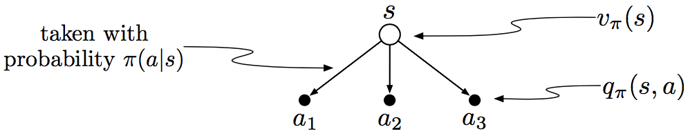
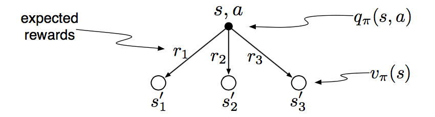

#### 复习与回顾

$t$时刻的**回报的定义**：
$$
\begin{eqnarray*}
G_t
&=& \sum_{k=0}^{T-t-1} \gamma^k R_{t+k+1} &\quad T=\infty\ \text{and}\ \gamma=1\ \text{not simultaneously}\\
&=& R_{t+1} + \gamma G_{t+1} &\quad \text{Bellman equation}
\end{eqnarray*}
$$
**马尔科夫特性**：若信号具有马尔科夫特性，则环境在$t+1$时刻的反应仅依赖于在时间$t$状态和行为的表达，即：
$$
P(S_{t+1},R_{t+1}|S_0,A_0,R_1,S_1,A_1,\dots,R_t,S_t,A_t) = P(S_{t+1}, R_{t+1} \mid S_n, A_n)
$$
**马尔科夫决策过程**：

- 满足马尔科夫特性的强化学习任务；若状态和空间都有限，为有限MDP；

- $p(s',r\mid s,a)$可完全指定一个有限MDP动态，计算有关环境的任何内容；

- **状态-行为的期望激励**：
  $$
  r(s,a) \dot= \mathbb E\left[ R_{t+1} | S_t=s, A_t=a \right] = \sum_{r \in \mathcal R}r\sum_{s' \in \mathcal S} p(s',r|s,a)
  $$

- **状态转移概率**：
  $$
  p(s'|s,a) \dot= \text{Pr}\left\{ S_{t+1}=s' | S_t=s, A_t=a \right\} = \sum_{r \in \mathcal R} p(s',r|s,a)
  $$

##### 价值函数(value function)：

- **策略$\pi$的状态-价值函数**，用于评估状态的好坏：
  $$
  v_{\pi}(s) \dot=\mathbb E_{\pi}[G_t | S_t=s] = \mathbb E_\pi \left[ \sum_{k=0}^\infty \gamma^kR_{t+k+1} \middle| S_t=s \right]
  $$

- **策略$\pi$的行为-价值函数**：用于评估某状态下某行为的好坏：
  $$
  q_{\pi}(s,a) \dot= \mathbb E_{\pi}[G_t \mid  S_t=t, A_t=a] = \mathbb E_{\pi}\left[ \sum_{k=0}^\infty \gamma^kR_{t+k+1} \middle | S_t=s, A_t=a \right]
  $$

- **$v_\pi$的贝尔曼方程**：表述状态的价值与其后继价值的关系：
  $$
  v_\pi(s) = \sum_a \pi(a\mid s) \sum_{s',r} p(s',r\mid s,a)\left[ r+\gamma v_\pi(s') \right]\quad\forall s \in \mathcal S
  $$

- **$q_\pi$的贝尔曼方程**：
  $$
  q_\pi(s,a) = \sum_{s',r}p(s',r\mid s,a) \left[ r + \gamma\sum_{a'}\pi(a'\mid s')q_\pi(s',a') \right]\quad \forall s\in\mathcal S, \forall a\in\mathcal A(s)
  $$

- **$v_\pi$与$q_\pi$的关系**：
  $$
  \begin{eqnarray*}
  v_\pi(s) &=& \sum_a \pi(a\mid s) q_\pi(s,a)\\
  q_\pi(s,a) &=& \sum_{s',r}p(s',r\mid s,a)\left(r+\gamma v_\pi(s')\right)
  \end{eqnarray*}
  $$

##### 最优价值函数：

- **最优状态价值函数$v_*$**：
  $$
  v_*(s) \dot= \max_\pi v_\pi(s),\quad \forall s \in \mathcal S
  $$

- **最优行为价值函数$q_*$**：
  $$
  q_*(s,a) \dot= \max_{\pi} q_\pi(s,a)\quad \forall s \in \mathcal S,\forall a\in \mathcal A(s)
  $$

- **$v_*$最优贝尔曼性方程**：
  $$
  v_*(s) = \max_{a\in\mathcal A(s)} \sum_{s',r}p(s',r\mid s,a)\left[ r+\gamma v_*(s') \right]
  $$

- **$q_*$最优贝尔曼性方程**：
  $$
  q_*(s,a) = \sum_{s',r} p(s'r\mid s,a) \left[ r+\gamma\max_{a'}q_*(s',a') \right]
  $$

- $v_*$与$q_*$的关系：
  $$
  \begin{eqnarray*}
  v_*(s) &=& \max_a q_*(s,a)\\
  q_*(s,a)v&=& \sum_{s',r}p(s',r\mid s,a)\left[ r+\gamma\max_{a'}q_*(s',a') \right]
  \end{eqnarray*}
  $$

#### 作业与练习

**练习3.1** 设计三个适用于强化学习框架的任务，确定每一个的状态、任务和激励。使得它们尽可能地不同。

- 贪吃蛇游戏：状态是蛇头所在位置，当蛇身碰到食物时是终止状态；任务是在蛇身不碰到食物的情况下尽可能多吃食物；蛇每一次移动为激励为0，吃到食物的激励为1。
- 五子棋：状态是棋盘上棋子的状态；
- 赛车游戏：状态是赛车所处的位置，撞车、出界为终止状态；任务是尽快到达终点；每前进一个单位路程

**练习3.2** 强化学习框架是否足够能有效地表示所有目标导向的学习任务？能举出任何反例吗？

- 不能，比如有监督学习任务、无监督学习任务。

**练习3.3** 考虑驾驶问题，可定义行为是加速器、方向盘、刹车，即身体接触机器的地方；也可以是轮胎扭矩，即远离身体的外部；或者是肌肉扭动控制身体，即深入身体的内部；还可以是驶向何方的选择。什么才是正确的层次？基于何种基础相比其它更好？是否有解释一个位置比另一个更好的基本理由，或只是自由选择？

- 驶向何方是正确的层次。驾驶问题就是要在路上安全地看车，那么所行驶的方向是最直接决定车辆安全的因素。其余的层次都太过底层，都需要中介才能影响到安全问题，这样未免就将问题复杂化了。
- 一个位置相对于另一个位置更好的基本原因是，这个位置的决定是直接影响学习问题的成败的。

**练习3.4** 假设视平衡杆为分节任务，但依然使用失败为-1其余为0激励的折扣。则每次的回报是什么？与此任务的连续折扣形式的区别是什么？

- 若视为连续任务，
- 若视为分节任务，

**练习3.5** 设计一个走迷宫机器人，给逃出迷宫激励为+1，其余为0。任务似乎自然分节——每次成功逃脱——目标就是最大化总激励的期望。在运行学习代理一段时间后发现对逃出迷宫没有任何改进，问题出在哪里？与代理有效沟通了需要实现的目标了吗？

**解答**：激励设置地有问题。对未逃离迷宫的每一步施加负激励。

**练习3.6** 假设$\gamma=0.5$，并接收到如下激励序列：$R_1=-1, R_2=2, R_3=6, R_4=3, R_5=2$，其中$T=5$。则$G_0, G_1, \dots, G_5$分别是什么？提示：回溯。
$$
\begin{eqnarray*}
G_5 &=& 0 \\
G_4 &=& R_5 + \gamma G_5 = 2 + 0.5 \times 2 = 3 \\
G_3 &=& R_4 + \gamma G_4 = 3 + 0.5 \times 3 = 4.5 \\
G_2 &=& R_3 + \gamma G_3 = 6 + 0.5 \times 4.5 = 8.25 \\
G_1 &=& R_2 + \gamma G_2 = 2 + 0.5 \times 8.25 = 6.125 \\
G_0 &=& R_1 + \gamma G_1 = -1 + 0.5 \times 6.125 = 2.0625
\end{eqnarray*}
$$
注意，从$G_1$和$G_2$可以看出即便激励序列都是正数，，只要$\gamma<1$，**$G_t$也不一定是递减的**。

**练习3.7** 假设$\gamma=0.9$，激励序列是$R_1=2$后接无穷的7，则$G_1$、$G_0$是什么？

因$n$项等比数列和的公式为：$\frac{a_1(1-q^n)}{1-q}$，因此有：
$$
\begin{eqnarray*}
G_1
&=& \sum_{k=2}^\infty \gamma^{k-2}R_k = \sum_{k=2}^\infty 0.9^{k-2} \bullet 7 \\
&=& 7\bullet\left( 0.9^0 + 0.9^1+0.9^2 + \cdots\right) \\
&=& \lim_{n \to \infty} \frac{1-0.9^n}{1-0.9} = 10 \\
G_0
&=& R_1 + \gamma G_1 = 2 + 0.9\times 10 = 11
\end{eqnarray*}
$$
可以得出结论，当$n\to \infty$时，等比数列和的公式为：
$$
\frac{a_1}{1-q}
$$

**练习3.8 破损视觉系统**：想象一个视觉系统，第一次打开时，图像洪流涌入摄像头中，可以看到很多事物，但并非全部，比如闭塞或身后的物体。在看到第一个场景后，系统是否能获得环境马尔科夫的状态？若那天摄像头破损并为获得任何图像，则还能获得马尔科夫状态吗？

- 看到第一个场景后，后面的场景就只与前一个场景有关了，因此是马尔科夫状态。
- 不能？

**练习3.9**：若当前状态是$S_t$，行为由随机策略$\pi$选择，则$R_{t+1}$关于4参数函数$p$的期望是什么？
$$
\begin{eqnarray*}
r(s)
&=& \mathbb E\left[ R_{t+1} \middle | S_t=s \right] \\
&=& \sum_{r\in \mathcal R} r\bullet p(r\mid s) \\
&=& \sum_{r \in \mathcal R} r \sum_{s' \in \mathcal S} p(s', r\mid s) \\
&=& \sum_{r \in \mathcal R} r \sum_{s' \in \mathcal S} \sum_{a \in \mathcal A(s)} p(s',r \mid s,a)
\end{eqnarray*}
$$

**练习3.10**：给出$p(s',r|s,a)$的类似3.1的表，它应该有$s,a,s',r$列和$p(s',r|s,a)$，以及每个$p(s',r|s,a)>0$的四元组一行。

|       $s$       |         $a$         |      $s'$       |          $r$          | $p(s',r\mid s,a)$ |
| :-------------: | :-----------------: | :-------------: | :-------------------: | :---------------: |
| $\mathtt{high}$ |  $\mathtt{search}$  | $\mathtt{high}$ | $r_{\mathtt{search}}$ |     $\alpha$      |
| $\mathtt{high}$ |  $\mathtt{search}$  | $\mathtt{low}$  | $r_{\mathtt{search}}$ |    $1-\alpha$     |
| $\mathtt{high}$ |   $\mathtt{wait}$   | $\mathtt{high}$ |  $r_{\mathtt{wait}}$  |         1         |
| $\mathtt{high}$ |   $\mathtt{wait}$   | $\mathtt{low}$  |  $r_{\mathtt{wait}}$  |         0         |
| $\mathtt{low}$  |  $\mathtt{search}$  | $\mathtt{high}$ |          -3           |     $1-\beta$     |
| $\mathtt{low}$  |  $\mathtt{search}$  | $\mathtt{low}$  | $r_{\mathtt{search}}$ |      $\beta$      |
| $\mathtt{low}$  |   $\mathtt{wait}$   | $\mathtt{high}$ |  $r_{\mathtt{wait}}$  |         0         |
| $\mathtt{low}$  |   $\mathtt{wait}$   | $\mathtt{low}$  |  $r_{\mathtt{wait}}$  |         1         |
| $\mathtt{low}$  | $\mathtt{recharge}$ | $\mathtt{high}$ |           0           |         1         |
| $\mathtt{low}$  | $\mathtt{recharge}$ | $\mathtt{low}$  |           0           |         0         |

**练习3.11**：给出行为价值$q_\pi$的贝尔曼方程。必须给出依照所有到$(s,a)$可能后继的$q_\pi(s',a')$的行为价值$q_\pi(s,a)$。这个方程的备份图如3.4右边所示。

全概率公式：若事件$A_1,\cdots,A_n$构成一个完备事件组，则对任意事件$B$有：
$$
\begin{eqnarray*}
P(B) &=& \sum_{i=1}^n P(A_i)P(B\mid A_i) \tag{1}\\
P(B\mid C) &=& \sum_{i=1}^n P{A_i}P(B\mid C, A_i)
\end{eqnarray*}
$$
若上面的条件中：$C=A_1+\cdots+A_n$，于是有：
$$
P(C) = \sum_{i=1}^n P(A_i) \tag{2}
$$
期望计算公式：
$$
\begin{eqnarray*}
\mathbb E(X+Y) &=& \mathbb EX + \mathbb EY \tag{3}\\
\mathbb E(X\mid y) &=& \sum_{x} x\bullet p(x\mid y) \\
\mathbb E(X\mid Y) &=& \sum_x x\bullet p(x\mid Y)
\end{eqnarray*}
$$
模仿$v_\pi$贝尔曼方程的推导过程：
$$
\begin{eqnarray*}
v_\pi(s)
&=& \mathbb E_\pi \left[ G_t \middle | S_t=s \right] \\
&=& \mathbb E_\pi \left[ R_{t+1} + \gamma G_{t+1} \middle | S_t=s \right] \\
&=& \mathbb E_\pi \left\{ \sum_a p(a\mid s) \bullet \left[ R_{t+1}+\gamma G_{t+1} \middle | S_t=s, A_t=a \right] \right\} \tag{1}\\
&=& \sum_a\pi(a\mid s) \bullet \left\{\mathbb E_\pi\left[ R_{t+1}\middle | S_t=s, A_t=a \right] + \gamma\mathbb E_\pi\left[ G_{t+1} \middle | S_t=s, A_t=a \right] \right\}  \tag{3}\\
&=& \sum_a\pi(a\mid s) \sum_r r\bullet p(r\mid s,a) + \sum_a\pi(a\mid s) \sum_rp(r\mid s,a) \bullet \gamma\mathbb E_\pi \left[ G_{t+1} \middle | S_t=s, A_t=a \right] \\
&=& \sum_a\pi(a\mid s) \sum_{r,s'} r\bullet p(r,s'\mid s,a) + \sum_a\pi(a\mid s) \sum_{r,s'}p(r,s'\mid s,a) \bullet \gamma\mathbb E_\pi \left[ G_{t+1} \middle | S_t=s, A_t=a \right] \tag{2}\\
&=& \sum_a\pi(a\mid s) \sum_{r,s'} r\bullet p(r,s'\mid s,a) + \sum_a\pi(a\mid s) \sum_{r,s'}p(r,s'\mid s,a) \bullet \gamma\mathbb E_\pi \left[ G_{t+1} \middle | S_{t+1}=s' \right] \\
&=& \sum_a \pi(a\mid s)\sum_{r,s'} p(s',r\mid s,a)\left[ r+\gamma v_\pi(s') \right]\quad \forall s \in \mathcal S
\end{eqnarray*}
$$
上面的过程中，从倒数第三步到倒数第二步，因为列举的是从$s,a$到$s'$，因此那一步就相当于是以$s'$为条件的了。于是
$$
\begin{eqnarray*}
q_\pi(s,a)
&=& \mathbb E_\pi \left[G_t \mid S_t=s, A_t=a\right]\\
&=& \mathbb E_\pi \left[ R_{t+1} + \gamma G_{t+1} \mid S_t=s, A_t=a \right]\\
&=& \sum_{s',r} p(s',r\mid s,a)\left[ r + \gamma v_\pi(s') \right] \\
&=& \sum_{s',r} p(s',r\mid s,a) \left[ r + \gamma\sum_{a'}\pi(a'\mid s')q_\pi(s',a,) \right]\\
\end{eqnarray*}
$$

**练习3.12**：贝尔曼方程必定对图3.5右边的价值函数$v_\pi$的每个状态都成立。以中心价值为0.7的状态为例，用数值展示对应于四个价值为+2.3、+0.4、-0.4、+0.7的临近状态，这个方程成立（数值仅精确到小数点后一位）。

由贝尔曼方程：
$$
v_\pi(s) = \sum_a\pi(a\mid s)\sum_{s',r} p(s',r\mid s,a)\left[ r+\gamma v_\pi(s') \right]
$$
本题中，$\pi=\text{stochastic}$，设中心为$\mathtt{center}$，相应四个后继状态集为$\mathcal S={\mathtt{cleft,cright,cup,cdown}}$，因此有：
$$
\begin{aligned}
&v_\text{stochastic}(\mathtt{center}) = 0.7\\
&\sum_{a\in \mathcal A(\mathtt{center})} \text{stochastic}(a\mid s)\sum_{s',r}p(s',r\mid s,a)\left[ r+\gamma v_{\text{schostic}}(s') \right]\\
&=0.25\times0.9\times \left[ 2.3+0.4-0.4+0.7 \right]\\
&=0.675 \approx0.7
\end{aligned}
$$
因此在中心状态是满足贝尔曼方程的。

**练习3.13**：在网格世界案例中，目标的激励为正值，碰到世界边缘为负值，其余为0。这些符号是否重要，还是仅是它们的间隔？用(3.2)证明：给所有的激励加上常数$c$，会给所有状态的价值加上一个常数$v_c$，因此并不影响任意策略下任意状态间的相对关系。写出$v_c$关于$c$和$\gamma$的表达。

对$\forall s \in \mathcal S$:
$$
\begin{aligned}
v_{\pi+c}(s)
&= \mathbb E_{\pi}\left[ G_t\mid S_t=s \right]\\
&= \mathbb E_\pi\left[ G_t+c\mid S_t=s \right]\\
&= \mathbb E\pi\left[ G_t \mid S_t=s \right] + c\\
&= v_\pi(s) + c
\end{aligned}
$$
因此并不影响任意策略下任意状态间的相对关系。其中$v_c=c$。

**练习3.14**：考虑给一个迷宫逃离这样的分节任务的所有激励都加上一个常数$c$带来的影响。举例说明原因。

**练习3.15**：状态的价值取决于此状态下可能的行为以及当前策略下采取每种行为的可能性。可以用根节点为状态的小型备份树并考虑每种可能行为来看待这个问题：

给出根节点上状态对应这种直觉和图表的价值$v_\pi(s)$关于给定状态$S_t=s$期望叶子结点的价值$q_\pi(s,a)$的方程，应该包含一个以遵循策略$\pi$为条件的期望。然后再给出一个期望价值明确关于$\pi(a\mid s)$故无期望价值符号出现的方程。
$$
\begin{eqnarray*}
v_\pi(s)
&=& \mathbb E_\pi[G_t\mid S_t=s] \\
&=& \sum_a \pi(a\mid s)\mathbb E[G_t\mid S_t=s,A_t=a]\\
&=& \sum_a \pi(s\mid s)q_\pi(s,a)\\
\end{eqnarray*}
$$

**练习3.16**：行为的价值$q_\pi(s,a)​$依赖于期望激励和剩余激励和的期望。同样以小型备份图看待，根节点为行为（状态-行为），分支为可能的下个状态：

对应这个直觉和图表，给出行为价值在给定$S_t=s,A_t=a$时$q_\pi(s,a)$关于期望激励$R_{t+1}$，以及下个状态的期望价值$v_\pi(S_{t+1})$的方程，应该包含一个并非以以遵循策略为条件为条件的期望。然后再给出一个期望价值确定关于(3.8)定义的$p(s',r\mid s,a)$的方程，因此没有期望价值符号出现。
$$
\begin{eqnarray*}
q_\pi(s,a)
&=& \mathbb E[G_t\mid S_t=s, A_t=a]\\
&=& \sum_{s',r} p(s',r\mid s,a)\mathbb E\left[ R_{t+1}+\gamma G_{t+1} \mid S_t=s,A_t=a \right]\\
&=& \sum_{s',r} p(s',r\mid s,a)\left\{ \mathbb ER_{t+1} + \gamma\mathbb E[G_{t+1}\mid S_t=s, A_t=a] \right\}\\
&=& \sum_{s',r} p(s',r\mid s,a)\left\{ \mathbb ER_{t+1} +  \gamma v_\pi(S_{t+1})\right\}\\
&=& \sum_{s',r} p(s',r\mid s,a)\left[ r+\gamma v_\pi(s') \right]
\end{eqnarray*}
$$
**练习3.17**：给出高尔夫示例的最优状态-价值函数。

**练习3.18**：给出高尔夫例子putting的最优行为-价值函数$q_*(s,\mathtt{putter})$的等高线。

**练习3.19**：给出回收机器人的$q_*$的贝尔曼方程。

**练习3.20**：图3.8给出了网格世界最佳状态的最优价值为保留小数点后一位的24.4，使用最优策略和(3.2)的知识用符号表示这个值并保留小数点后面三位。

**练习3.21**：考虑下图展示的连续MDP，唯一要做的决策是在顶部状态，有$\mathtt{left}$和$\mathtt{right}$两种行为，数字展示了每个行为确定的激励，恰有两种确定的策略$\pi_{\mathtt{left}}$和$\pi_{\mathtt{right}}$。在$\gamma$分别为0，0.5，0.9时，对应的优策略分别是什么？

**练习3.22**：给出$v_*$关于$q_*$的一个方程。

**练习3.23**：给出$q_*$关于$v_*$的一个方程，以及世界的动态$p(s',r\mid s,a)$。

**练习3.24**：给出$\pi_*$关于$q_*$的一个方程。

**练习3.25**：给出$\pi_*$关于$\pi_*$的一个方程，以及世界的动态$p(s',r\mid s,a)$。