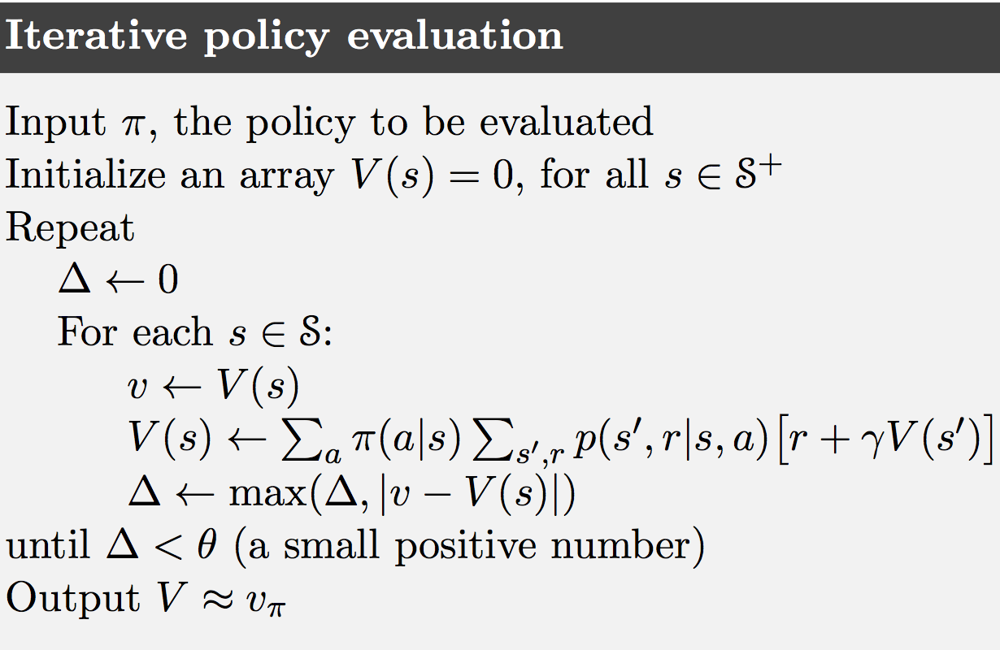

术语**动态规划(Dynamic Programming, or DP)**指一系列用于计算环境模型完美已知（如MDP）的最优策略的算法。因为完美环境模型的假设和巨大计算消耗，经典的DP算法在RL中作用有限，但理论上依然重要，因其是理解本书余下算法的必要基础。事实上，所有这些方法都可视为获得与DP相同效果的尝试，除了更少的计算和没有环境完美模型的假设。

假设环境是有限MDP，即状态、行为、和激励集合，$\mathcal S, \mathcal A(s)$，和$\mathcal R$，对$s \in\mathcal S$，是有限的；环境的动态由概率集合$p(s',r\mid s,a)$，对所有$s \in \mathcal S, a \in \mathcal A(s), r \in \mathcal R$和$s' \in \mathcal S^+$（$\mathcal S$加上终止状态若任务分节）。尽管DP思想可应用于连续状态和行为空间，但仅在特殊情况中才可能有精确解。DP和一般强化学习的关键思想，就是使用价值函数来组织和安排良好策略的搜索。回忆贝尔曼最优性方程：
$$
\begin{eqnarray*}
v_*(s)
&=& \max_a \mathbb E\left[ R_{t+1} + \gamma v_*(S_{t+1}) \middle | S_t=s, A_t=a \right] \\
&=& \max_a \sum_{s',r} p(s',r\mid s,a)\left[ r + \gamma v_*(s') \right] \tag{4.1}
\end{eqnarray*}
$$
或
$$
\begin{eqnarray*}
q_*(s,a)
&=& \mathbb E \left[ R_{t+1} +\gamma\max_a q_*(S_{t+1}, a') \middle | S_t=s, A_t=a \right] \\
&=& \sum_{s',r} p(s,r\mid s,a)\left[ r+\gamma\max_{a'} q_*(s',a') \right] \tag{4.2}
\end{eqnarray*}
$$
对任意$s \in \mathcal S, a \in \mathcal A(s)$和$s' \in S^+$。DP算法通过将贝尔曼方程转化为赋值，也就是改善期望价值函数近似的更新规则来获得。

##### 4.1 策略评估

首先考虑如何计算任意策略$\pi$的状态-价值函数$v_\pi$，这在DP中称为**策略评估(policy evaluation)**。这里也称为**预测问题**。对任意$s \in \mathcal S$：
$$
\begin{eqnarray*}
v_\pi(s)
&=& \mathbb E_\pi[G_t \mid S_t=s] \\
&=& \mathbb E_\pi[R_{t+1} + \gamma G_{t+1}\mid S_t=s] \\
&=& \mathbb E_\pi[R_{t+1} + \gamma v_\pi(S_{t+1})\mid S_t=s] \tag{4.3} \\
&=& \sum_a \pi(a\mid s) \sum_{s',r}p(s',r\mid s,a)\left[ r+\gamma v_\pi(s') \right] \tag{4.4}
\end{eqnarray*}
$$
其中$\pi(a\mid s)$是策略$\pi$下状态$s$时采取行为$a$的概率。只要$\gamma<1$或$\pi$下所有状态都能终止，则就能保证$v_\pi$的存在和唯一。若环境动态完全已知，则(4.4)就是$\left\vert\mathcal S\right\vert$个未知变量的$\left\vert\mathcal S\right\vert$线性方程组。这里更适合用迭代方法，考虑一个近似价值函数序列$v_0, v_1, v_2,\cdots$每个都映射$\mathcal S^+$到$\mathbb R$（这里的每个$v_k$都是状态的一种价值函数），初始估计$v_0$可任意选择（除终止状态必须为0），每个后继近似都通过使用(3.14)作为更新规则获得，对任意$s \in \mathcal S$：
$$
\begin{eqnarray*}
v_{k+1}(s)
&=& \mathbb E_\pi[R_{t+1}+\gamma v_k(S_{t+1}) \mid S_t=s] \\
&=& \sum_a \pi(a\mid s)\sum_{s',r} p(s',r\mid s,a) \left[ r+\gamma v_k(s') \right] \tag{4.5}
\end{eqnarray*}
$$
显然$v_k=v_\pi$是这个更新规则的固定点，因$v_\pi$的贝尔曼方程保证了这种情况的等价性。实际上，在与确保$v_\pi$存在相同的条件下，序列$\{v_k\}$通常展现为随$k \to \infty$收敛于$v_\pi$。这种算法称为**迭代策略评估**。

为从$v_k$得到每个后继近似$v_{k+1}$，迭代策略评估对每个状态$s$应用同样的操作：将$s$的旧价值替换为从$s$后继状态旧价值得到的新值，期待的即时激励，伴随着被评估策略下所有一步转移的可能性。称这种操作为**全备份**，每一步迭代**备份**每个状态的价值一次以产生新的近似价值函数$v_{k+1}$。有几种不同的全备份，取决于备份的是状态还是状态-行为，也取决于后继状态评估的值组合的精确方式。DP算法中所做的所有备份都是全备份，因其基于所有可能的下个状态而非一个样本。

要实现迭代策略评估的计算机程序，可以使用两个数组分别存储$v_k(s)$和$v_{k+1}(s)$。但更简单的是用一个数组并在“就地”更新旧值，也就是每个新的备份值立即覆盖旧值，然后依赖于状态备份的顺序，有时新值会代替旧值在(4.5)右侧使用。这种算法也收敛到$v_\pi$，事实上速度更快，因其获得新值后便立即使用。对就地算法而言，状态备份的顺序对收敛速度影响显著，在提到DP算法时记住通常是就地算法。

另一个实现点与算法的终止有关。正式情况下，迭代策略评估算法仅在极限情况下(in the limit)收敛，但实际中必须短于此停止。通常的停机条件是在每步迭代后测试$\max_{s\in\mathcal S}\left\vert v_{k+1}(s)-v_k(s) \right\vert$，当充分小的时候停止。下面展示了带停机标准的完整算法：

**示例4.1**：考虑下面展示的$4\times 4$网格世界，

非终止状态是$\mathcal S=\{1,2,\dots,14\}$，每个状态有4种行为$\mathcal A=\{\mathtt{up, down, right, left}\}$，也确定了相应的状态转移，除了使代理离开网格实际保持不变的行为。这是一个无折扣分节任务，所有转移的激励是-1直到到达终止状态。终止状态是图中阴影部分（尽管展示了两个地方但形式上是一个状态）。图4.1左侧展示了由迭代策略评估计算的价值函数序列$\{v_k\}$。最终评估实际是$v_\pi$，这种情况下给每个状态从次开始到终结的期望步数的负数。

**练习4.1**：示例4.1中，若$\pi$是等概率随机策略，则$q_\pi(11,\mathtt{down}), q_\pi(7,\mathtt{down})$分别是什么？

**练习4.2**：示例4.1中，若在状态13的正下方加入状态15，其行为$\mathtt{left, up, right, down}$分别转移到12，13，14和15。假定从原状态的转移不变，则等概率随机策略的$v_\pi(15)$是什么？若状态13的动态也发生变化，其行为$\mathtt{down}$将其带到新状态15，则这种情况下等概率随机策略的$v_\pi(15)$是什么？

**练习4.3**：行为价值函数$q_\pi$类似于(4.3)、(4.4)和(4.5)的等式，和其函数序列$q_0,q_1,q_2,\dots$的连续近似分别是什么？