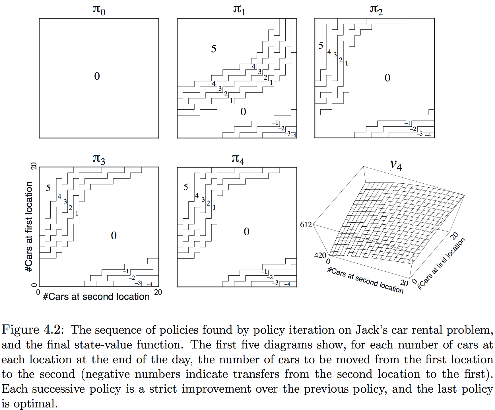

术语**动态规划(Dynamic Programming, or DP)**指一系列用于计算环境模型完美已知（如MDP）的最优策略的算法。因为完美环境模型的假设和巨大计算消耗，经典的DP算法在RL中作用有限，但理论上依然重要，因其是理解本书余下算法的必要基础。事实上，所有这些方法都可视为获得与DP相同效果的尝试，除了更少的计算和没有环境完美模型的假设。

假设环境是有限MDP，即状态、行为、和激励集合，$\mathcal S, \mathcal A(s)$，和$\mathcal R$，对$s \in\mathcal S$，是有限的；环境的动态由概率集合$p(s',r\mid s,a)$，对所有$s \in \mathcal S, a \in \mathcal A(s), r \in \mathcal R$和$s' \in \mathcal S^+$（$\mathcal S$加上终止状态若任务分节）。尽管DP思想可应用于连续状态和行为空间，但仅在特殊情况中才可能有精确解。DP和一般强化学习的关键思想，就是使用价值函数来组织和安排良好策略的搜索。回忆贝尔曼最优性方程：
$$
\begin{eqnarray*}
v_*(s)
&=& \max_a \mathbb E\left[ R_{t+1} + \gamma v_*(S_{t+1}) \middle | S_t=s, A_t=a \right] \\
&=& \max_a \sum_{s',r} p(s',r\mid s,a)\left[ r + \gamma v_*(s') \right] \tag{4.1}
\end{eqnarray*}
$$
或
$$
\begin{eqnarray*}
q_*(s,a)
&=& \mathbb E \left[ R_{t+1} +\gamma\max_a q_*(S_{t+1}, a') \middle | S_t=s, A_t=a \right] \\
&=& \sum_{s',r} p(s,r\mid s,a)\left[ r+\gamma\max_{a'} q_*(s',a') \right] \tag{4.2}
\end{eqnarray*}
$$
对任意$s \in \mathcal S, a \in \mathcal A(s)$和$s' \in S^+$。DP算法通过将贝尔曼方程转化为赋值，也就是改善期望价值函数近似的更新规则来获得。

##### 4.1 策略评估

首先考虑如何计算任意策略$\pi$的状态-价值函数$v_\pi$，这在DP中称为**策略评估(policy evaluation)**。这里也称为**预测问题**。对任意$s \in \mathcal S$：
$$
\begin{eqnarray*}
v_\pi(s)
&=& \mathbb E_\pi[G_t \mid S_t=s] \\
&=& \mathbb E_\pi[R_{t+1} + \gamma G_{t+1}\mid S_t=s] \\
&=& \mathbb E_\pi[R_{t+1} + \gamma v_\pi(S_{t+1})\mid S_t=s] \tag{4.3} \\
&=& \sum_a \pi(a\mid s) \sum_{s',r}p(s',r\mid s,a)\left[ r+\gamma v_\pi(s') \right] \tag{4.4}
\end{eqnarray*}
$$
其中$\pi(a\mid s)$是策略$\pi$下状态$s$时采取行为$a$的概率。只要$\gamma<1$或$\pi$下所有状态都能终止，则就能保证$v_\pi$的存在和唯一。若环境动态完全已知，则(4.4)就是$\left\vert\mathcal S\right\vert$个未知变量的$\left\vert\mathcal S\right\vert$线性方程组。这里更适合用迭代方法，考虑一个近似价值函数序列$v_0, v_1, v_2,\cdots$每个都映射$\mathcal S^+$到$\mathbb R$（这里的每个$v_k$都是状态的一种价值函数），初始估计$v_0$可任意选择（除终止状态必须为0），每个后继近似都通过使用(3.14)作为更新规则获得，对任意$s \in \mathcal S$：
$$
\begin{eqnarray*}
v_{k+1}(s)
&=& \mathbb E_\pi[R_{t+1}+\gamma v_k(S_{t+1}) \mid S_t=s] \\
&=& \sum_a \pi(a\mid s)\sum_{s',r} p(s',r\mid s,a) \left[ r+\gamma v_k(s') \right] \tag{4.5}
\end{eqnarray*}
$$
显然$v_k=v_\pi$是这个更新规则的固定点，因$v_\pi$的贝尔曼方程保证了这种情况的等价性。实际上，在与确保$v_\pi$存在相同的条件下，序列$\{v_k\}$通常展现为随$k \to \infty$收敛于$v_\pi$。这种算法称为**迭代策略评估**。

为从$v_k$得到每个后继近似$v_{k+1}$，迭代策略评估对每个状态$s$应用同样的操作：将$s$的旧价值替换为从$s$后继状态旧价值得到的新值，期待的即时激励，伴随着被评估策略下所有一步转移的可能性。称这种操作为**全备份**，每一步迭代**备份**每个状态的价值一次以产生新的近似价值函数$v_{k+1}$。有几种不同的全备份，取决于备份的是状态还是状态-行为，也取决于后继状态评估的值组合的精确方式。DP算法中所做的所有备份都是全备份，因其基于所有可能的下个状态而非一个样本。

要实现迭代策略评估的计算机程序，可以使用两个数组分别存储$v_k(s)$和$v_{k+1}(s)$。但更简单的是用一个数组并在“就地”更新旧值，也就是每个新的备份值立即覆盖旧值，然后依赖于状态备份的顺序，有时新值会代替旧值在(4.5)右侧使用。这种算法也收敛到$v_\pi$，事实上速度更快，因其获得新值后便立即使用。对就地算法而言，状态备份的顺序对收敛速度影响显著，在提到DP算法时记住通常是就地算法。

另一个实现点与算法的终止有关。正式情况下，迭代策略评估算法仅在极限情况下(in the limit)收敛，但实际中必须短于此停止。通常的停机条件是在每步迭代后测试$\max_{s\in\mathcal S}\left\vert v_{k+1}(s)-v_k(s) \right\vert$，当充分小的时候停止。下面展示了带停机标准的完整算法：
$$
\bbox[25px,border:2px solid]
{
\begin{aligned}
&\text{Input }\pi,\text{ the policy to be evaluated}\\
&\text{Initialize an array }V(s)=0,\text{ for all }s\in\mathcal S^+\\
&\text{Repeat}\\
&\qquad\Delta \leftarrow 0\\
&\qquad\text{For each }s\in\mathcal S:\\
&\qquad\qquad v \leftarrow V(s)\\
&\qquad\qquad V(s)\leftarrow\sum_a\pi(a\mid s)\sum_{s',r}p(s',r\mid s,a)\left[ r+\gamma V(s') \right]\\
&\qquad\qquad\Delta\leftarrow\max(\Delta,\left\vert v-V(s) \right\vert)\\
&\text{until }\Delta < \theta\text{ (a small positive number) }\\
&\text{Output }V\approx v_\pi
\end{aligned}
}
$$
**示例4.1**：考虑下面展示的$4\times 4$网格世界，

非终止状态是$\mathcal S=\{1,2,\dots,14\}$，每个状态有4种行为$\mathcal A=\{\mathtt{up, down, right, left}\}$，也确定了相应的状态转移，除了使代理离开网格实际保持不变的行为。这是一个无折扣分节任务，所有转移的激励是-1直到到达终止状态。终止状态是图中阴影部分（尽管展示了两个地方但形式上是一个状态）。图4.1左侧展示了由迭代策略评估计算的价值函数序列$\{v_k\}$。最终评估实际是$v_\pi$，这种情况下给每个状态从次开始到终结的期望步数的负数。

**练习4.1**：示例4.1中，若$\pi$是等概率随机策略，则$q_\pi(11,\mathtt{down}), q_\pi(7,\mathtt{down})$分别是什么？

**练习4.2**：示例4.1中，若在状态13的正下方加入状态15，其行为$\mathtt{left, up, right, down}$分别转移到12，13，14和15。假定从原状态的转移不变，则等概率随机策略的$v_\pi(15)$是什么？若状态13的动态也发生变化，其行为$\mathtt{down}$将其带到新状态15，则这种情况下等概率随机策略的$v_\pi(15)$是什么？

**练习4.3**：行为价值函数$q_\pi$类似于(4.3)、(4.4)和(4.5)的等式，和其函数序列$q_0,q_1,q_2,\dots$的连续近似分别是什么？

##### 4.2 策略改善

假定已确定任一策略$\pi$的价值函数，对某个状态$s$要知道是否需改变策略选择一个行为$a \neq \pi(s)$。已经知道从状态$s$遵循当前策略的好坏—就是$\pi(s)$，但转到新策略会变得如何呢？一种方法是考虑在$s$选择$a$，此后遵循已有的策略$\pi$。这种方法的价值是：
$$
\begin{eqnarray*}
q_\pi(s,a)
&=& \mathbb E_\pi \left[ R_{t+1} + \gamma v_\pi(S_{t+1}) \middle | S_t=s, A_t=a \right] \\
&=& \sum_{s',r} p(s',r \mid s,a) \left[ r + \gamma v_\pi(s') \right] \tag{4.6}
\end{eqnarray*}
$$
关键标准是看这个值与$\pi(s)$的大小。若有一次在$s$选择$a$然后遵循$\pi$比始终遵循$\pi$更好（这里的有一次不是试了很多次中的一次），则能够期待每次遇到$s$时选择$a$会更好，因此这个新的策略事实上就是一个更好的。

这是更一般的称为**策略改善理论**的一个特殊情况。令$\pi$和$\pi'$为任意策略对，若$\forall s \in \mathcal S$：
$$
q_\pi(s, \pi'(s)) \ge v_\pi(s) \tag{4.7}
$$
则策略$\pi'$必然与策略$\pi$同样或更好，也就是说$\pi'$必然从$\forall s \in \mathcal S$获得更多或相等的期望回报：
$$
v_\pi'(s) \ge v_\pi(s) \tag{4.8}
$$
若对任意状态(4.7)都是严格不等式，则(4.8)中至少有一个状态是严格的。这个结果尤其适用于考虑一个改变的策略$\pi'$与一个原始策略$\pi$除$\pi'(s)=a\neq\pi(s)$都是等价的，则(4.7)在除$s$外的所有状态都成立，因此若$q_\pi(s,a)>\pi(s)$，则改变的策略是比$\pi$更好的策略。

证明策略改善理论背后的思想很简单，从(4.7)开始持续展开$q_\pi$侧并反复应用(4.7)直到获得$v_{\pi'}(s)$：
$$
\begin{eqnarray*}
v_\pi(s)
&\le& q_{\pi'}(s, \pi'(s)) \\
&=&  \mathbb E_{\pi'} \left[ R_{t+1} +\gamma v_\pi(S_{t+1}) \middle | S_t=s \right] \\
&\le& \mathbb E_{\pi'} \left[ R_{t+1} +\gamma q_\pi(S_{t+1}, \pi'(S_{t+1})) \middle | S_t=s \right] \\
&=& \mathbb E_{\pi'} \left[ R_{t+1} +\gamma \mathbb E_{\pi'}(R_{t+2}+\gamma v_\pi(S_{t+2})) \middle | S_t=s \right] \\
&=& \mathbb E_{\pi'} \left[ R_{t+1} + \gamma R_{t+2}+\gamma^2 v_\pi(S_{t+2}) \middle | S_t=s \right] \\
&\le& \mathbb E_{\pi'} \left[ R_{t+1} + \gamma R_{t+2} + \gamma^2 R_{t+3} + \gamma^3v_\pi(S_{t+3}) \middle | S_t=s \right] \\
&\vdots& \\
&\le& \mathbb E_{\pi'} \left[ R_{t+1} + \gamma R_{t+2} + \gamma^2 R_{t+3} + \gamma^3R_{t+4} + \cdots \middle | S_t=s \right] \\
&=& v_{\pi'}(s)
\end{eqnarray*}
$$
目前已看到给定策略及其价值函数，如何评估此策略下在单个状态到一个特定行为的改变。很自然地想到考虑在所有状态到所有可能行为的改变，在每个状态选择表现出最好$q_\pi(s,a)$的行为。换句话说，考虑如下新的**贪心**策略：
$$
\begin{eqnarray*}
\pi'(s)
&\dot=&  \arg\max_a q_\pi(s,a)\\
&=& \arg\max_a \mathbb E\left[ R_{t+1} + \gamma v_\pi(S_{t+1}) \middle | S_t=s, A_t=a \right]\tag{4.9}\\
&=& \arg\max_a \sum_{s',r} p(s',r\mid s,a)\left[ r+\gamma v_\pi(s') \right]
\end{eqnarray*}
$$
贪心策略选择基于$v_\pi$短期的最优行为。由其构造，贪心策略满足策略改善理论的条件，因此与原策略相比他一样活着更加好。这样通过贪心选择原策略价值函数来产生新策略以改善原策略过程称为**策略改善**。

假定新的贪心策略$\pi'$，一样好、但不优于旧策略$\pi$，则$v_\pi = v_{\pi'}$。由(4.9)，它满足$\forall s \in \mathcal S$：
$$
\begin{eqnarray*}
v_{\pi'}(s)
&=& \max_a \mathbb E\left[ R_{t+1} + \gamma v_{\pi'}(S_{t+1}) \middle | S_t=s, A_t=a \right]\\
&=& \max_a \sum_{s',r} p(s',r\mid s,a) \left[ r+\gamma v_{\pi'}(s') \right]
\end{eqnarray*}
$$
这与贝尔曼最优性方程相同，因此$v_{\pi'}$必然是$v_*$，而$\pi$和$\pi'$都是最优策略。策略改善必然给出严格更优的策略除非原策略已是最优。

目前这节内容已经考虑了策略的特殊情况，更一般的案例中，一个随机策略$\pi$确定在每种状态下采取没中行为的概率$\pi(a\mid s)$，这一节所有的内容都能很简单地扩展到随机策略。尤其是策略改善理论像陈述地那样在随机情况中贯彻。另外，如果在策略改善步骤出现平局—即有多个行为取得了最大值—则在随机过程中不必从中挑选一个，而是每个最大的行为都赋予被新贪心策略选中的概率的一部分。任何分配计划都可以，只要所有次优行为都赋予0概率。

图4.1的最后一行展示了改善随机策略的一个示例。原策略$\pi$是等概率随机的，新策略$\pi'$，则是关于$v_\pi$贪心的，价值函数$v_\pi$展示在底部左侧图表中，可能的策略$\pi'$集在底部右侧图表。任何这样策略$v_{\pi'}(s)$的价值函数通过检查可看到所有状态$s \in \mathcal S$可能是-1，-2或-3，而$v_\pi(s)$最大是-14。因此$v_{\pi'}(s) \ge v_\pi(s),\quad\forall s\in\mathcal S$，展示了策略改善。尽管在这个示例中新的策略$\pi'$是最优，但通常仅能保证一步改进。

##### 4.3 策略迭代

一旦某个策略$\pi$用$v_\pi$改善产生更好的策略后，则能计算$v_{\pi'}$然后又产生更好的$\pi''$，因此就能获得一序列单调递增改进的策略和价值函数。
$$
\begin{CD}
\pi_0 @>E>> v_{\pi_0} @>I>> \pi_1 @>E>> v_{\pi_1} @>I>> \pi_2 @>E>> \cdots @>I>> \pi_* @>E>> v_*
\end{CD}
$$

其中$\begin{CD} @>E>> \end{CD}$表示策略评估，$\begin{CD} @>I>> \end{CD}$表示策略改善。每个策略都保证为前一个的严格改善（除非已是最优）。因有限MDP仅有有限的策略，这个过程必然会在有限次迭代后收敛到最优策略和最优价值函数。这种寻找最优策略的方法称为**策略迭代**，完整的算法在如下面所示（注意它有一个细小的缺陷，就是可能会在两个或多个同样好的策略中切换而永不终止，可通过增加额外的flag修正）。注意每个策略评估本身也是迭代计算，从前一个策略的价值函数开始。这通常能带来策略评估收敛速度的巨大提升（大概是因为价值函数从一个策略到下一个改变很小）。
$$
\bbox[25px,border:2px solid]
{
\begin{aligned}
1.&\text{Initialization}\\
&V(s) \in \mathbb R\text{ and }\pi(s) \in \mathcal A(s)\text{ arbitrary for all }s\in \mathcal S\\
\\
2.&\text{Policy Evaluation}\\
&\text{Repeat}\\
&\qquad\Delta \leftarrow 0\\
&\qquad\text{For each }s \in \mathcal S:\\
&\qquad\qquad v\leftarrow V(s)\\
&\qquad\qquad V(s) \leftarrow \sum_{s',r}p(s',r\mid s,\pi(s))\left[ r+\gamma V(s') \right]\\
&\qquad\qquad \Delta\leftarrow \max(\Delta,\left\vert v-V(s) \right\vert)\\
&\text{until }\Delta<\theta\text{ (a small positive number) }\\
\\
3.&\text{Policy Improvement}\\
&policy\text-stable \leftarrow true\\
&\text{For each }s\in\mathcal S:\\
&\qquad old\text-action \leftarrow \pi(s)\\
&\qquad \pi(s) \leftarrow \arg\max_{a} \sum_{s',r} p(s',r\mid s,a)\left[ r+\gamma V(s') \right]\\
&\qquad \text{If } old\text-action\neq\pi(s),\text{ then }policy\text-stable \leftarrow false\\
&\text{If }policy\text-stable,\text{ then stop and return }V\approx v_*\text{ and }\pi\approx\pi_*;\text{else go to 2}
\end{aligned}
}
$$
策略迭代通常以令人惊异的速度收敛，如图4.1的例子展示的那样。策略改善了理论保证了这些策略优于原始的随机策略。在这种情形中，这些策略不仅是更优，而是最优，以最小的步数进展到了终止状态。在这个示例中，策略迭代仅在一步之后就找到了最优策略。

**示例4.2 Jack的汽车租赁**：Jack管理一家全国范围汽车租赁公司的两个地点。每天一些顾客到每个地点租车。如果Jack有车则租出去然后通过全国公司记入\$10的贷方。若在那个地点没车，则错失这笔生意。车在被归还的后一天才能被出租。为确保车在需要的时候能获得，Jack可以在一夜之间将车在两个地点间移动，每辆车移动的代价为\$2。假定每个地点车辆的需求和归还数是泊松随机变量(Poisson random variables)，也就是数目为$n$的概率为$\frac{\lambda^n}{n!}e^{-\lambda}$，其中$\lambda$为期望数目。假定第一个地点租赁和归还的$\lambda$都是3，第二个地点租赁的$\lambda$为4，归还为2。假定每个地点不超过20辆车，一个晚上能从一个地点移动的车不超过5辆。取折扣率为$\gamma=0.9$并将此问题建立为连续有限MDP，时间步是天，状态是每个地点当天结束时的车辆数，行为是一晚在两地点间移动车辆的净数目。图4.2展示了策略迭代从永不移动车辆的策略开始找到的策略序列。

**练习4.4（编程）**：写一个策略迭代的程序并按照以下变化重新解决Jack的汽车租赁问题。Jack第一个地点的一个员工每晚乘公交回第二个地点附近的家，很乐意免费将车开到第二个地点。此方向额外的车和另一个方向所有车的移动的花销依然是\$2。另外，Jack在每个地点的车位有限，若一个地点一晚停有超过10辆车（在车的任何移动后），则需额外的\$4来使用第二个停车场（无论在那停几辆车）。这些非线性和任意动态经常在实际问题中出现，无法用动态规划以外的最优化方法来解决。为检查程序，先复现原始问题给出的结果。

**练习4.5**：如何定义行为价值的策略迭代？给出完整的与$v_*$类似的计算$q_*$的算法。要特别重视这个练习，因其包含的思想在本书其余部分都会用到。

**练习4.6**：假定仅考虑$\epsilon\text-soft$的策略，即在每个状态$s$选择每个行为的概率至少是$\epsilon/\left\vert\mathcal A(s)\right\vert$。以3、2、1的顺序，量化地描述$v_*$的策略迭代算法每一步相应的变化。

##### 4.4 价值迭代

策略迭代的一个缺陷是它本身包含策略评估—本身也可能是一个耗时的迭代计算。若迭代地完成策略评估，确切到$v_\pi$的收敛仅在极限时发生。事实上策略迭代的策略评估可以在不损失策略迭代收敛的保证下通过几种方法缩短。其中一个重要的特例是仅一步清扫后就停止策略评估。这种算法称为**价值迭代**，能够写为结合策略改善和缩短策略评估步骤的简单备份操作：
$$
\begin{eqnarray*}
v_{k+1}(s) 
&=& \max_a \mathbb E\left[ R_{t+1} + \gamma v_k(S_{t+1}) \mid S_t=s, A_t=a \right]\\
&=& \max_a \sum_{s', r} p(s',r\mid s,a)\left[ r+\gamma v_k(s') \right]
\end{eqnarray*}
$$
对$\forall s \in \mathcal S$。对任意$v_0$，序列$\{v_k\}$在保证$v_*$存在同样的条件下收敛到$v_*$。另一种理解价值迭代的方法是参考贝尔曼最优性方程(4.1)。注意价值迭代策略仅是将贝尔曼最优性方程转换为更新规则而得，同样注意价值迭代备份是如何与策略评估备份(4.5)等价的，除了它需从所有行为中采取最大值。也可以通过比较这些算法的备份图来理解这种紧密关系：图3.7左边展示了策略评估的备份图，而图3.7左侧展示了价值迭代的备份图。这两个是计算$v_\pi$和$v_*$的自然备份操作。

最后考虑价值迭代如何终止。与策略评估类似，价值迭代形式上要求无限次的迭代来恰好收敛到$v_*$。实际上一旦价值函数在一次清扫中仅改变很小的量时就停机。价值迭代有效地结合了策略评估的一次清扫和策略改善的每一次清扫。通常，整个缩短的策略迭代算法类可以认为是一系列清扫。其中一些使用策略评估备份，一些则使用价值迭代备份。因为(4.10)中的最大化操作是这些备份间仅有的差异，这就意味着最大操作附加到了策略评估的的清扫。所有这些算法收敛到折扣有限MDP的最优策略。
$$
\bbox[25px,border:2px solid]
{\begin{aligned}
&\text{Initialize array }V\text{ arbitrarily}\\
\\
&\text{Repeat}\\
&\qquad \Delta \leftarrow 0\\
&\qquad\text{For each }s \in \mathcal S:\\
&\qquad\qquad v \leftarrow V(s)\\
&\qquad\qquad V(s) \leftarrow \max_a\sum_{s',r}p(s',r\mid s,a)\left[ r+\gamma V(s') \right]\\
&\qquad\qquad \Delta \leftarrow \max(\Delta, \left\vert v-V(s) \right\vert)\\
&\text{until }\Delta < \theta\text{ (a small positive number)}\\
&\\
&\text{Output a deterministic policy, }\pi \approx\pi_*,\text{ such that}\\
&\qquad\pi(s) = \arg\max_a \sum_{s',r} p(s',r\mid s,a)\left[ r + \gamma V(s') \right]
\end{aligned}}
$$
**示例4.3 赌徒难题**：一个赌徒有机会为一系列抛掷硬币的结果下注。若硬币头朝上，他赢得与下注数相等的美元；若尾朝上，则输掉所下赌注。当赌徒赢得其目标100刀、或输掉所有钱后，游戏结束。每次抛掷，他都要决定用哪部分资本下注，以整数刀计。这个问题能表述为无折扣、分节、有限MDP。状态为赌徒的资本$s\in\{1,2,\dots,99\}$,行为为赌注$a\in\{0,1,\dots,\min(s,100-s)\}$。所有状态转移的激励都为0，除了赌徒达到自己目标时激励为+1。状态-价值函数给出从每个状态获胜的概率，策略为从资本水平到赌注的映射，最优策略最大化达到目标的概率。令$p_h$表示硬币头朝上的概率。若$p_h$已知，则整个问题就已知并能被例如价值迭代的方法解决。图4.3展示了$p_h=0.4$时，在价值迭代连续的清扫中价值函数的变化，和找到的最终策略，策略最优但不唯一。实际上，存在一个最优策略族，对应为关于最优价值函数参数最大选择的平局。试猜测整个族的样子。

**练习4.7**：为何赌徒问题的最优策略的形式如此奇怪？尤其是资本为50时堵上所有资本，但51时就不。为何这是好的策略？

**练习4.8（编程）**：实现赌徒问题的价值迭代并在$p_h=0.25$和$p_h=0.55$时解决此问题。编程中引入两个对应于资本为0和100的终止的伪状态可能会比较方便，分别赋予其价值0和1。似图4.3那样图形化展示结果。在$\theta \to 0$时结果是否稳定。

**练习4.9**：与(4.10)类似的行为价值$q_{k+1}(s,a)$价值迭代的备份是什么。

##### 4.5 异步动态规划

目前为止所讨论的DP方法都涉及MDP整个状态集的操作，若状态集非常大，则即便单步清扫的代价也会非常惊人。**异步DP算法**是不按照状态集系统清理组织的就地迭代算法，他们以任意顺序备份状态的价值，使用恰有的其他状态的任意价值。一些状态的价值可能在其他状态备份前已备份数次，然而为正确地收敛，异步算法必须继续备份所有状态的价值：在计算的一些点以后不能忽视任何状态。异步DP算法在选择备份操作应用到的状态中具有巨大的灵活性。

例如，一种异步价值迭代在每一步$k$，仅用(4.10)就地备份一个状态$s_k$。若$0 \le \gamma < 1$，则仅给定所有在序列$\{s_k\}$的状态仅发生有限次（序列甚至可以是随机的），就能保证渐进收敛到$v_*$（在无折扣分节情形中，可能存在一些备份顺序不导致收敛，但可以相对简单地避免）。同样，也可能混合策略评估和策略迭代备份来产生一种异步缩减策略迭代。显然一些不同的备份形成能灵活地用在多种无清理DP算法的模块。

当然避免清理并不一定意味着计算量更少，仅意味着算法在使用进展改善策略前无需被极度冗长的清理所束缚。可以尝试通过选择应用更新状态的这种灵活性的优势来改善算法进展的速度。可以尝试整理更新以使价值信息在状态间高效地传递。一些状态的价值可能无需像其他状态一样频繁更新，甚至可以尝试整个跳过某些状态的更新，若其与最优行为无关。

异步算法也使得计算与实时交互更简单。要解决给定的MDP，可以**在代理真实经历MDP的同时运行迭代DP算法**。代理的经验能用于确定DP算法将更新应用到哪个状态。同时，来自DP算法的最新价值和策略信息能够指导代理的决策。例如，可以在代理访问状态时更新它们，这使得DP算法的更新聚焦在状态集中与代理最相关的部分。这种聚焦是强化学习中反复的主题。

##### 4.6 广义策略迭代

策略迭代由两个同时、交互的进程组成，其中一个使价值函数与当前策略一贯（策略评估），另一个使策略对当前价值函数贪婪（策略改善）。在策略迭代中，这两个进程交替轮换，每个都在另一个开始前结束，但这并不是必须的。例如在价值迭代中，在每个策略改善之间仅进行单步策略迭代。在异步DP方法中，评估和改善过程则更细粒度地互相交错。某些情况中，在回到另一个之前单个进程仅更新单个状态。只要两个过程持续更新所有状态，最终通常都会收敛到最优价值函数和最优策略。

使用术语**广义策略迭代(GPI)**来表示与粒度和其他细节无关的策略评估和策略改善进程交互的一般思想。几乎所有的强化学习算法能用GPI很好地描述，即都有可识别的策略和价值函数，其中策略总是就价值函数改善，而价值函数则总被驱向策略的价值函数，如下图所示。显然若评估进程和改善进程都稳定，即不再产生变化时，则价值函数和策略就是最优的。仅当与当前策略一致时价值函数才稳定；而仅当关于当前价值函数贪心时策略才稳定。因此仅当策略关于其自身的评估函数贪心时两者才豆稳定。这就意味着贝尔曼最优性方程(4.1)成立，此时的策略和价值函数是最优的。

GPI中的评估和改善过程竞争与合作。就往相反的方向拉拽它们是竞争的，策略关于价值函数贪心通常会使价值函数对改变后的策略错误，而价值函数与策略一致通常导致策略不再贪心。然而就长期而言，这两个进程交互找到单个联合解决方法：最优价值函数和最优策略。也可以依照两个限制或目标来GPI中评估和改善进程的交互——比如下面图中二维空间中的两条直线。虽然实际的几何会复杂得多，但图表显示了实际案例中所发生的事。每个过程驱使价值函数或策略到其中一条直线，表示其中一个目标的解法。两个目标相交因两者并非正交，往一个目标的驱动会导致到另一个目标的远离。然后这个联合进程必然被带得离总体最优目标更近。在GPI中也可以向每个目标采用更小、非完整的步骤。在每种情况中，两个进程一起到达总体最优目标，尽管都没有尝试直接去实现。

