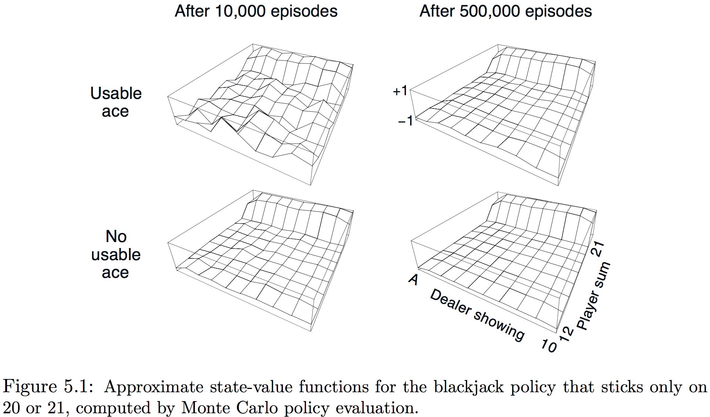

本章考虑第一个评估价值函数、探索最优策略的学习方法。不同于前面章节假设已知环境的完整知识，本章仅需**经验**——来自真实或模拟的与环境交互状态、行为和激励的样本序列。从**实际**经验的学习十分惊人，无需环境动态的先验知识也能获得最优行为；从**模拟**经验的学习也十分强大，尽管需要模型，但仅产生样本转移(transitions)，而非动态规划需要的所有转移的完整分布。

**蒙特卡洛（Monte Carlo，后面简称MC）方法**是基于平均样本回报来解决强化学习问题的方法。为获得定义良好的回报，这里仅为分节任务定义MC方法。即假定经验被分为小节，而无论选择什么行为所有小节最终都会终止。仅当一个小节结束时，价值评估和策略才会改变，因此MC方法是按节而非按步（在线）递增。术语“蒙特卡洛”常广义地用于任何涉及重要随机成分操作的评估方法，这里明确表示为基于平均完整回报的方法。

MC方法对每个状态-行为对采样并求平均**回报**。与第二章中采样并平均每个行为的激励的老虎机方法十分相似，主要不同是这里有多个状态，每个都似一个不同的老虎机问题并且互相关联。也即在某个状态采取某种行为之后的回报同一节中后面状态采取的行为。因所有的行为选择都在学习中，从更早状态的观点来看这个问题就变得非平稳。

为解决非平稳性，调整第四章中DP的GPI的思想，尽管从MDP的知识中计算了价值函数，这里用MDP从样本回报中学习价值函数。价值函数与相应策略以本质相同（GPI）的方法交互达到最优性，就像在DP章节，首先考虑预测问题（任意固定策略$\pi$的$v_\pi$和$q_\pi$的计算）然后策略评估，最后是控制问题和其通过GPI的解法。所有这些从DP中获得的思想都扩展到仅有样本经验可得的MC情形中。

##### 5.1 蒙特卡洛预测

考虑学习给定策略的状态-价值函数的MC方法。状态的价值是期望回报——从此状态开始期望的累积未来折扣激励。则从经验估计它的方法就是对访问状态之后观察到的回报求均值。随着观察到的均回报多，均值就向期望价值收敛。这种思想贯穿于所有的MC方法。

假设给定一组遵循策略$\pi$通过状态$s$获得的小节，需估计$v_\pi(s)$。一节中每个$s$的出现被称为**到$s$的一次访问**。当然$s$会在同一节中被访问多次，称一节中被访问的第一次为**到$s$的首次访问**，**首次访问MC方法**将$\pi_s$估计为首次访问$s$之后所有回报的均值；而**每次访问MC方法**则将所有访问$s$后的回报求均值。这两种MC方法十分相似但有些许理论特性的差异。本章关注首访，并在下面以程序的形式显示了出来:
$$
\bbox[5px,border:2px solid]
{\begin{aligned}
  &\text{Initialize:}\\
  &\qquad \pi \leftarrow \text{policy to be evaluated}\\
  &\qquad V \leftarrow \text{an arbitrary state-value function}\\
  &\qquad Returns(s) \leftarrow \text{an empty list, for all }s\in \mathcal S\\
  \\
  &\text{Repeat forever:}\\
  &\qquad\text{Generate an episode using }\pi\\
  &\qquad\text{For each state }s\text{ appearing in the episode:}\\
  &\qquad\qquad G\leftarrow \text{return following the first occurrence of }s\\
  &\qquad\qquad\text{Append G to }Returns(s)\\
  &\qquad\qquad V(s) \leftarrow \text{average}(Returns(s))
  \end{aligned}}
$$

随着访问／首次访问的次数趋于无穷，每次／首次MC都收敛于$\pi(s)$。这在首次访问MC中很容易理解：每个回报都是$v_\pi(s)$有限方差的独立同分布估计，由大数定律这些评估的均值系列收敛到期望值。每个均值本身是一个无偏估计，其误差的标准差作$1/\sqrt{n}$下降，其中$n$是求均值的回报数（也就是说估计平方收敛）。

**示例5.1 二十一点游戏**：流行的21店纸牌游戏的目标是获得数值和在不超过21情况下尽可能大的牌。所有脸牌计为10，A牌(ace)计为1或11，考虑每个玩家独立与庄家竞争的版本。游戏以庄家和玩家都被发到两张牌开始，庄家的一张牌朝上另一张朝下。若玩家立即有21（一张A和一张10），称为一个21点，然后他获胜，除非庄家也有一个21点，这种情况为平局。若玩家没有21点，则可要求额外的牌，一张接一张（要牌，hits），直到停止（停牌，sticks）或超过21(暴牌，goes bust)。若暴牌，则落败；若停牌，则轮到庄家。庄家按照固定策略：和不小于17时就停牌，否则要牌。若庄家暴牌，则玩家获胜；否则结果——胜、败或平——由最终的和更接近21决定。

玩21点可以自然地表述为分节有限MDP。每次21点游戏就是一节，胜局、败局、平局对应的激励为+1、-1、0。一个游戏中所有激励为0，且不使用折扣($\gamma=1$)，因此最终的激励也是回报。玩家的行为为要牌或者停牌，状态依赖于万家的牌和庄家展示的牌。假定从一副无限纸牌发出（即没有替换），因此记录已发的牌并没有作用。若万家持有一张A牌并且将它计为11不会暴牌，则称这个A牌是可用的，这种情况下总是计为11。因此玩家基于3个变量决策：自己的当前和(12-21)、庄家展示的牌(A-10)、以及自己是否持有一张可用的A牌，这样就有200个状态。

考虑玩家和为20或21则停牌否则要牌的策略，要用MC方法找到这种策略的状态-价值函数，可以用这种策略多次模仿这个游戏并求每个状态后面回报的均值。注意这个任务中同样的状态在不会在同一节出现，因此使用首次访问MC或没次访问MC都没区别。通过这种方法，可以获得图5.1展示的状态-价值函数，拥有一个可用A牌的状态显得更加不确定和不规律因其更不普遍。在任何结果中，在500000次游戏后价值函数都能很好地近似。

尽管拥有这个任务整个环境的知识，但应用DP方法来计算价值函数并不简单，它需要知道$p(s',r\mid s,a)$的数值——而确定21点任务的这些值并不简单。MC方法对仅是样本小节有效的能力即使是在拥有环境动态完整知识的情况下依然是一个巨大的优势。

备份图的一般思想是在顶点展示要更新的根节点，在下面展示所有激励和估计价值促成更新的转移和叶节点。对$v_\pi$的MC估计，根是状态节点，其下是顺着单个以终止状态结束的特定小节的转移的整个策略，如图5.2所示。DP图（图3.4左边）展示了所有可能的转移，而MC图一路到小节的终点。图之间的区别精确反映了两种算法间的本质区别。

MC一个很重要的事实是每个状态的估计都是独立的。一个状态的估计并不依赖于其他任何状态估计，与DP的情况一样。也就是说，MC方法并不像前面章节定义的那样**引导(bootstrap)**。特别是注意评估单个状态的价值计算成本独立于状态数，这就使得MC方法在仅需要一个或一部分状态的价值时变的尤为动人。可以产生许多以感兴趣状态开始的样本小节，仅对这些状态的回报求平均，这是MC方法相对于DP方法的第三个优势（在从实际经验和模拟经验中学习的能力之后）。