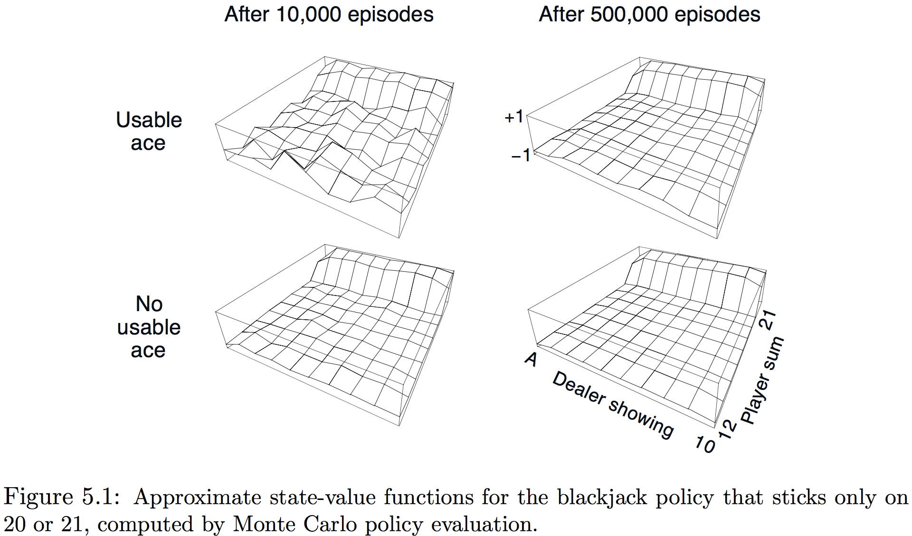
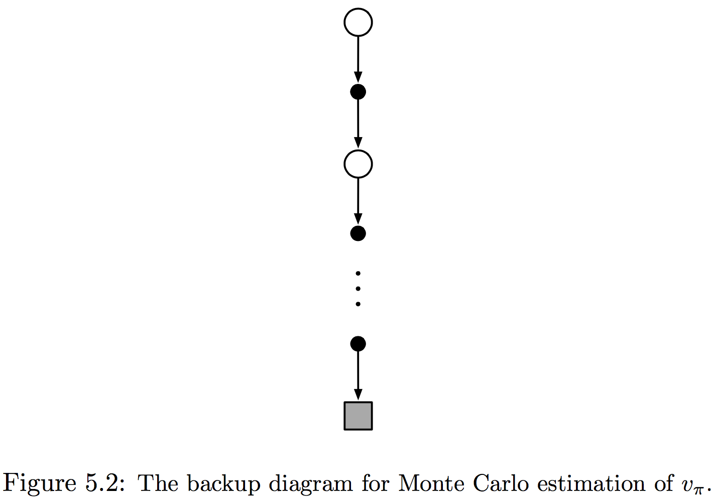
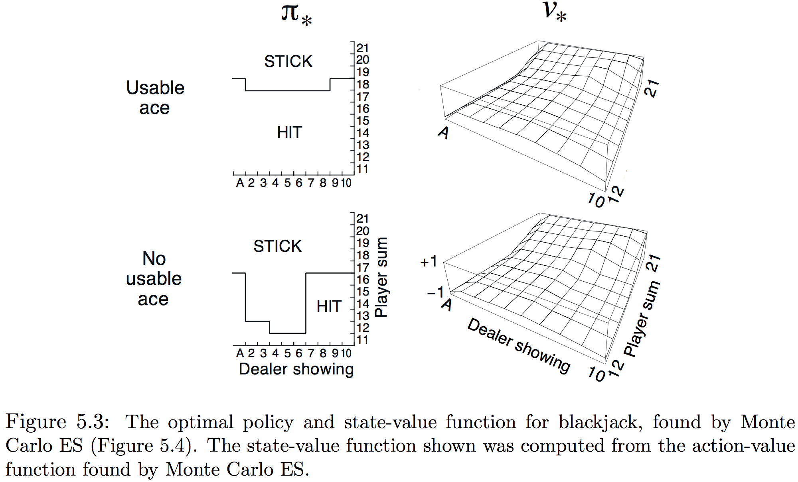
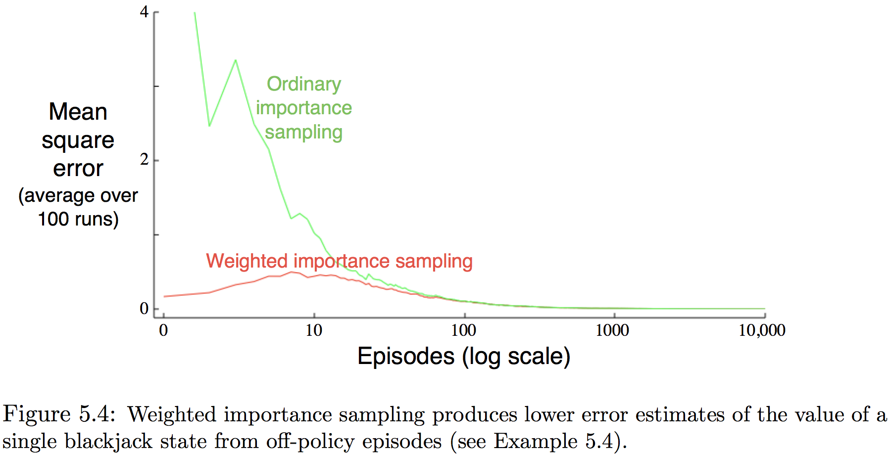
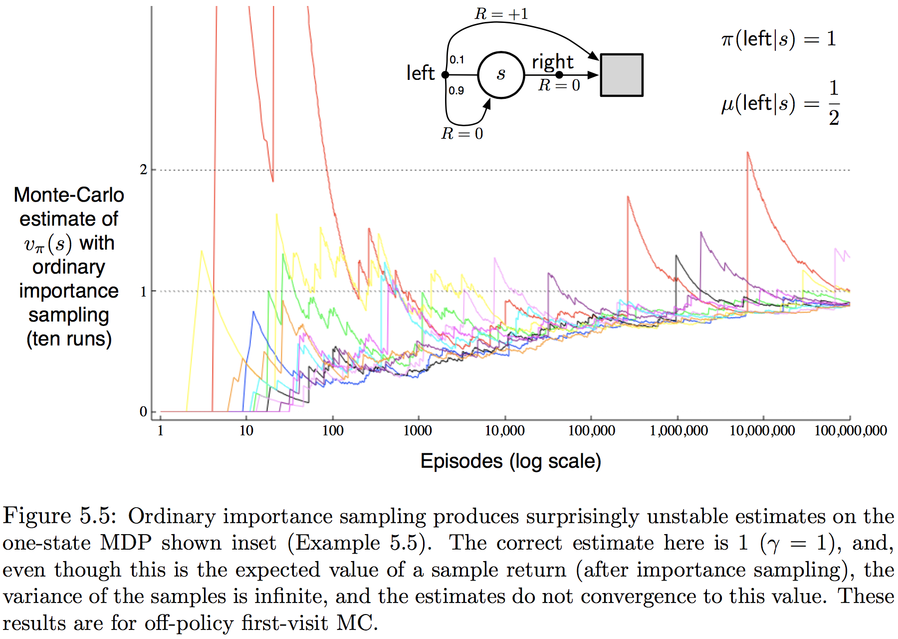
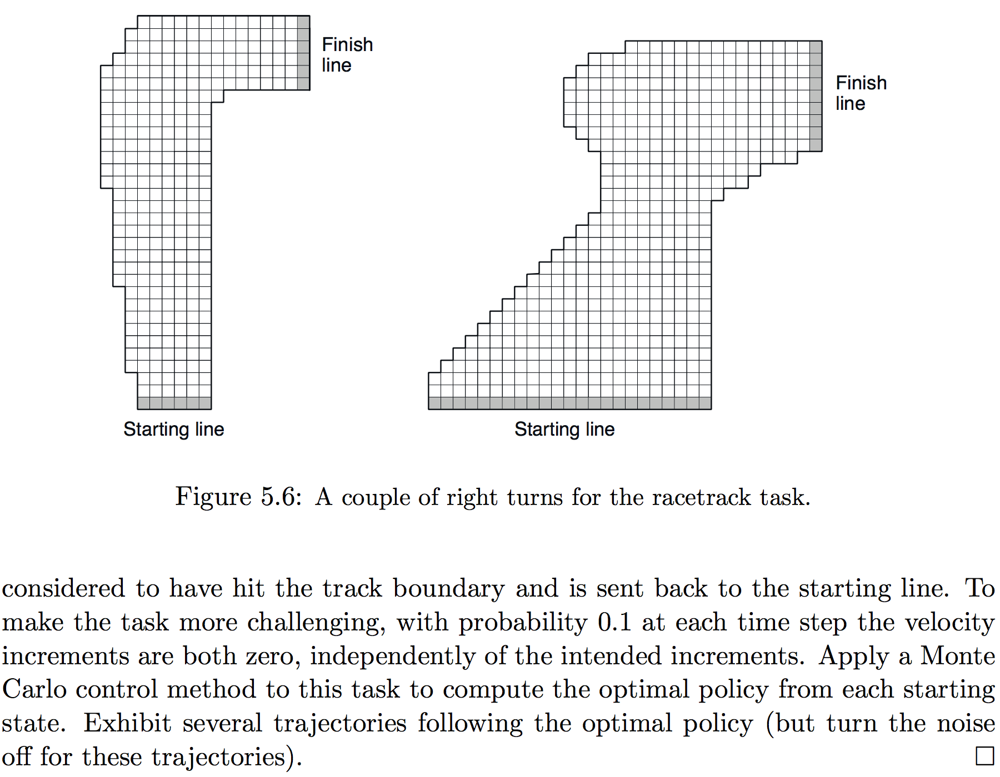

本章考虑第一个评估价值函数、探索最优策略的学习方法。不同于前面章节假设已知环境的完整知识，本章仅需**经验**——来自与环境真实或模拟交互的状态、行动和激励的样本序列。从**实际**经验学习的效果惊人，无需环境动态的先验知识也能获得最优行动；从**模拟**经验学习的能力也十分强大，尽管需要模型，但仅需样本转移(transitions)，而非动态规划需要的所有转移的完整分布。

**蒙特卡洛（Monte Carlo，后面简称MC）方法**是基于平均样本回报来解决强化学习问题的方法。为获得定义良好的回报，这里仅为分节任务定义MC方法。即假定经验被分为小节，而无论选择什么行动所有小节最终都会终止。仅当一个小节结束时，价值评估和策略才会改变，因此MC方法是**按节**而非按步（在线）递增。术语“蒙特卡洛”常广义地用于任何涉及重要随机成分操作的评估方法，这里明确表示为基于平均完整回报的方法。

MC方法对每个状态-行动对采样并求平均**回报**。与第二章中采样并平均每个行动激励的老虎机方法十分相似，主要不同是这里有多个状态，每个都是不同的老虎机问题并且互相关联。也即在某个状态采取某种行动之后的回报同一节中后面状态采取的行动有关。因所有的行动选择都在学习中，就较早状态的而言这个问题是非平稳的。

为解决非平稳性，调整第四章中DP的GPI的思想，尽管从MDP的知识中计算了价值函数，但这里用MDP从样本回报中学习价值函数。价值函数与相应策略以本质相同（GPI）的方法交互达到最优性，就像在DP章节，首先考虑预测问题（任意固定策略$\pi$的$v_\pi$和$q_\pi$的计算），然后评估策略，最后是控制问题和其使用GPI的解法。所有这些从DP中获得的思想都扩展到仅有样本经验可得的MC情形中。

##### 5.1 蒙特卡洛预测

考虑学习给定策略的状态-价值函数的MC方法。状态的价值是期望回报——从此状态开始期望的累积未来折扣激励。然后从经验估计它的方法就是对访问状态之后观测到的回报求均值。随着观察到的均回报多，均值就向期望价值收敛。这种思想贯穿于所有的MC方法。

假设用一组遵循策略$\pi$经过状态$s$获得的小节来估计$v_\pi(s)$。一节中每个$s$的出现被称为**到$s$的一次访问**。显然$s$会在同一节中被访问多次，称一节中第一次被访问为**到$s$的首次访问**，**首访MC方法**将$\pi_s$估计为首次访问$s$之后所有回报的均值；而**每次访问（每访）MC方法**则将所有访问$s$后的回报求均值。这两种MC方法十分相似但有些许理论特性的差异。本章关注首访，并在下面以程序的形式显示了出来:
$$
\bbox[5px,border:2px solid]
{\begin{aligned}
  &\underline{\mathbf{First\text{-}visit\space MC\space prediction,\space for\space estimating\space }V\approx v_\pi}\\
  \\
  &\text{Initialize:}\\
  &\qquad \pi \leftarrow \text{policy to be evaluated}\\
  &\qquad V \leftarrow \text{an arbitrary state-value function}\\
  &\qquad Returns(s) \leftarrow \text{an empty list, for all }s\in \mathcal S\\
  \\
  &\text{Repeat forever:}\\
  &\qquad\text{Generate an episode using }\pi\\
  &\qquad\text{For each state }s\text{ appearing in the episode:}\\
  &\qquad\qquad G\leftarrow \text{return following the first occurrence of }s\\
  &\qquad\qquad\text{Append G to }Returns(s)\\
  &\qquad\qquad V(s) \leftarrow \text{average}(Returns(s))
  \end{aligned}}
$$

随着访问／首次访问的次数趋于无穷，每次／首次MC都收敛于$\pi(s)$。这在首次访问MC中很容易理解：每个回报都是$v_\pi(s)$有限方差的独立同分布估计，由大数定律这些评估的均值系列收敛到期望值。每个均值本身是一个无偏估计，其误差的标准差作$1/\sqrt{n}$下降，其中$n$是求均值的回报数（也就是说估计平方收敛）。

**示例5.1 二十一点游戏**：21点纸牌游戏的目标是获得数值和不超过21的尽可能大的牌。所有脸牌计为10，A牌(ace)计为1或11，考虑每个玩家独立与庄家竞争的版本。游戏开始时庄家和玩家都发到两张牌，庄家的一张牌朝上另一张朝下。若玩家此时就有21（一张A和一张10），称为21点，则获胜；除非庄家也有21点，此时为平局。若玩家没有21点，则可要求额外的牌，一张接一张（要牌，hits），直到停止（停牌，sticks）或超过21(暴牌，goes bust)。若暴牌，则落败；若停牌，则轮到庄家。庄家按照固定策略：和不小于17时就停牌，否则要牌。若庄家暴牌，则玩家获胜；否则结果——胜、败或平——由最终谁的和更接近21决定。

玩21点可以自然地表述为分节有限MDP。每次21点游戏就是一节，胜局、败局、平局对应的激励为+1、-1、0。一个游戏中所有激励为0，且不使用折扣($\gamma=1$)，因此最终的激励也是回报。玩家的行动为要牌和停牌，状态依赖于玩家的牌和庄家展示的牌。假定从一副无限纸牌发牌（即没有替换），因此记录已发的牌没有用。若玩家持有一张A牌并且计为11时不会暴牌，则称此A牌是可用的，这种情况下总是计为11。因此玩家基于3个变量决策：自己当前牌的和(12-21)、庄家展示的牌(A-10)、以及自己是否持有一张可用的A牌，这样就有200个状态。

考虑玩家和为20或21则停牌否则要牌的策略，用MC方法计算这种策略的状态-价值函数。可以用此策略多次模仿这个游戏并求每个状态后面回报的均值。注意这个任务中同样的状态不会在同一节出现，因此使用首次访问MC或没次访问MC都没区别。通过这种方法，可以获得图5.1展示的状态-价值函数，拥有一个可用A牌的状态显得更加不确定和不规律因这种状态更不普遍。在任何结果中，在500000次游戏后价值函数都能很好地近似。

尽管拥有这个任务所有环境的知识，但应用DP方法来计算价值函数并不方便，它需要知道$p(s',r\mid s,a)$的数值——而确定21点任务的这些值并不简单。MC方法对仅是样本小节有效的能力即使是在拥有环境动态完整知识的情况下依然是一个巨大的优势。

备份图的一般思想是在顶点展示要更新的根节点，在下面展示所有激励和估计价值促成更新的转移和叶节点。对$v_\pi$的MC估计，根是状态节点，其下是顺着单个以终止状态结束的特定小节的转移的整个策略，如图5.2所示。DP图（图3.4左边）展示了所有可能的转移，而MC图一路到小节的终点。图之间的区别精确反映了两种算法间的本质区别。

MC一个很重要的事实是每个状态的估计都是独立的。一个状态的估计并不依赖于其他任何状态估计，与DP的情况一样。也就是说，MC方法并不像前面章节定义的那样**引导(bootstrap)**。特别是注意评估单个状态的价值计算成本独立于状态数，这就使得MC方法在仅需要一个或一部分状态的价值时变的尤为动人。可以产生许多以感兴趣状态开始的样本小节，仅对这些状态的回报求平均，这是MC方法相对于DP方法的第三个优势（在从实际经验和模拟经验中学习的能力之后）。

**示例5.2 肥皂泡**：将一个形为闭合圆环的金属框浸入肥皂水中以形成一个遵从框边界的肥皂表面或泡。若金属框的几何不规则但已知，则如何计算表面的形状。这个形状的特性为每一点其相邻点施加的合力为0（否则形状会发生变化）。这意味着表面在任一点的高度都是环绕其小圆内点高度的均值。另外，表面在其边界必须与金属框接触。解决这种问题的通常方法是放置一个网格在这个表面所覆盖区域之上并用迭代计算解出网格点之上的高度。边界上的网格点强制为金属框架，所有其他的则向周围四个最近邻高度的均值调整。然后迭代这个过程，与DP的策略评估迭代十分类似，最终收敛为到目标表面十分精确的近似。

这与MC方法最初设计来解决的问题类型十分相似。想象站立在这个表面上随机游走，从网格点以相同的概率随机向近邻点漫步，直到到达边界。事实证明边界上高度的期望值是所求表面在初始点高度的精确近似（实际上恰好是上面所描述迭代方法计算所得的值）。因此，可以简单通过求从一个点开始多次游走到达边界高度的均值来近似表面在此点的高度。若仅需求一个点或一部分点的值，则这种MC方法比基于局部连贯性的迭代方法要有效地多。

**练习5.1**：考虑图表5.1的右边，为何估计的价值函数会在尾部的最后两行跳起？为何在左边整个最后一行跌落？为何上面图表最前面的值比下面图表的要高？

##### 5.2 行动价值的蒙特卡洛估计

若模型不可得，则估计行动价值（状态-行动对的价值）相对于估计状态价值特别有用。利用模型，仅状态价值就足以确定策略，简单地向前看一步，选择引向激励和下个状态最佳结合的行动，就如在DP章节所做的；然而若没有模型，仅状态价值函数就不是充分的，必须明确地估计每个行动的价值以使价值在启示策略时有用。因此，MC方法的一个主要目标就是评估$q_*$。要实现这个目标，首先考虑行动价值的策略估计。

行动价值的策略评估问题就是评估$q_\pi(s,a)$，它的MC方法本质上与刚展示的价值函数类似，除了访问的是状态-行动对。在一节中若访问过状态$s$且采取行动是$a$，则称状态-行动对$s,a$被访问过。每次访问MC方法将状态-行动对的价值评估为所有访问其之后回报的平均；首次访问MC方法则对每节第一次访问此状态-行动对之后的回报求均值。与前面方法一样，随着访问状态-行动对的次数趋于无穷，这些方法二次地收敛到真实的期望价值。

唯一的难题在于很多状态-行动对可能永远不会访问到。如果$\pi$是一个确定性的策略，则遵循$\pi$从每个状态只能观察到其中一个行动的回报。没有回报来平均，其他行动的MC估计就无法用经验改善。这是**持续探索(maintaining exploration)**的普遍难题，就如第二章中$k$臂老虎机上下文所讨论的那样。要使行动价值的策略评估有效，必须保证持续探索的进行。实现这个的一种方法是**将这些节指定为以一个行动-状态对开始**，这样每一对作为开始就有一个非零的被选概率。这保证了所有的行动-状态对在无限次数小节的极限中被访问无限次，称此为**探索启动(exploring starts)**假设。

探索启动假设有时会有用，但无法普遍依赖于它，尤其是当从与环境的实际交互中直接学习时，那种情况下初始条件就不可能会这样有用。最通用的保证所有状态-行动对都会遇到的替代方法是仅考虑在每个状态都以非零概率随机选择所有行动的策略。后面会讨论这种方法的两种重要变体，目前仍保留探索启动的假设并完成整个蒙特卡洛控制方法的陈述。

**练习5.2**：$q_\pi$蒙特卡洛估计的备份图是什么？

##### 5.3 蒙特卡洛控制

现在考虑将MC评估用于控制，也即近似最优策略。总体思想是依据广义策略迭代(GPI)进行。GPI维护一个近似策略和一个近似价值函数，价值函数被不断地改变以更精确地近似当前策略的价值函数，关于当前策略也不断地改善。这两种改变在某种程度上相互对立，但一起推进策略和价值函数达到最优性。考虑经典策略迭代的MC版本，此方法会执行策略评估和策略改善完整的交替步骤，以任意策略$\pi_0$开始并以最优策略和最优行动-价值函数结束：
$$
\begin{CD}
\pi_0 @>\text E>> q_{\pi_0} @>\text I>> \pi_1 @>\text E>> q_{\pi_1} @>\text I>> \pi_2 @>\text E>> \cdots @>\text I>> \pi_* @>\text E>> q_*
\end{CD}
$$
其中$\begin{CD} @>\text E>> \end{CD}$表示一个完整的策略评估，$\begin{CD} @>\text I>> \end{CD}$表示一个完整策略改善。策略评估就像前面章节描述的那样完成，经历许多节，近似行动-价值函数渐近地趋于真实函数。现在假设事实上观察到无穷数目的节，另外节以探索启动产生。在这些假设下，MC方法能为任何$v_k$计算确切的$q_{\pi_k}$。策略改善通过使策略对当前价值函数贪婪而完成，这种情况下有行动价值函数，因此无需模型即可构建贪心策略。对任意行动价值函数$q$，相应的贪心策略就是对所有$s\in\mathcal S$，选择具有最大行动价值的行动：
$$
\pi(s) \dot= \arg\max_a q(s,a)\tag{5.1}
$$
策略改善就能通过构建每个$\pi_{k+1}$为关于$q_{\pi_k}$的贪心策略来完成。策略改善定理（4.2节）就能应用在$\pi_k$和$\pi_{k+1}$，因$\forall s\in\mathcal S$：
$$
\begin{aligned}
q_{\pi_k}(s,\pi_{k+1}(s))
&= q_{\pi_k}\left(s, \arg\max_a q_{\pi_k}(s,a)\right)\\
&= \max_a q_{\pi_k}(s,a)\\
&\ge q_{\pi_k}\left( s, \pi_k(s) \right)\\
&\ge v_{\pi_k}(s)
\end{aligned}
$$
这个定理保证了每个$\pi_k$都一致优于$\pi_k$，或都为最优策略的情况下与$\pi_k$等优。这转而也保证了整个过程收敛到最优策略和最优价值函数。通过这种方式就能使用MC方法在仅给定抽样小节而无其他环境动态知识的情况下找到最优策略。上面为简单得到MC方法收敛的保证做了两个不太可能的假设。一个是小节有探索启动，另一个是策略评估能有无穷数目的节来完成。要获得切实可行的算法就必须去除这两个假设。

先关注策略评估在无穷数目节上操作的假设。实际上即便在经典的DP方法如迭代策略评估中也会引起同样的问题，也仅是渐近收敛到真实价值函数。在DP和MC情形中都有两种方法来解决这个问题，一个是抓牢(hold firm)在每个策略评估中近似$q_{\pi_k}$的思想。做测量和假设来获得评估中误差大小和概率的范围(bounds)，然后在每个策略评估中采取充分的步骤来保证这些范围充分小。在保证达到某种程度近似的收敛上这种方法很可能会完全满足，但也很可能在任何但最小的问题上要求远多于在实践中能用的小节。

第二种方法是放弃在回到策略改善之前完成策略评估的尝试。在每个评估步骤将价值函数向$q_{\pi_k}$移动，但不指望真正接近除非超过很多步。在首次介绍GPI思想的时候（4.6节）也使用了这种思想，它的一个极端形式是价值迭代，其中策略评估的每步之间仅执行迭代策略评估的一次迭代。价值函数的就地版本更加极端，仅为单个状态交替改善和评估步骤。

对MC策略评估很自然以节为基础交替改善和评估。在每一节之后，观测到的回报用于策略评估，然后在这节所有访问到的状态上改善策略。完整的简明算法，被称为**探索启动的蒙特卡洛(Monte Carlo with Exploring Starts)**，或简写为**MCES**，具体如下：
$$
\bbox[5px,border:2px solid]
{\begin{aligned}
  &\underline{\mathbf{Monte\space Carlo\space ES\space(Exploring\space Starts),\space for\space estimating\space}\pi\approx\pi_*}\\
  \\
  &\text{Initialize, for all }s\in\mathcal S, a\in\mathcal A(s)\\
  &\qquad Q(s,a) \leftarrow \text{arbitrary}\\
  &\qquad \pi(s) \leftarrow \text{arbitrary}\\
  &\qquad Returns(s,a) \leftarrow \text{empty list}\\
  \\
  &\text{Repeat forever:}\\
  &\qquad \text{Choose }S_0\in\mathcal S\text{ and }A_0\in\mathcal A(S_0)\text{ s.t. all pairs have probability > 0}\\
  &\qquad \text{Generate an episode starting from }A_0,S_0,\text{ following }\pi\\
  &\qquad \text{For each pair }s,a\text{ appear in the episode:}\\
  &\qquad\qquad G \leftarrow \text{return following the first occurrence of }s,a\\
  &\qquad\qquad \text{Append }G\text{ to }Returns(s,a)\\
  &\qquad\qquad Q(s,a) \leftarrow \text{average}(Returns(s,a))\\
  &\qquad \text{For each }s\text{ in the episode:}\\
  &\qquad\qquad \pi(s) \leftarrow \arg\max_a Q(s,a)
\end{aligned}}
$$
在MCES中，每个行动-状态对的所有回报都被累积并平均，无论它们被观测到时有效的策略是什么。易见MCES不能收敛到任意次优策略。若收敛到次优，则价值函数最终会收敛到此策略的价值函数，那样反过来会引起策略的变化。仅当策略和价值函数都为最优时才达到稳定性，随着行动值函数的变化依时间减小，到达此最优固定点的收敛似乎是必然的，但还未被正式证明，而这是强化学习中最基础的开放理论问题之一。

**示例5.3 解决21点**：将MCES应用到21点十分直接，因这些节都是模拟游戏，安排包含所有概率的探索启动就十分方便。这种情况下只要简单地挑选庄家的牌、玩家的和、玩家是否有可用的A，所有的都以等概率随机。使用前面21点示例中的策略——仅在20和21停牌——作为初始策略，所有状态-行动对的初始价值函数可以为0。图5.3展示了MCES找到的最优策略，它与Thorp(1996)的基本战略相同，唯独除了可用A策略最左边的凹口，未在Thorp的战略中出现。尚不确定这种差异的原因，但很确信这里展示的确实是所描述版本的21点的最优策略。

##### 5.4 无探索启动的蒙特卡洛控制

下面考虑避免不切实际的探索启动假设。保证所有行动无穷次被选中的唯一通用方法就是代理持续选择它们。有两种方法来保证这个，导致了称之为**on-policy**方法和**off-policy**方法。on-policy方法试着评估和改善用于决策的策略，而off-policy方法则评估和改善一个不同于产生这些数据的策略。MCES是一种on-policy方法，这里展示一个on-policy的MC控制方法如何设计来避免不现实的探索启动假设。

在on-policy方法中，策略通常是**松弛的(soft)**，意味着对所有$s \in \mathcal S$和所有$a\in\mathcal A(s)$，都有$\pi(a\mid s)>0$，但逐渐向一个确定性的最优策略转移，本节展示的on-policy方法使用**$\varepsilon$-贪婪**策略，意味着大多数时间选择具有最大价值的行动，但以$\varepsilon$的概率随机选择行动，也即给定选择所有非贪婪行动的最小概率是$\frac{\varepsilon}{\left\vert \mathcal A(s) \right\vert}$，大量的剩余概率$1-\varepsilon+\frac{\varepsilon}{\left\vert \mathcal A(s) \right\vert}$给到最优行动。$\varepsilon$-贪婪是定义为对某个大于0的$\varepsilon$所有策略和行动满足$\pi(a\mid s)\ge\frac{\varepsilon}{\left\vert \mathcal A(s) \right\vert}$的**$\varepsilon$-松弛**策略的例子，也是在某种意义上最接近贪婪的。

On-policy的MC控制整体思想依然是GPI的，就像在MCES中，使用首访MC方法来评估当前策略的行动价值函数。然而没有探索启动的假设，无法简单地通过使策略关于当前行动价值贪婪来改善它，因其会阻碍对非贪婪行动更深的探索。好在GPI并不要求采取的策略一直是贪婪的，仅是移向贪婪策略。在这个on-policy方法中仅移向一个$\varepsilon$-贪婪策略。对任意$\varepsilon$-松弛策略$\pi$，任何关于$q_\pi$的$\varepsilon$-贪婪策略都保证更优于或等优于$\pi$，完整的算法如下：
$$
\bbox[5px,border:2px solid]
{\begin{aligned}
  &\underline{\mathbf{On\text{-}policy\space first\text{-}visit\space MC\space control\space(for\space \varepsilon\text{-}soft\space policies),\space estimates\space\pi\approx\pi_*}}\\
  \\
  &\text{Initialize, for all }s\in\mathcal S, a\in\mathcal A(s)\\
  &\qquad Q(s,a) \leftarrow \text{arbitrary}\\
  &\qquad Returns(s,a) \leftarrow \text{empty list}\\
    &\qquad \pi(a\mid s) \leftarrow \text{an arbitrary }\varepsilon\text{-soft policy}\\
  \\
  &\text{Repeat forever:}\\
  &\qquad \text{(a) Generate an episode using }\pi\\
  &\qquad \text{(b) For each pair s,a appearing in the episode:}\\
  &\qquad\qquad G \leftarrow \text{return following the first occurrence of }s,a\\
  &\qquad\qquad \text{Append }G\text{ to }Returns(s,a)\\
  &\qquad\qquad Q(s,a) \leftarrow \text{average}(Returns(s,a))\\
  &\qquad \text{For each }s\text{ in the episode:}\\
  &\qquad\qquad A^* \leftarrow \arg\max_a Q(s,a)\\
  &\qquad\qquad \text{For all }a\in\mathcal A(s)\text{:}\\
  &\qquad\qquad\qquad \pi(a\mid s) \leftarrow 
  \begin{cases}
  1-\varepsilon+\varepsilon/\left\vert \mathcal A(s) \right\vert,&\text{ if }a=A^*\\
  \varepsilon/\left\vert \mathcal A(s) \right\vert, &\text{ if }a\neq A^*
  \end{cases}
\end{aligned}}
$$
策略改善定理保证了任何关于$q_\pi$的$\varepsilon$-贪婪策略都是任意$\varepsilon$-松弛策略$\pi$的改善。令$\pi'$为$\varepsilon$-贪婪策略，适用策略改善定理的条件因对任意$s\in\mathcal S$：
$$
\begin{eqnarray*}
q_\pi(s,\pi'(s))
&=& \sum_a \pi'(a\mid s) q_\pi(s,a)\\
&=& \frac\varepsilon{\mathcal A(s)} \sum_aq_\pi(s,a) + (1-\varepsilon)\max_aq_\pi(s,a)\tag{5.2}\\
&\ge& \frac\varepsilon{\mathcal A(s)} \sum_aq_\pi(s,a) + (1-\varepsilon)\sum_a\frac{\pi(a\mid s)-\frac\varepsilon{\left\vert\mathcal A(s)\right\vert}}{1-\varepsilon}q_\pi(s,a)\\
&=& \frac\varepsilon{\mathcal A(s)} \sum_aq_\pi(s,a) - \frac\varepsilon{\mathcal A(s)} \sum_aq_\pi(s,a) + \sum_a\pi(a\mid s)q_\pi(s,a)\\
&=& v_\pi(s)
\end{eqnarray*}
$$
第三步的和是和为1的非负权重的加权平均，必小于或等于第二步中最大数的平均。由策略改善定理，$\pi'\ge\pi$，也即$\pi'(s)\ge\pi(s), \forall s \in \mathcal S$。现在证明仅当$\pi'$和$\pi$都为$\varepsilon$松弛策略中的最优策略时等号才成立，也即更优或等优于所有其他$\varepsilon$-松弛策略。考虑一个除了要求策略是在环境内移动且$\varepsilon$-松弛的其余都与原环境相同的新环境，有与原始环境同样的行动和状态集并按如下这样运转：若在状态$s$并采取行动$a$，则新环境以$1-\varepsilon$的概率与原环境行动相同，以$\varepsilon$的概率重新等概率随机选择行动，然后以这个新的随机行动像原环境一样运转。在新环境中用一般策略能做到的最好与在原环境中用$\varepsilon$-贪婪策略能做到的最好相同。令$\tilde v_*$和$\tilde q_*$表示新环境的最优价值函数。则当且仅当$v_\pi=\tilde v_*$时，$\varepsilon$-松弛中策略$\pi$也是最优的。由$\tilde v_*$的定义知，它是
$$
\begin{aligned}
\tilde v_*(s)
&= (1-\varepsilon)\max_a\tilde q_*(s,a) + \frac{\varepsilon}{\left\vert\mathcal A(s)\right\vert}\sum_a\tilde q_*(s,a)\\
&= (1-\varepsilon)\max_a\sum_{s',r}p(s',r\mid s,a) \left[ r + \gamma\tilde v_*(s') \right] + \frac{\varepsilon}{\left\vert\mathcal A(s)\right\vert}\sum_a\sum_{s',r}p(s',r\mid s,a) \left[ r + \gamma\tilde v_*(s') \right]
\end{aligned}
$$
当等式成立并且$\varepsilon$-松弛策略无法再改进时，由(5.2)知
$$
\begin{aligned}
v_\pi(s)
&= (1-\varepsilon)\max_a q_\pi(s,a) + \frac{\varepsilon}{\left\vert\mathcal A(s)\right\vert}\sum_a q_\pi(s,a)\\
&= (1-\varepsilon)\max_a\sum_{s',r}p(s',r\mid s,a) \left[ r + \gamma\ v_\pi(s') \right] + \frac{\varepsilon}{\left\vert\mathcal A(s)\right\vert}\sum_a\sum_{s',r}p(s',r\mid s,a) \left[ r + \gamma v_\pi(s') \right]
\end{aligned}
$$
这个方程与前面的相同，除了将$\tilde v_*$替换为$v_\pi$。因$\tilde v_*$是唯一解，因此必有$v_\pi=\tilde v_*$。本质上，上面一些内容展示了策略迭代对$\varepsilon$-松弛策略也有效。$\varepsilon$松弛策略的贪婪的自然概念保证了每一步的改善，除非已经找到$\varepsilon$-松弛策略中的最佳策略。这个分析未提到每个阶段行动价值函数确定的方法，但可以假定能直接计算。这样就到达了与前一章节大约相同的点，获得了$\varepsilon$-松弛策略中的最佳策略，但另一方面也消除了探索启动的假设。

##### 5.5 基于重要性采样的off-policy预测

所有的学习控制算法都面临一个困境：它们追求以后面最优行为为条件学习行动价值，却必须表现地非最优来探索所有行动（以找到最优行动）。前面章节的on-policy方法实际是一种折衷——它学习的不是最优策略、而是依然探索的近似最优策略的行动价值。一种更直接的方法是使用两个策略，一个是要学习的并变为最优的策略，一个是更探索的并用于生成行为(behavior)的策略。要学习的策略称为**目标策略(target policy)**，用于产生行为的称为**行为策略(behavior policy)**。这种情况称从off目标策略的数据的学习，整个过程被称为**off-policy学习(off-policy learning)**。

On-policy方法一般更简单并首先考虑，Off-policy方法需要额外的概念和记号；而且因为数据由不同策略产生，因此off-policy方法通常方差更大且收敛更慢。另一方面，off-policy更加强大且普遍。作为目标函数和行为函数相同的特例，off-policy包含了on-policy的方法。Off-policy方法在应用中也有很多额外用处，比如经常用于从传统非学习控制器产生的或来自人类专家的数据中学习。Off-policy学习也被认为是学习世界动态的多步预测模型的关键。

本节以考虑目标和行为策略都固定的**预测问题**开始off-policy的学习。也就是假定希望评估$v_\pi$和$q_\pi$，但全部所有的都是遵循另一个策略$b$的节，其中$\pi\neq b$。这种情况下$\pi$是目标策略，$b$是行为策略，两者策略都被认为是固定且给定的。为使用来自$b$的节来评估$\pi$的价值，要求任何$\pi$下采取的行动也，至少是偶尔被$b$采取。即要求$\pi(a\mid s)>0$意味着$b(a\mid s)>0$。这被称为**包含假设(assumption of coverage)**。它由在与$\pi$不相等的状态中$b$必然随机的包含产生。另一方面目标策略$\pi$可能是确定性的，并事实上是控制问题特别有兴趣的一种情况。在控制中，目标策略通常是关于当前行为价值函数估计的确定性贪婪策略。在行为策略保持随机且更探索时这个策略变得确定性最优，例如$\varepsilon$-贪婪策略。然而本节考虑预测问题，其中$\pi$不变且给定。

几乎所有的off-policy方法都会利用**重要性采样**，一种给定其他分布样本来估计一种分布下期望价值的通用技巧。这里通过权衡目标和行为策略下它们轨迹发生的相对概率确定的回报来将重要性采样应用到off-policy学习，被称为**重要性采样比率(importance-sampling ratio)**，给定开始状态$S_t$，随后的状态-行动轨迹$A_t,S_{t+1},A_{t+1}, \dots, S_T$在任意策略$\pi$下发生的概率是：
$$
\begin{aligned}
&\qquad\text{Pr}\{ A_t,S_{t+1},A_{t+1},\dots,S_T \mid S_t,A_{t:T-1} \sim \pi \}\\
&=\pi(A_t\mid S_t)p(S_{t+1}\mid S_t,A_t)\pi(A_{t+1}\mid S_{t+1})\cdots p(S_T\mid S_{T-1}, A_{t-1})\\
&=\prod_{k=t}^{T-1}\pi(A_k\mid S_k)p(S_{k+1}\mid S_k, A_k)
\end{aligned}
$$
这里$p$是(3.10)定义的状态转移概率函数，因此在此目标和行为策略下轨迹的相对概率（重要性采样率）是：
$$
\rho_{t:T-1} = \frac{\prod_{k=t}^{T-1}\pi(A_k\mid S_k)p(S_{k+1}\mid S_k, A_k)}{\prod_{k=t}^{T-1}b(A_k\mid S_k)p(S_{k+1}\mid S_k, A_k)} = \prod_{k=t}^{T-1}\frac{\pi(A_k\mid S_k)}{b(A_k\mid S_k)}\tag{5.3}
$$
尽管轨迹概率依赖于通常是未知的MDP转移概率，但在分子和分母同样出现，因此抵消。重要性抽样率的结束仅依赖于这两个策略和序列，而非MDP。现在给出使用一批遵循策略策略$b$的节来评估$v_\pi(s)$的MC算法。这里给时间步在节边界处按递增的方式编号十分方便。即若批的第一节在时间100以某个终止状态结束，则下一节在$t=101$时间开始，这样就能用时间步数来表示特定节的特定步。尤其是可以定义访问状态$s$的所有时间步，记为$\mathcal T(s)$，这是每次访问的方法。对首次访问的方法，$\mathcal T(s)$仅包含在它们节中首次访问状态$s$的时间步。同时，令$T(t)$表示时间$t$后的首次终止时间，$G_t$表示$t$后到$T(t)$的回报。则$\{G_t\}_{t\in\mathcal T(s)}$是属于状态$s$的回报，而$\{\rho_{t:T(t)-1}\}_{t\in\mathcal T(s)}$是对应的重要性采样率。要评估$v_\pi(s)$，简单地用比率衡量回报并将结果求平均：
$$
V(s) \dot= \frac{\sum_{t\in\mathcal T(s)} \rho_{t:T(t)-1}G_t}{\left\vert \mathcal T(s) \right\vert}\tag{5.4}
$$
若以这种方式简单求均值来计算重要性采样，则称为**常规重要性采样**。一个重要的替代是**加权重要性采样**，使用一个加权均值，定义为：
$$
V(s) \dot= \frac{\sum_{t\in\mathcal T(s)} \rho_{t:T(t)-1}G_t}{\sum_{t\in\mathcal T(s)}\rho_{t:T(t)-1}}\tag{5.5}
$$
或0若分母是0。要理解这两种重要性采样，考虑观测到单个回报后的估计。在加权均值估计中，单个回报的比率$\rho_{t:T(t)-1}$在分子分母消除，因此估计就等于独立于比率（假设比率非零）的观测到回报。考虑到这是观测到的唯一回报，因此是一个合理的估计，但其期望是$v_b(s)$而非$v_\pi(s)$，在统计意义上就是有偏的。相反，简单均值(5.4)的期望总是$v_\pi(s)$（无偏），但可能会变得极端。假定比率是10，表示观测到的轨迹的可能性在目标策略下是行为策略下的10倍。这种情况下常规常规重要性采样估计就是观测到回报的10倍。也就是说，它会距观测到的回报相当远，即使小节的轨迹被认为是目标策略非常典型的代表。

正式而言，这两种重要性采样以其偏差和方差来表述。常规重要性采样估算子是无偏的，而加权重要性采样估算子则是有偏的（偏差渐近趋于0）。另一方面，常规重要性采样估算子的方差一般是无界的，因比率本身的方差就可能是无界的；而加权估算子中任意单个回报的最大权重为1，假设回报有界，加权重要性采样估算子的方差趋于0，即便比率本身的方差为无穷，实践中加权估算子通常有显著更低的方差并强烈优先。但也不会完全丢弃常规重要性采样因其更易于扩展到使用函数近似的近似方法。

**示例5.4 21点状态价值的off-policy评估**：将常规和加权重要性采样方法应用到从off-policy数据估计单个21点状态价值的估计。蒙特卡洛方法的一个优势是能用于评估单个状态而无需任意其他状态。本例评估庄家展示一个2、玩家的和为13并有一张可用的A（即万家持有一张A和2，或等价的三张A）的状态。从这个状态开始然后等概率随机选择要牌或停牌（行为策略）来产生数据。像示例5.1那样目标策略是仅在和为20或21才停牌。目标策略下这个状态的价值约为-0.27726（由使用目标策略分别产生10亿个节并将其回报平均所确定）。在1000个使用随机策略的off-policy节后两种off-policy方法都很好地近似了这个值。为确保它们的可信赖性，这里执行了100个独立的运行(run)，每个都从0估计开始并学习10000个节。图5.4展示了结果的学习曲线——在100个运行上每种方法估计平方误差的平均作为节数的函数。两种算法的误差都趋近于0，但就像在实践中一样，加权重要性采样方法的误差在开始时低得多。

**示例5.5 无限方差**：无论何时放缩的回报有无限方差——当轨迹中存在循环时很容易发生，常规重要性采样的估计通常就有无限方差，因此不尽人意的收敛性质。一个简单的例子是图5.5展示的例子，仅有一个非终结状态和2个行动，$\mathtt{right}$和$\mathtt{left}$。$\mathtt{right}$行动导致确定性的转移到终结状态，而$\mathtt{left}$行动则以0.9的概率返回到$s$，以0.1的概率到终结。后一个移动的激励为+1，其余为0。考虑总是选择$\mathtt{left}$的目标策略。这个策略下所有的节都由一些数目（可能为0）的返回$s$转移随之终结组成，激励和回报都是1。因此$s$在目标策略下的价值是1($\gamma=1$)，假定从使用等概率选择$\mathtt{right}$和$\mathtt{left}$行为策略产生的off-policy数据中评估这个值。

图5.5的下部展示了使用常规重要性采样首访MC算法的10个独立的运行。即便百万节后，估计依然无法收敛到正确值1。相反，加权重要性算法自第一节以$\mathtt{back}$行动结束便会给出确切的1估计，所有不等于1的回报（也即以$\mathtt{end}$行动结束的节）可能与目标策略不一致并因此有$\rho_{t:T(t)-1}$为0以及对(5.5)的分子和分母都没有贡献。加权重要性采样算法仅与目标策略一致回报的均值，而所有这些都恰好是1。

**练习5.3**：写出行为价值函数$Q(s,a)$类似于(5.5)的等式，同样由$b$产生回报。

**练习5.4**：在像图5.4展示的学习曲线中误差通常随着训练降低，就像常规重要性采样方法实际发生的那样。但对加权重要性采样方法误差先上升然后下降。为何会发生这个？

**练习5.5**：在图5.5展示的示例5.5的结果使用了首访MC方法。假定使用每访MC方法在同样的问题上，估算的方差依然是无穷的吗？为什么是或不是？

##### 5.6 递增实现

蒙特卡洛方法能使用第二章中描述的扩展技巧以节为基础递增地实现。第二章中对激励平均，而蒙特卡洛方法则对回报平均，用在on-policy蒙特卡洛上的方法其他方面都与第二章中使用的相同，而对off-policy方法则需分别考虑使用常规重要性采样的方法和使用加权重要性采样的方法。

在常规重要性采样中，回报被重要性采样比率$\rho_{t:T(t)-1}$缩放，然后简单地平均。这些方法可以继续使用第二章中的递增方法，只需用缩放的回报代替激励。现构造加权重要性采样的递增算法。有一系列回报$G_1,G_2,\dots, G_{n-1}$都是从同一个状态开始并且每个都有一个相应随机的权重$W_i$（即$W_i=\rho_{t:T(t)-1}$）。这里要构造估计：
$$
V_n \dot= \frac{\sum_{k=1}^{n-1}W_kG_k}{\sum_{k=1}^{n-1}W_k}.\qquad n\ge2,\tag{5.6}
$$
并在获得单个回报$G_n$之后保持更新。除追踪$V_n$外，还必须为每个状态维护给到前面$n$个回报的权值的累积和$C_n$。$V_n$的更新规则为：
$$
V_{n+1} \dot= V_n + \frac{W_n}{C_n}\Big[G_n-C_n\Big],\qquad n\ge1,\tag{5.7}
$$
和
$$
C_{n+1} \dot= C_n + W_{n+1}
$$
其中$C_0\dot=0$（$V_1$任意因此无需指定）。下面的方框包含了完整的蒙特卡洛策略评估按节增量的算法。这个算法名义上是off-policy的情况，但也适用于on-policy情况，只需将目标和行为策略选为相同（即$\pi=b$，$W$总是1）。近似值$Q$收敛到$q_\pi$（对所有遇到的状态-行为对），而行为都基于可能不同的策略$b$选择。
$$
\bbox[5px,border:2px solid]
{
  \begin{aligned}
  &\underline{\mathbf{Off\text{-}policy\space MC\space prediction,\space for\space estimating\space Q\approx q_\pi}}\\
  \\
  &\text{Input: an arbitrary target policy }\pi\\
  \\
  &\text{Initialize, for all }s\in\mathcal S,\space a\in\mathcal A(s)\\
  &\qquad Q(s,a) \leftarrow \text{arbitrary}\\
  &\qquad C(s,a) \leftarrow 0\\
  \\
  &\text{Repeat forever:}\\
  &\qquad b \leftarrow \text{any policy with coverage of }\pi\\
  &\qquad \text{Generating an episode using b:}\\
  &\qquad\qquad S_0,A_0,R_1,\dots,S_{T-1},A_{T-1},R_T,S_T\\
  &\qquad G \leftarrow 0\\
  &\qquad W \leftarrow 1\\
  &\qquad \text{For }t=T-1, T-2,\dots,\text{ downto }0\text{:}\\
  &\qquad\qquad G \leftarrow \gamma G + R_{t+1}\\
  &\qquad\qquad C(S_t,A_t) \leftarrow C(S_t,A_t) + W\\
  &\qquad\qquad Q(S_t, A_t) \leftarrow Q_(S_t,A_t) + \frac{W}{C(S_t,A_t)}\left[G-Q(S_t,A_t)\right]\\
  &\qquad\qquad W \leftarrow W\frac{\pi(A_t\mid S_t)}{b(A_t\mid S_t)}\\
  &\qquad\qquad\text{If }W=0\text{ then ExitForLoop}
  \end{aligned}
}
$$
**练习5.6**：用2.4节描述的采样-平均的增量实现修改首访MC策略评估的算法。

**练习5.7**：从(5.6)推导加权平均更新规则(5.7)。遵循(2.3)未加权推导的模式。

##### Off-policy蒙特卡洛控制

On-policy方法的一个显著特征是它们评估策略的价值并用它的来控制。而在off-policy中，这两个函数是分开的。这样的好处是目标策略可以是确定性的（即贪婪），而行为策略可以持续对所有可能的行动采样。Off-policy蒙特卡洛控制方法在学习和改善目标策略时遵循行为策略，这些技巧要求目标策略有一个非零的选中所有可能被目标策略选中行动的概率（包含假设）。为探索所有概率，要求行为策略是松弛的（也就是说它在所有状态以非零的概率选择所有行动）。

下面展示了一个基于GPI和加权重要性采样的用于评估$\pi_*$和$q_*$的off-policy蒙特卡洛方法。目标策略$\pi\approx\pi_*$是关于$Q$的贪心策略，是$q_\pi$的估计。行为策略$b$可以任意，但为确保$\pi$到最优策略的收敛，每个状态行动对都必须能获得无穷数目的回报。这可以选择$b$为$\varepsilon$-松弛来保证。策略$\pi$在所有遇到的状态都收敛到最优，即便行动是基于一个不同的在节间甚至节内改变的松弛策略$b$选择的。
$$
\bbox[5px,border:2px solid]
{
  \begin{aligned}
  &\underline{\mathbf{Off}\text{-}\mathbf{policy\space MC\space control,\space for\space estimating\space \pi\approx\pi_*}}\\
  \\
  &\text{Initialize, for all }s\in\mathcal S, a\in\mathcal A(s)\text{:}\\
  &\qquad Q(s,a) \leftarrow \text{arbitrary}\\
  &\qquad C(s,a) \leftarrow 0\\
  &\qquad \pi(s) \leftarrow \arg\max_aQ(S_t,a)\qquad(\text{with ties broken consistently})\\
  \\
  &\text{Repeat forever:}\\
  &\qquad b\leftarrow \text{any soft policy}\\
  &\qquad\text{Generate an episode using }b\text{:}\\
  &\qquad\qquad S_0, A_0, R_1, \dots, S_{T-1}, A_{T-1}, R_T, S_T\\
  &\qquad G\leftarrow 0\\
  &\qquad W\leftarrow 1\\
  &\qquad\text{For }t=T-1,T-2,\dots,\text{downto 0:}\\
  &\qquad\qquad G\leftarrow\gamma G+ R_{t+1}\\
  &\qquad\qquad C(S_t, A_t) \leftarrow C(S_t,A_t) + W\\
  &\qquad\qquad Q(S_t,A_t) \leftarrow Q(S_t,A_t) + \frac{W}{C(S_t,A_t)}[G-Q(S_t,A_t)]\\
  &\qquad\qquad \pi(S_t) \leftarrow \arg\max_a Q_{S_t,a}\qquad(\text{with ties broken consistently})\\
  &\qquad\qquad\text{If }A_t\neq\pi(S_t)\text{ then ExitForLoop}\\
  &\qquad\qquad W\leftarrow W\frac{1}{b(A_t\mid S_t)}
  \end{aligned}
}
$$
一个潜在问题是当一节所有其余行动都是贪心时这个方法仅从节的尾部学习。若非贪婪行动非常普遍，则学习会变的很慢，尤其是出现在很长节前面部分的状态，它可能会极大地减慢学习。已经有一些就off-policy蒙特卡洛方法非充分的经验来评测这个问题的严重性，若十分严重，则处理这个问题最重要的方法可能是结合下一章详述的时间-差分(temporal-difference)学习的思想。或者，若$\gamma<1$,下一节详述的思想可能也有显著的帮助。

**练习5.8 赛车场（编程）**：考虑在图5.6所展示的转向附近驾驶一辆赛车，希望开得越快越好，但不至于快到脱离赛道。在简化的赛车场中，赛车在离散图表单元网格位置集中，速度也是离散的，每个时间步在垂直或水平方向上移动的网格单元数。行为是速度分量的增量，每个在一步内都可以改变+1，-1或0，总共是9种行为。两个速度分量都限制为非负并小于5，除了在起始线不能两者都为0。每节都在随机选择的起始状态开始，两个速度分量都为0，在穿越终止线结束。在穿过终止线前每一步的激励都是-1。若赛车撞倒赛道边缘，它被移回到起始线的随机位置，两个速度分量都减为0，本节继续。每一步在更新赛车位置之前，检查赛车预计的路径是否与赛道边缘相交。若与终止线相交，本节结束；若与任何其他地方相交，赛车被认为撞到了赛道边缘并被送回到起始线。为使任务更优挑战，在每一步速度增量以0.1的概率都是0，而无论想要的增量式什么。应用MC控制方法到这个任务来从每条初始线计算最优策略。展示几条遵循最优策略的轨迹（但对这些轨迹将噪音关闭）。

##### 5.7 *折扣意识(discounting-aware)的重要性采样

目前为止所考虑的off-policy方法都基于将回报视为单一整体的加权重要性采样，而未考虑回报内在作为激励折扣和的结构。现在简单讲述使用这种结构来显著降低off-policy估算方差的前沿研究思想。比如，考虑小节很长并且$\gamma$显著小于1的情形，具体而言，假设小节持续100步并且$\gamma=0$。则来自时间0的回报就仅是$G_0=R_1$，但其重要性比率却是100个因子的乘积，$\frac{\pi(A_0\mid S_0)}{b(A_0\mid S_0)}\frac{\pi(A_1\mid S_1)}{b(A_1\mid S_1)}\cdots\frac{\pi(A_{99}\mid S_{99})}{b(A_{99}\mid S_{99})}$。在常规重要性采样中，回报会被整个乘积缩放，但实际上仅第一个因子$\frac{\pi(A_0\mid S_0)}{b(A_0\mid S_0)}$的缩放才是必要的，其他99个因子$\frac{\pi(A_1\mid S_1)}{b(A_1\mid S_1)}\cdots\frac{\pi(A_{99}\mid S_{99})}{b(A_{99}\mid S_{99})}$都是不想关的，因第一个激励后回报就已经确定了。后面的因子都独立于这个回报并且期望值为1；它们不会改变期望的更新，但极大地增加了方差，在某些情况下甚至可能使方差为无穷大。现在考虑避免这种大量无关方差的思想。

这个思想的本质在于**将折扣视为确定一个终止的概率(determine a probability of termination)，或者等价的，偏终止的程度(a degree of partial termination)**。对任意的$\gamma\in[0,1)$，可以认为回报$G_0$为以$1-\gamma$程度在一步部分终止，产生仅是第一个激励$R_1$的回报；以$(1-\gamma)\gamma$程度在两步后终止，产生一个$R_1+R_2$的回报，等等。后一个程度对应在第二步终止，$1-\gamma$；并未在在第一步终止，$\gamma$。在第三步终结的程度因此就是$(1-\gamma)\gamma^2$，$\gamma^2$反映出开始两步都未终止。这个偏回报称为**平坦偏回报(flat partial returns)**：
$$
\bar G_{t:h} \dot=R_{t+1} + R_{t+2} + \cdots+R_h,\qquad 0\le t<h \le T
$$
其中“平坦(flat)”表示存在折扣，“偏”表示这些回报并不扩展到终止而是在被称为**视野(horizon)**的$h$停止（$T$则是节的终止）。传统的全回报$G_t$可视为下面所示的平坦偏回报的和：
$$
\begin{aligned}
G_t &\dot=R_{t+1} + \gamma R_{t+2} + \gamma^2R_{t+3} +\cdots+\gamma^{T-t-1}R_t\\
&=(1-\gamma) R_{t+1}\\
&\quad + (1-\gamma)\gamma(R_{t+1}+R_{t+2})\\
&\quad + (1-\gamma)\gamma^2(R_{t+1}+R_{t+2}+R_{t+3})\\
&\quad\space \vdots\\
&\quad + (1-\gamma)\gamma^{T-t-2}(R_{t+1}+R_{t+2}+\cdots+R_{T-1})\\
&\quad + \gamma^{T-t-1}(R_{t+1}+R_{t+2}+\cdots+R_T)\\
&=(1-\gamma)\sum_{h=t+1}^{T-1} \gamma^{h-t-1}\bar G_{t:h} + \gamma^{T-t-1}\bar G_{t:T}
\end{aligned}
$$
现在需要将平坦偏回报用一个重要性采样比率同样缩短地缩放。因$\bar G_{t:h}$仅包含到视野$h$的激励，故仅需要到$h$的概率比率。定义一个类似(5.4)的常规重要性采样估算：
$$
V(s)\dot=\frac{\sum_{t\in\mathcal T(s)}\left( (1-\gamma)\sum_{h=t+1}^{T(t)-1}\gamma^{h-t-1}\rho_{t:h-1}\bar G_{t:h} + \gamma^{T(t)-t-1}\rho_{t:T(t)-1}\bar G_{t:T(t)} \right)}{\left\vert \mathcal T(s) \right\vert} \tag{5.8}
$$
和一个类似于(5.5)的加权重要性采样估算：
$$
V(s)\dot=\frac{\sum_{t\in\mathcal T(s)}\left( (1-\gamma)\sum_{h=t+1}^{T(t)-1}\gamma^{h-t-1}\rho_{t:h-1}\bar G_{t:h} + \gamma^{T(t)-t-1}\rho_{t:T(t)-1}\bar G_{t:T(t)} \right)}{\sum_{t\in\mathcal T(s)}\left( (1-\gamma)\sum_{h=t+1}^{T(t)-1}\gamma^{h-t-1}\rho_{t:h-1} + \gamma^{T(t)-t-1}\rho_{t:T(t)-1} \right)} \tag{5.9}
$$
称这两个估算为**折扣意识(discounting-aware)的重要性采样**。它们考虑了折扣率但若$\gamma=1$则无影响（与5.5节的off-policy估算一样）。

##### 5.9 *每个激励(per-reward)的重要性采样

还有一种在off-policy中考虑回报和结构、即便没有折扣（即$\gamma=1$）也能减小方差的方法。在(5.4)和(5.5)的off-policy估算中，分子中和的每一项本身也是一个和：
$$
\begin{eqnarray*}
\rho_{t:T-1}
&=& \rho_{t:T-1}\left( R_{t+1} + \gamma R_{t+2} + \cdots + \gamma^{T-t-1}R_T \right)\\
&=& \rho_{t:T-1}R_{t+1} + \gamma\rho_{t:T-1}R_{t+2} + \cdots + \gamma^{T-t-1}\rho_{t:T-1}R_T\tag{5.10}
\end{eqnarray*}
$$
Off-policy估算依赖于这些项的期望值，试着将其写为更简单的形式。注意(5.10)的每歌子项是一个随机激励和一个随机重要性采样比率的乘积，比如使用(5.3)，第一个子项可以写为：
$$
\rho_{t:T-1} R_{t+1} = \frac{\pi(A_{t}\mid S_{t})}{b(A_{t}\mid S_{t})}\frac{\pi(A_{t+1}\mid S_{t+1})}{b(A_{t+1}\mid S_{t+1})}\frac{\pi(A_{t+2}\mid S_{t+2})}{b(A_{t+2}\mid S_{t+2})}\cdots\frac{\pi(A_{T-1}\mid S_{T-1})}{b(A_{T-1}\mid S_{T-1})}R_{t+1}
$$
现在注意，在所有这些因子中，仅第一项和最后一项（激励）是相关的，所有其他的比率都期望值为1的独立随机变量：
$$
\mathbb E_{A_k\sim b}\left[ \frac{\pi(A_k\mid S_k)}{b(A_k\mid S_k)} \right] = \sum_ab(a\mid S_k)\frac{\pi(a\mid S_k)}{b(a\mid S_k)} = \sum_a\pi(a\mid S_k) = 1
$$
因为独立随机变量乘积的期望是它们期望的乘积，因此除第一项外期望中所有的比率都丢弃，仅剩下：
$$
\mathbb E[\rho_{t:T-1}R_{t+1}] = \mathbb E[\rho_{t:t}R_{t+1}]
$$
若为(5.10)的第$k$项重复这种分析，得到：
$$
\mathbb E\left[ \rho_{t:T-1}G_t \right] = \mathbb E\left[ \tilde G_t \right]
$$
其中
$$
\tilde G_t=\rho_{t:t}R_{t+1} + \gamma\rho_{t:t+1}R_{t+2} + \gamma^2\rho_{t:t+2}R_{t+3}+\cdots+\gamma^{T-t-1}\rho_{t:T-1}R_T
$$
称这个想法为**每个激励(per-reward)的重要性采样**，使用$\tilde G_t$，它即刻满足存在一个代替的重要性采样估算，与(5.4)的OSI估算有相同的非偏期望而能期望有时有更低的方差：
$$
V(s) \dot= \frac{\sum_{t\in\mathcal T(s)}\tilde G_t}{\left\vert.\mathcal T(s) \right\vert} \tag{5.11}
$$

那是否存在加权重要性采样的每个激励版本呢？这个就不那么清晰。目前为止所有已知的提出的这种估算都是不一致的（也就是它们不以无限的数据收敛到真实值）。

**\*练习5.9**：使用(5.9)缩短加权平均估算来修改off-policy蒙特卡洛控制算法。注意首先需将方程转化为行为价值。

##### 5.10 Off-policy回报

事实证明一种特殊形式的回报效果最好，产生方差最小的更新。最具理解的一种写法是按照一种特殊的称为时间差分(temporal-difference, TD)的误差。TD误差定义为：
$$
\delta_t = R_{t+1} + \gamma V(S_{t+1}) - V(S_t)\tag{5.12}
$$
其中$V(s)$是此节状态$s$估计的价值，使用这个，状态-价值的off-policy回报定义为：
$$
G_t^p = \sum_{k=t}^\infty \gamma^{k-t}\rho_{t:k}\delta_k + V(S_t)\tag{5.13}
$$
对用的蒙特卡洛算法是一种离线(off-line)算法。它会等到节的终点然后在这些时间步返回执行更新：
$$
V'(s) \dot= \frac{\sum_{t\in\mathcal T(s)}G_t^p}{\left\vert \mathcal T(s) \right\vert}\tag{5.14}
$$

##### 5.11 总结

