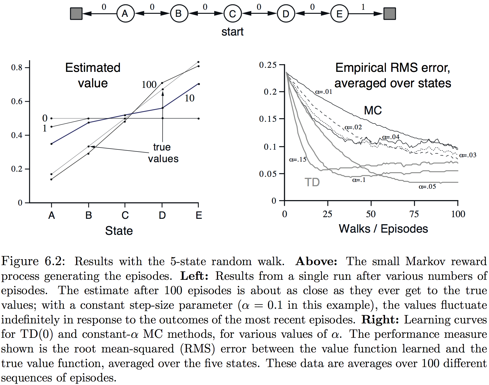

若希望确认一个思想对强化学习是中心或新颖，则它毫无疑问是**时间差分学习(temporal-difference or TD learning)**。TD学习是蒙特卡洛(MC)思想和动态规划(DP)思想的结合。像MC，TD方法也能不靠环境动态的模型从原始经验中学习；像DP，TD方法更新估计部分基于其他学得的估计，而无需等待一个最终的结果——它们引导启动(bootstrap)。TD、DP和MC的关系是强化学习理论中循环的主题，本章是探索它的起点，在结束以前，我们会看到这些思想和方法相互融合并能够以许多方法组合起来。尤其是，在第7章会介绍$n$-步算法，它构建了从TD到MC方法的桥梁；在第12章会介绍$\text{TD}(\lambda)$算法，它将它们无缝地统一了起来。

如往常一样，从关注策略评估或预测问题开始，也即给定策略$\pi$估计价值函数$v_\pi$。对于控制问题（找到最优策略），DP、TD和MC方法都使用了广义策略迭代(GPI)的某种变形。这些方法间的差异首先是它们要解决的预测问题的差异。

##### 6.1 TD预测

TD和MC方法都使用经验来解决预测问题。给定一些遵循策略$\pi$的经验，两种方法都为每个出现在此经验中的非终止状态$S_t$更新其$v_\pi$的估计$V$。大致而言，MC方法等到已知访问后的回报才使用此回报作为$V(S_t)$的目标。一个简单的适用于与非平稳环境的每访MC方法为：
$$
V(S_t) \leftarrow V(S_t) + \alpha\Big[G_t-V(S_t)\Big]\tag{6.1}
$$
其中$G_t$是时间$t$后的实际回报，$\alpha$是常数步长参数，称这种方法为**常数$\alpha$ MC**。相比MC方法必须等到节的终结才确定$V(S_t)$的增量（直到那时$G_t$才已知），TD方法仅需等到下个时间步。在时间$t+1$它们立即就能使用观测到的激励$R_{t+1}$和估计$V(S_{t+1})$来构造一个目标并做出有用的更新。最简单的TD方法即刻便在到$S_{t+1}$的转移和获得的回报$R_{t+1}$上更新：
$$
V(S_t) \leftarrow V(S_t) + \alpha\Big[ R_{t+1} + \gamma V(S_{t+1}) - V(S_t) \Big]\tag{6.2}
$$
实际上，MC更新的的目标是$G_t$，而TD更新的目标是$R_{t+1}+\gamma V(S_{t+1})$。这种TD方法称为**TD(0)**或**一步TD(one-step TD)**。因其是第7和12章扩展的**TD($\lambda$)**和**多步TD**方法的特例。下面以程序的形式详细完整地阐述了TD(0)：
$$
\bbox[5px,border:2px solid]
{\begin{aligned}
  &\underline{\mathbf{Tabular\ TD(0)\ for\ estimating\ }v_\pi}\\
  \\
  &\text{Input: the policy }\pi\text{ to be evaluated}\\
  &\text{Initialize }V(s)\text{ arbitrary }(\text{e.g., }V(s)=0,\ \forall s \in \mathcal S^+)\\
  &\text{Repeat (for each episode):}\\
  &\qquad \text{Initialize }S\\
  &\qquad \text{Repeat (for each step of episode):}\\
  &\qquad\qquad A \leftarrow \text{action given by }\pi\text{ for }S\\
  &\qquad\qquad \text{Take action }A,\text{ observe }R, S'\\
  &\qquad\qquad V(S) \leftarrow V(S) + \alpha\left[ R + \gamma V(S') - V(S) \right]\\
  &\qquad\qquad S \leftarrow S'\\
  &\qquad\text{until }S\text{ is terminal}\\
\end{aligned}}
$$
因TD(0)将更新部分基于一个存在的估计，称它是一种**自举(bootstrapping)**的方法，就像DP。从第3章可知：
$$
\begin{eqnarray*}
v_\pi(s) &\dot=& \mathbb E_\pi\left[ G_t \mid S_t=s \right]\tag{6.3}\\
&=& \mathbb E_\pi\left[ R_{t+1} + \gamma G_{t+1} \mid S_t=s \right]\tag{from (3.3)}\\
&=& \mathbb E_\pi\left[ R_{t+1} + \gamma v_\pi(S_{t+1}) \right]\tag{6.4}
\end{eqnarray*}
$$
大体而言，MC方法使用(6.3)的估计作为目标，而DP方法则使用(6.4)的估计作为目标。蒙特卡洛目标是一个估计因(6.3)中的预期的值未知，用一个样本回报来替代真实预期的回报。DP目标是估计并非因为预期的值，这假定完全由环境的模型提供，而是因为$v_\pi(S_{t+1})$，而使用了当前的估计$V(S_{t+1})$。TD目标是估计原因包含上面两个：它采样了(6.4)中的预期值并使用了当前估计$V$而非真实$v_\pi$。因此，TD方法将MC采样和DP自举结合了起来。就像我们将看到的，通过审慎和想象，这能在获得MC和DP两种方法的优势上取得长足的进展。

下面图表是表格TD(0)的备份图。备份图顶端状态节点的价值估计基于从它出发即时后续状态转移的样本来更新。我们认为TD和MC更新是**样本备份(sample backup)**，因为它们包含了向前一步的后继状态（或状态-行动对）的抽样，使用沿途后继者的价值和激励来计算一个备份值，然后相应原始状态（或状态-行动对）的价值。样本备份不同于DP的全备份在于它们基于单个后继样本而非所有可能后继者的完整分布。

最后，注意TD(0)中的数量是一种误差，它衡量$S_t$的估计值与更好估计$R_{t+1}+\gamma V(S_{t+1})$之间差异。这个称为**TD误差(TD error)**的数量自强化学习始终以多种形式出现：
$$
\delta_t \dot= R_{t+1} + \gamma V(S_{t+1}) - V(S_t)\tag{6.5}
$$
注意每个时间TD误差那个时间做估计的误差。因为TD误差依赖于下个状态和下个激励，因此要在一个时间步后才能获得。也就是说$\delta_t$是在时间$t+1$获得的$V(S_t)$的误差。同样注意若数组$V$在节内没有改变（就像在MC方法中没有改变一样），则MC误差可以写为TD误差的和：
$$
\begin{eqnarray*}
G_t-V(S_t)
&=& R_{t+1} + \gamma G_{t+1} - V(S_t) + \gamma V(S_{t+1})  - \gamma V(S_{t+1})\tag{from (3.3)}\\
&=& \delta_t + \gamma\left( G_{t+1} - V(S_{t+1}) \right)\\
&=& \delta_t + \gamma\delta_{t+1} + \gamma^2\left( G_{t+2}-V(S_{t+2}) \right)\\
&=& \delta_t + \gamma\delta_{t+1} + \gamma^2\delta_{t+2} + \cdots + \gamma^{T-t-1}\delta_{T-1} + \gamma^{T-t}\left(G_T-V(S_T)\right)\\
&=& \delta_t + \gamma\delta_{t+1} + \gamma^2\delta_{t+2} + \cdots + \gamma^{T-t-1}\delta_{T-1} + \gamma^{T-t}(0-0)\\
&=& \sum_{k=t}^{T-1} \gamma^{k-t}\delta_k\tag{6.6}
\end{eqnarray*}
$$
若在节内$V$改变了（就像在TD(0)中）这个等式就不再准确，但若步长很小则它依然近似成立。这个等式的推广在TD学习的理论和算法中十分重要。

**练习6.1**：若$V$在节内改变，则(6.6)仅近似相等。则两边之间的差异是什么？令$V_t$表示在时间$t$TD误差(6.5)和TD更新(6.2)中使用的状态价值数组，重做上面的推导以确定要等于MC误差TD误差需要增加的额外量。

**示例6.1 开车回家**：每天下班开车回家时，你会试着预测需要耗费的时间。当离开办公室时，你会注意时间、星期、天气以及其他任何有关的事物。假定本周五你在恰好下午6点时离开办公室，并估计需要花30分钟到家。在你到车旁时是6:05，然后你注意到开始下雨了。雨中交通通常更慢，因此你重新估计此后会花35分钟，或总共40分钟。15分钟后你及时地完成旅途的主路部分，当你离开进入辅路时，你将总的预估时间减为35分钟，但这时被堵在一辆很慢的卡车后面，路很窄无法超车，最终不得不跟在卡车后面直到在6:40你转到你居住小巷，三分钟之后到家。状态、时间和预测序列因此就是：

|     状态     | 过去的时间（分钟） | 预测去的时间 | 预测的总时间 |
| :--------: | :-------: | :----: | :----: |
| 周五六点，离开办公室 |     0     |   30   |   30   |
|   到车上，下雨   |     5     |   35   |   40   |
|    出主路     |    20     |   15   |   35   |
|   辅路，卡车后   |    30     |   10   |   40   |
|   进入居住街道   |    40     |   3    |   43   |
|     到家     |    43     |   0    |   43   |

本例的激励是在每段旅程耗去的时间（因只关注预测，方便起见这里用正值），因此每个状态的回报是从这个状态到家还要消耗的实际时间，每个状态的价值是到家的期望时间。第二列的数字给出了每个状态的当前估计值。观察MC方法操作的简单途径是在序列上画出预计的总时间，如图6.1左边。箭头显示了$\alpha=1$的常数-$\alpha$MC方法(6.1)推介预测的变化。这些恰好是每个状态估计价值（实际到家要的时间）和实际回报（实际到家要的时间）间的误差。在每个事件中，改变必须在线下做出，也就是你回到家后。

那么在学习开始之前一定要等到最终的结果出来吗？假定另一天你在离开办公室时又估计需要30分钟开车回家，但陷在严重的交通堵塞中，离开办公室25分钟后依然堵在主路上，现在估计需要另外的25分钟到家，总共50分钟。在等待交通时，你已知之前30分钟的估计太过乐观。你还必须等到家才提高你对最初状态的估计吗？按照MC方法是必须的，因为还未知道真实的回报。

但按照TD方法，可以立即学习，将你原始的估计从30分钟改变到50。实际上，每个估计都会转向紧随其后即时的估计。回到开车的第一天，图6.1右边展示了TD规则(6.2)推介推测的变化（这是$\alpha=1$规则做出的变化）。每个误差成比例于随时间预测的变化，也就是预测中的**时间差分**。

##### 6.2 TD预测方法的优势

TD方法部分以其他估计作为学习估计的基础。它们从一个猜想学习一个猜想——它们**自举(bootstrap)**。那它是好的事吗？TD方法相对于MC和DP方法有优势吗？详述和回答这个问题需要剩余的这本书乃至更多。本节简要地展望一些答案。

很明显，就无需环境、激励和下个状态概率分布方面，TD方法相对于DP方法具有优势。

TD方法下一个相对MC方法最明显的优势是它们能自然以一种在线、全增量的方式实现。而用MC方法则必须等到一节的结束，因为到那时回报才已知，而用TD方法就仅需等一个时间步。事实证明它这是一种惊人普遍的关键原因。一些应用的节非常长，将所有学习推迟到节的结束就太慢了。其他的应用则是连续任务根本并没有节。最后，就像前一章所注意到的，一些MC方法必须对采取实验行动的节忽视或打折，这会极大地降低学习的速度。TD方法则不容易受这些问题的影响因为它们从每个转移中学习而与后面采取的行动无关。

但TD方法是可靠的吗？从下个猜想学习一个猜想而无需等待事实的结果当然很方便，但还能保证收敛到正确的答案吗？幸运的是，答案是肯定的。对任意固定的策略$\pi$，TD(0)已被证明收敛到$v_\pi$，对于一个充分小的固定步长参数，和在补偿参数依照通常的随机近似条件(2.7)递减事以1的概率收敛。大多证明仅适用于(6.2)上面展示算法的基于表格的情况，但有一些适用于广义线性函数近似的情况。结果会在第9章中以更普遍的设定讨论。

既然TD和MC方法都能渐近地收敛到正确的预测，则很自然下一个问题就是“那一个更快地到那？”换句话说就是哪种方法学习得更快。哪种更高效地有限数据？目前这还是一个开放的问题，目前还没有人能在数学上证明一种方法比另一种收敛地更快。实际上，甚至以正式方式陈述这个问题的最合适的方式都还不确定。但实际中，通常可以发现在随机任务上TD方法比常数-$\alpha$MC方法更快收敛，就像图6.2所展示的。

**练习6.2**：这是一个帮助你建立TD方法通常比MC方法更高效的直觉的练习。考虑开车回家示例和用TD和MC方法解决它的途径。想象一个TD更新平均优于蒙特卡洛更新的场景。给出一个案例场景——过去经验的描述和当前的状态——你认为期望更新可以更好。这里是一个提示：假设你有很多下班开车回家的经验。然后你搬到了一栋新的大楼和新的停车场（但还在同样的地方上主路）。现在开始学习新大楼的预测，试理解为何这种情况下TD更新很可能更好，至少在初始时。原始任务中是否可能发生同一类事。

**练习6.3**：图6.2左侧显示第一节仅在$V(\mathtt A)$发生了变化。这透漏出关于第一节发生事情的什么信息。为何仅这一个状态的估计发生了变化。精确地改变了多少？

**示例6.2 随机游走**：这个示例经验地比较TD(0)和常数-$\alpha$MC应用到图6.2上边展示的小型马尔科夫激励过程的预测能力。所有节都以中心状态$\mathtt C$开始，并每步一个状态以等概率向左或向右进行。这个行动可以认为是由于一个固定策略和一个环境的状态转移概率结合的效果，但我们并不关注是哪个；我们仅关心无论如何它们产生的回报。节在左端点或右端点终止，当节在右端点终止时，激励为+1，其余都为0。比如，一个典型的节可能由下面的状态和激励序列组成：$\mathtt{C, 0, B, 0, C, 0, D, 0, E, 1}$。因任务时非折扣的，每个状态的真实价值就是从它出发在右边终止的概率。因此，中心状态的真实价值就是$v_\pi(\mathtt C)=0.5$。所有状态的真实价值，$\mathtt A$到$\mathtt E$，分别是$\frac{1}{6}, \frac{2}{6}, \frac{3}{6}, \frac{4}{6}, \frac{5}{6}$。图6.2的左边显示TD(0)在预测上发现的价值随着经历的节数增多趋向于真实价值。在许多节序列上求平均，图形的右边展示了在预测中TD(0)和多个$\alpha$值的常数-$\alpha$MC发现的作为结数函数的平均误差。在所有情形中对所有状态$s$近似价值函数初始化为中间价值$V(s)=0.5$。在这个任务中TD方法一致优于MC方法。

**练习6.4**：图6.2右边展示的特定结果依赖于步长参数的值$\alpha$。若使用更大范围的$\alpha$，则哪个算法更优的结论是否受影响？是否有一个不同、固定的$\alpha$值，任一算法表现显著优于已展示的？为何是或不是？

**\*练习6.5**：图6.2右边TD方法的RMS误差似乎降低后又上升了，尤其是高$\alpha$的。导致这个的原因是什么？这个是否总是发生？或是近似价值函数初始化方式的函数？

**练习6.6**：上面陈述了随机游走任务状态$\mathtt A$到$\mathtt E$真实价值分别是$\frac{1}{6}, \frac{2}{6}, \frac{3}{6}, \frac{4}{6}, \frac{5}{6}$，至少描述两种不同的计算这些值的方法。猜测我们实际用了哪种？为何？

##### 6.3 TD(0)的最优性

假定仅能获得有限数量的经验，比如说10节或100步。这种情况下一种使用增量学习的常用方法是重复地展示这些经验直到方法在一个答案上收敛。给定一个近似价值函数$V$，(6.1)和(6.2)确定的增量每一步在访问的非终止状态都会计算出来，但价值函数仅通过所有增量的和更新一次。然后所有能获得的经验又用新的价值处理以产生新的全部增量，如此等等，直到价值函数收敛。称这种为**批更新(batch updating)**，因为更新仅在处理每个完整训练数据批(batch)后才更新。

在批更新下，只要$\alpha$选得足够小，TD(0)确定性地收敛到单个与步长参数$\alpha$无关的答案。常数-$\alpha$MC方法在同样的条件下也确定性地收敛，但是到一个不同的答案。理解这两个答案可以帮我们理解这两种方法的差异。在正常更新中此方法并不一路移动到相应的批答案中，但在某种意义中它们向这些方法采取了行动。

**示例6.3 批更新下的随机游走**：TD(0)和常-$\alpha$MC的批更新版本像下面一样应用到随机游走的示例中（示例6.2）。在每个新节后，目前为止所见的所有节都视为一批。它们反复展示给TD(0)或常-$\alpha$MC，并使$\alpha$足够小以保证价值函数收敛。将产生的价值函数与$v_\pi$作对比，并绘出关于5个状态（大约100次整个试验的独立重复）均方根误差的均值以获得图6.3所示的学习曲线。注意到批TD方法一贯优于批MC方法。

在批训练中，常-$\alpha$MC收敛到价值$V(s)$，是在访问$s$后所经历的实际回报的样本均值；就从训练集的实际回报中最小化均方误差而言，这些是最优估计；然而在这样的意义下令人惊奇的是，由图6.3展示的均方根误差批TD方法能表现得更好。批TD是如何表现得比这个最优方法还好的呢？答案是MC方法仅在有限的方式中是最优的，而TD则是在与预测回报更相关的方式最优。首先来建立关于不同类型最优性的直觉。

**示例6.4 你是预言家**：现在将你置身于一个未知马尔科夫激励过程预言家的角色中，假设观测到下面8个节：
$$
\begin{matrix}
&\mathtt{A,0,B,0} \qquad\qquad\qquad\qquad &\mathtt{B,1}\\
&\mathtt{B,1} \qquad\qquad\qquad\qquad\qquad\ \ &\mathtt{B,1}\\
&\mathtt{B,1} \qquad\qquad \qquad\qquad\qquad\ \ &\mathtt{B,1}\\
&\mathtt{B,1} \qquad\qquad\qquad\qquad\qquad\ \ &\mathtt{B,0}\\
\end{matrix}
$$
给定这批数据，每个人都很可能同意最优$V(\mathtt B)$是$\frac{3}{4}$。那最优$V(\mathtt A)$是什么呢？有两种合理的答案。

一个是观测到过程在$\mathtt A$会100%立刻转移到$\mathtt B$（激励为0）；而既然已决定$\mathtt B$的值为$\frac{3}{4}$，则$\mathtt A$必然也有值$\frac{3}{4}$。看待这个答案的一种方式是它基于先建立如下图的马尔科夫过程模型，然后在这个模型下计算正确的估计，事实上这种情况下也会给出$V(\mathtt A)=\frac{3}{4}$。这也是批TD(0)给出的答案。

另一个合理答案是仅看到$\mathtt A$一次而跟随其的回报是0，因此就估计$V(\mathtt A)=0$，这是批MC方法给出的答案。注意到这也是在训练数据上给出最小平方误差的答案，事实上在这个数据的误差为0，但依然预计第一个才是更好的答案。若过程是马尔科夫的，预计第一个答案会产生误差更低的**未来(future)**数据，尽管MC答案在现有数据上最好。

示例6.4展示了由批TD和批MC方法发现估计的普遍差异。批MC总是寻找在训练数据上均方误差最小的估计，而批TD(0)总是寻找对马尔可夫过程最大似然模型恰好正确的估计。一般而言，参数的**最大似然估计(maximum-likelihood estimate)**产生这些数据概率最大的参数值。这种情况下，最大似然估计是从观测到的节以明显方式形成的马尔可夫过程的模型：从$i$到$j$估计的转移概率就是从$i$去$j$的转移的分数，而相关的期望激励就是在这些转移上观测到激励的均值。给定这个模型，如果模型是确切正确的就能计算确切正确的价值函数的估计。这被称为**确定性等价估计(certainty-equivalence estimate)**，因其等价于假定潜在过程的估计确定已知而非是近似的。一般而言，批TD(0)收敛到确定性等价估计。

这就帮助解释了为何TD方法比MC方法更快收敛。在批形式中，TD(0)快于MC因其计算真实的确定性等价估计。这就解释了随机游走任务批结果（图6.3）展现的TD(0)的优势。与确定性等价估计的关系也能部分解释非批TD(0)的速度优势（图6.2右）。尽管非批方法并不获得确定性等价或最小平方差估计，但可以理解为大致向这些方向移动。非批TD(0)会比常-$\alpha$MC移动更快因其移向更好的估计，即便并非一路向那。目前关于在线(on-line)TD和MC方法没有什么能说得更确切了。

最后，值得注意的是仅管在某种意义上确定性等价估计是一种最优解法，但直接计算几乎是不可能的。若$N$是状态的个数，则仅仅构建过程的最大似然估计就需要$N^2$的存储，若用传统方式计算相应的价值函数需要近似$N^3$的计算步骤。实际令人震惊的是在这些方面TD方法能以不超过$N$的存储近似相同的方法并在训练集上反复计算。在有巨量状态空间的任务中，TD可能是唯一近似确定性等价方法的途径。

**\*练习6.7**：设计能用于任意目标策略$\pi$和所包含的行动策略$b$的TD(0)更新的off-policy版本，在每步$t$使用重要性采样比率$\rho_{t:t}$(5.3)。

##### 6.4 Sarsa：on-policy的TD控制

现在转向为控制问题使用TD预测方法，照例遵循广义策略迭代(GPI)的模式，只是在评估和预测部分使用TD方法。正如MC方法，这里也面临探索和开发的权衡，方法也落进两种主要分类中：of-policy和off-policy。本节展示on-policy的TD控制方法。

第一步是学习行动价值函数而非状态价值函数（是否是on-policy的方法计算行动价值函数而off-policy的方法计算状态价值函数呢）。尤其是对on-policy方法必须为当前行为策略$\pi$和所有状态$s$和行动$a$估计$q_\pi(s,a)$。这可用本质上与上面学习$v_\pi$相同的TD方法来实现。回忆由状态和状态行动对交替序列组成的节：

前面的章节考虑了从状态到状态的转移并学习了状态的价值，现在考虑从状态-行动对到状态-行动对的转移，并学习状态行动对的价值。形式上这些情况是相同的：它们两者都是有激励过程的马尔可夫链。这个定理保证了TD(0)下状态价值函数的收敛也适用于相应行动价值的算法：
$$
Q(S_t,A_t) \leftarrow Q(S_t,A_t) + \alpha\Big[ R_{t+1} + \gamma Q(S_{t+1}, A_{t+1}) - Q(S_t,A_t) \Big]\tag{6.7}
$$
在每次从非终止状态$S_t$转移后这个更新都发生。若$S_{t+1}$是终止状态，则$Q(S_{t+1}, A_{t+1})$定义为0。这个规则使用了组成从一个行动-状态对到下一个转移事件五元组$(S_t,A_t,R_{t+1},S_{t+1},A_{t+1})$的每个元素。这个五元组使得这个算法的名字为**Sarsa**，Sarsa的备份图如下：

**练习6.8**：展示行动价值版的(6.6)对TD误差$\delta_t=R_{t+1}+\gamma Q(S_{t+1},A_{t+1})-Q(S_t,A_t)$的行动-价值形式也成立，同样假设价值不在步间改变。

基于Sarsa预测方法设计一个on-policy控制算法非常直接，就像在所有on-policy方法中，持续估计行为策略$\pi$的$q_\pi$，同时向关于$q_\pi$贪婪改变$\pi$。Sarsa控制算法的一般形式如下：
$$
\bbox[5px,border:2px solid]
{\begin{aligned}
  &\underline{\mathbf{Sarsa\ (on\text-policy\ TD\ control)\ for\ estimating\ }Q\approx q_*}\\
  \\
  &\text{Initialize }Q(s,a),\ \forall s\in\mathcal S,\ \forall a\in\mathcal A(s),\ \text{ arbitrarily }\text{and}\ Q(terminal\text-state,\bullet)=0\\
  &\text{Repeat (for each episode):}\\
  &\qquad \text{Initialize }S\\
  &\qquad \text{Choose }A\text{ from }S \text{ using policy derived from }Q\ (\text{e.g., } \varepsilon\text{-greedy})\\
  &\qquad \text{Repeat (for each step of episode):}\\
  &\qquad\qquad \text{Take action }A,\text{ observe }R, S'\\
  &\qquad\qquad \text{Choose }A'\text{ from }S' \text{ using policy derived from }Q\ (\text{e.g., } \varepsilon\text{-greedy})\\
  &\qquad\qquad Q(S,A) \leftarrow Q(S,A) + \alpha\left[ R + \gamma Q(S',A') - Q(S,A) \right]\\
  &\qquad\qquad S \leftarrow S';\ A\leftarrow A'\\
  &\qquad\text{until }S\text{ is terminal}\\
\end{aligned}}
$$
Sarsa算法的收敛特定依赖于策略对$Q$依赖的本质。例如，可以使用$\varepsilon$-贪心或$\varepsilon$-松弛策略，根据Satinder Singh（作者与他的私人交流），只要所有状态-行动对被访问无限次并且策略在极限收敛到贪心策略（这个可以安排，比如用$\varepsilon=1/t$设定$\varepsilon$-贪心），则Sarsa以概率1收敛到最优策略和行动-价值函数，只是还未在学界发表。

**示例6.5 有风网格世界**：图6.4展现的插图是一个有开始和目标状态标准的网格世界，但有一个区别：有一个经过网格中点的向上侧风。行动是标准的4个——$\mathtt{up,down,left,right}$——但在中间区域产生的状态会被风向上移动，其强度逐列变化，在每列下面都给了出来，单位为向上移动的单元数。将此作为一个无折扣的分节任务，除目标状态其余激励恒为-1。

图6.4中的曲线图展示了以$\varepsilon=0.11,\alpha=0.5$的Sarsa算法应用到这个任务的结果，并且对所有的$s,a$，初始价值$Q(s,a)=0$。曲线图的倾斜上升表示表示随时间越来越快地到达目标。到8000步时，贪心策略自最优（从插图展示的轨迹）已是很久了；持续的$\varepsilon$-探索使得平均节长度保持在17步，比最小的15步大两个。注意MC方法无法很方便地应用到这个任务上，因所有策略都无法保证终止。如果曾找到的策略使得代理停止在同一状态，则下一节就永不会终结。而类似Sarsa这样逐步的学习方法则没有这个问题，因为它们在那节很快就学得这个策略很差并转向其他。

**练习6.9 带国王移动的有风网格世界**：假定8个可能行动，包括对角线移动，而非平常的4个，重新解决有风网格世界。用这些额外的行为可以做得多好？包含第9个仅由风引起移动的行动，可以做得更好吗？

**练习6.10 随机的风**：假定有风也是有时会从每栏给定平均值变化1的随机风。也就是1/3的时间按照这些值移动，但也有1/3的时间比给定值高一个单元，另外1/3的时间低一个单元。

##### 6.5 Q-学习：off-policy的TD控制

强化学习早期的一个突破是一种已知为Q-学习的off-policy时间差分控制算法的发展，定义为：
$$
Q(S_t,A_t) \leftarrow Q(S_t,A_t) + \alpha\Big[ R_{t+1} + \gamma\max_aQ(S_{t+1},a) - Q(S_t,A_t) \Big]\tag{6.8}
$$
这种情况下，学习的行动-价值函数$Q$，直接近似独立于所遵循策略的最优行动价值函数$q_*$。这显著简化了算法的分析并使得早期收敛的证明成为可能。这个策略还有一个作用就是决定哪个状态-行动对被访问和更新。就如第5章所见，这是一个最低要求，即在一般情况下任何要保证找到最优行为的方法必须满足的。在这种假设和一个与步长参数序列相关的通常随机近似条件变体下，已经显示$Q$-学习以1的概率收敛到$q_*$。$Q$-学习算法以程序的形式表现如下：
$$
\bbox[5px,border:2px solid]
{\begin{aligned}
  &\underline{\mathbf{Q\text-learnin g\ (off\text-policy\ TD\ control)\ for\ estimating\ }\pi\approx \pi_*}\\
  \\
  &\text{Initialize }Q(s,a),\ \forall s\in\mathcal S,\ \forall a\in\mathcal A(s),\ \text{ arbitrarily }\text{and}\ Q(terminal\text-state,\bullet)=0\\
  &\text{Repeat (for each episode):}\\
  &\qquad \text{Initialize }S\\
  &\qquad \text{Repeat (for each step of episode):}\\
  &\qquad\qquad \text{Choose }A\text{ from }S \text{ using policy derived from }Q\ (\text{e.g., } \varepsilon\text{-greedy})\\
  &\qquad\qquad \text{Take action }A,\text{ observe }R, S'\\
  &\qquad\qquad \text{Choose }A'\text{ from }S' \text{ using policy derived from }Q\ (\text{e.g., } \varepsilon\text{-greedy})\\
  &\qquad\qquad Q(S,A) \leftarrow Q(S,A) + \alpha\left[ R + \gamma\max_a Q(S',a) - Q(S,A) \right]\\
  &\qquad\qquad S \leftarrow S'\\
  &\qquad\text{until }S\text{ is terminal}\\
\end{aligned}}
$$
**示例6.6 漫步悬崖**：这个网格世界的例子比较Sarsa和Q-学习，突出on-policy(Sarsa)和off-policy(Q-学习)方法之间的区别。考虑图6.5上面部分展示的网格世界，这是一个标准的无折扣、分节任务，有起始和目标状态，引发移动的通常行动是$\mathtt{up, down, right, left}$。除了达到标记为“悬崖(The Cliff)”的区域，所有转移的激励都是-1。步入悬崖区域会招致-100的激励和将代理立即送回起点。

图6.5下部展示了使用$\varepsilon=0.1$的$\varepsilon$-贪心选择行动的Sarsa和Q-学习的表现。在初始的瞬变之后，Q-学习学到了最优策略的价值，也就是不停沿着悬崖边缘行走；但由于$\varepsilon$-贪婪的行动选择，这使它有时会落入悬崖中。相反，Sarsa将行动选择考虑在内，学到了更长但更安全的通过网格上边部分的路径。尽管实际上Q-学习学到了最优策略的价值，其在线表现却比只学到迂回策略的糟糕。当然，若$\varepsilon$逐渐减小，两个方法都会渐近收敛到最优策略。$Q$学习的备份图如下6.6左所示。

**练习6.11**：为何Q-学习被认为是off-policy的控制方法？

##### 6.6 期望Sarsa

考虑像Q-学习一样的算法，除了将此策略下每个行动的可能性考虑进去，在下个状态-行动对上使用期望值代替最大值。也就是考虑下面这样更新规则的算法：
$$
\begin{eqnarray*}
Q(S_t,A_t)
&\leftarrow& Q(S_t,A_t) + \alpha\Big[ R_{t+1} + \gamma\mathbb E[Q(S_{t+1}, A_{t+1})\mid S_{t+1}] - Q(S_t,A_t) \Big]\\
&\leftarrow& Q(S_t,A_t) + \alpha\Big[ R_{t+1} + \gamma\sum_a\pi(a\mid S_{t+1})Q(S_{t+1}, a) - Q(S_t,A_t) \Big]\tag{6.9}
\end{eqnarray*}
$$
除了其他都遵循Q-学习的模式。给定下个状态$S_{t+1}$，此算法移动的方向**在期望上**确定地与Sarsa相同，因此地被称为**期望Sarsa**，其备份图为6.6右。

期望Sarsa比Sarsa计算更复杂，但作为回报，排除了因$A_{t+1}$随机选择造成的方差。给定同样数量的经验，期望Sarsa的表现略好于Sarsa。图6.7展示了漫步悬崖任务上期望Sarsa对比Sarsa和Q-学习的总结结果。作为on-policy方法，期望Sarsa保持了Sarsa在这个问题上相对于Q-学习的显著优势。另外，期望Sarsa也展示了步长参数$\alpha$大范围值上期望Sarsa对Sarsa的显著改善。在漫步悬崖中，状态转移都是确定性的，所有的随机性都来自策略。在这种情况下，期望Sarsa可以安全地设置$\alpha=1$而无需遭受任何渐近表现的退化；但Sarsa仅能以较小的$\alpha$值在长远表现良好，而在这样的$\alpha$上短期表现十分糟糕。在这个和其他示例中，期望Sarsa相对于Sarsa都有一致的经验优势。

在这些漫步悬崖的结果中将期望Sarsa用作了on-policy算法，但通常情况下可以使用一个不同于目标策略的策略来产生行为，在这种情况下期望Sarsa就变为off-policy的算法。比如，假定$\pi$是贪心策略而行为是更探索的；这样期望Sarsa就恰好是Q-学习。就这种意义而言期望Sarsa在可靠地改善了Sarsa的同时包含并推广了Q-学习。除少量额外的计算代价，期望Sarsa完全优于另外两个更知名的TD控制算法。

##### 6.7 最大化偏差和对偶学习

目前为止讨论的所有算法在构造其目标策略时都涉及最大化。比如在Q-学习中，目标策略为给定当前行动价值用最大定义的贪心策略；在Sarsa中策略通常是$\varepsilon$-贪心，也涉及了最大化操作。在这些算法中，估计价值上的最大值隐含地作为最大价值的估计使用，这可能导致显著的正偏差。要理解原因，考虑单个状态$s$有许多的行动$a$，它们的真实价值$q(s,a)$都为0，但是估计的价值$Q(s,a)$不确定因此一些分布在0之上一些分布在0之下。真实价值的最大为0，但最大的估计为正，一个正偏差。称这个为**最大化偏差(maximization bias)**。

**示例6.7 最大化偏差示例**：图6.8插图所示的小型MDP提供了一个最大偏差会如何伤害TD控制算法表现的简单示例。此MDP有两个非终止状态$\mathtt{A,\ B}$，节总是以两个行动$\mathtt{left,\ right}$的一个选择从$\mathtt A$开始。行动$\mathbb{right}$立刻以0激励和回报转移到终止状态。行动$\mathtt{left}$激励也为0转移到$\mathtt B$；而从$\mathtt B$有许多可能的行动，所有都立即以来自均值为-0.1方差为1.0的正态分布的激励引起终止。因此，任何从$\mathtt{left}$开始轨迹的期望回报都是-0.1，因此在状态$\mathtt A$采取行动$\mathtt{left}$总是错误。然而，TD控制算法可能会偏爱$\mathtt{left}$因最大化偏差使得$\mathtt B$显得有正价值。图6.8显示在此示例中$\varepsilon$-贪婪行动选择的Q-学习初始时学得强烈偏爱$\mathtt{left}$，即便在渐近线中，Q-学习在参数设定($\varepsilon=0.1,\ \alpha=0.1,\ \gamma=1$)中采取$\mathtt{left}$行动的概率比最优高5%。

那这些算法如何避免最大化误差？考虑一种许多行动的老虎机案例，每个行动的的价值都是有噪估计，由所有行动每局获得的激励的样本估计来获得。就像上面讨论的，若使用估计的最大值作为真实价值的最大值估计，会有一个正的最大化偏差。一种看待这个问题的方式是因为在确定最大行动和估计估计其价值时都使用了同样的样本。假定将所有样本都分到两个集合中并，对每个$a\in\mathcal A$，使用它们来学习两个独立的估计，称之为$Q_1(a)$和$Q_2(a)$，每个都是真实价值$q(a)$的估计。然后就可以使用一个估计，不妨为$Q_1(a)$，来确定最大行动$A^*=\arg\max_a Q_1(a)$，并用另一个，$Q_2(a)$来提供其价值的估计$Q_2(A^*)=Q_2(\arg\max_aQ_1(a))$。在$\mathbb E\left[ Q_2\left(A^*\right) \right]=q\left( A^* \right)$这个意义上这个估计是无偏的。也可以将这两个估计的的角色反转重复这个过程来产生第二个无偏估计$Q_1\left( \arg\max_aQ_2(a) \right)$。这就是**对偶学习**的思想。转移尽管学习了两个估计，但每一局仅更新一个估计；对偶的学习加倍了存储的需求，但在每步的计算量上并没有增加。

对偶学习的思想很自然的扩展到所有全MDP的算法。比如类似Q-学习的对偶学习算法，称为对偶Q-学习，将时间步分为两个，可能在每一步扔硬币。若头朝上，则更新是
$$
Q_1(S_t, A_t) \leftarrow Q_1(S_t,A_t) + \alpha\left[ R_{t+1} + \gamma Q_2\left( S_{t+1},\arg\max_aQ_1(S_{t+1}, a) \right) - Q_1(S_t,A_t) \right]\tag{6.10}
$$
若尾朝上，则交换$Q_1$和$Q_2$做同样的更新。这两个近似价值函数完全对称对待。行为策略两个行动价值估计都可以使用。比如，对偶Q-学习的$\varepsilon$-贪心策略可以基于这两个行动价值估计的平均（或和）。对偶Q-学习的完整算法如下，这个是用于产生图6.8结果的算法，在那个示例中，对偶的学习似乎消除了最大化偏差引起的危害。同样也有Sarsa和期望Sarsa的对偶版本。
$$
\bbox[5px,border:2px solid]
{\begin{aligned}
  &\underline{\mathbf{Double\ Q\text-learning}}\\
  \\
  &\text{Initialize }Q_1(s,a)\text{ and }Q_2(s,a),\ \forall s\in\mathcal S,\ \forall a\in\mathcal A(s),\ \text{ arbitrarily }\\
  &\text{Initialize}\ Q_1(terminal\text-state,\bullet)=Q_2(terminal\text-state,\bullet)=0\\
  &\text{Repeat (for each episode):}\\
  &\qquad \text{Initialize }S\\
  &\qquad \text{Repeat (for each step of episode):}\\
  &\qquad\qquad \text{Choose }A\text{ from }S \text{ using policy derived from }Q_1\text{ and }Q_2\ (\text{e.g., } \varepsilon\text{-greedy in }Q_1+Q_2)\\
  &\qquad\qquad \text{Take action }A,\text{ observe }R, S'\\
  &\qquad\qquad \text{With 0.5 probability:}\\
  &\qquad\qquad\qquad Q_1(S,A) \leftarrow Q_1(S,A) + \alpha\left[ R + \gamma Q_2\left(S', \arg\max_a Q_1(S',a)\right) - Q_1(S,A) \right]\\
  &\qquad\qquad \text{else:}\\
  &\qquad\qquad\qquad Q_1(S,A) \leftarrow Q_1(S,A) + \alpha\left[ R + \gamma Q_2\left(S', \arg\max_a Q_1(S',a)\right) - Q_1(S,A) \right]\\
  &\qquad\qquad S \leftarrow S'\\
  &\qquad\text{until }S\text{ is terminal}\\
\end{aligned}}
$$
**练习6.12**：以$\varepsilon$-贪心目标策略的对偶期望Sarsa的更新方程是什么？