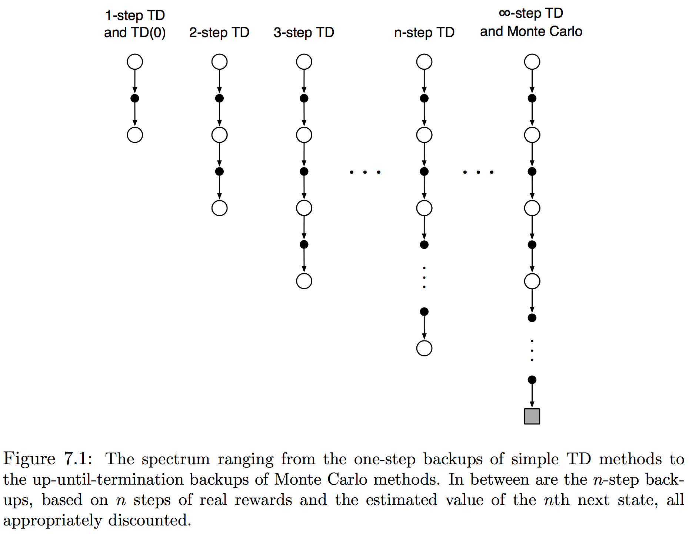
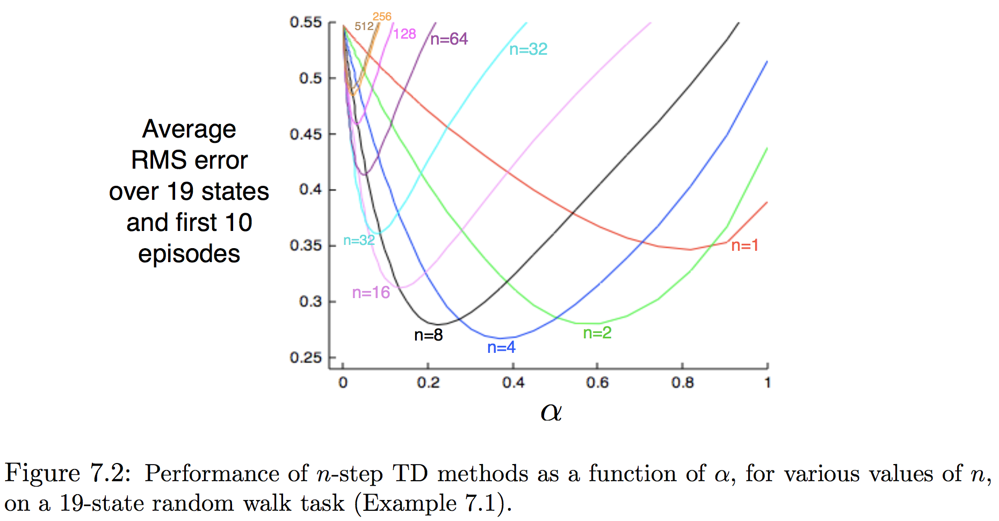
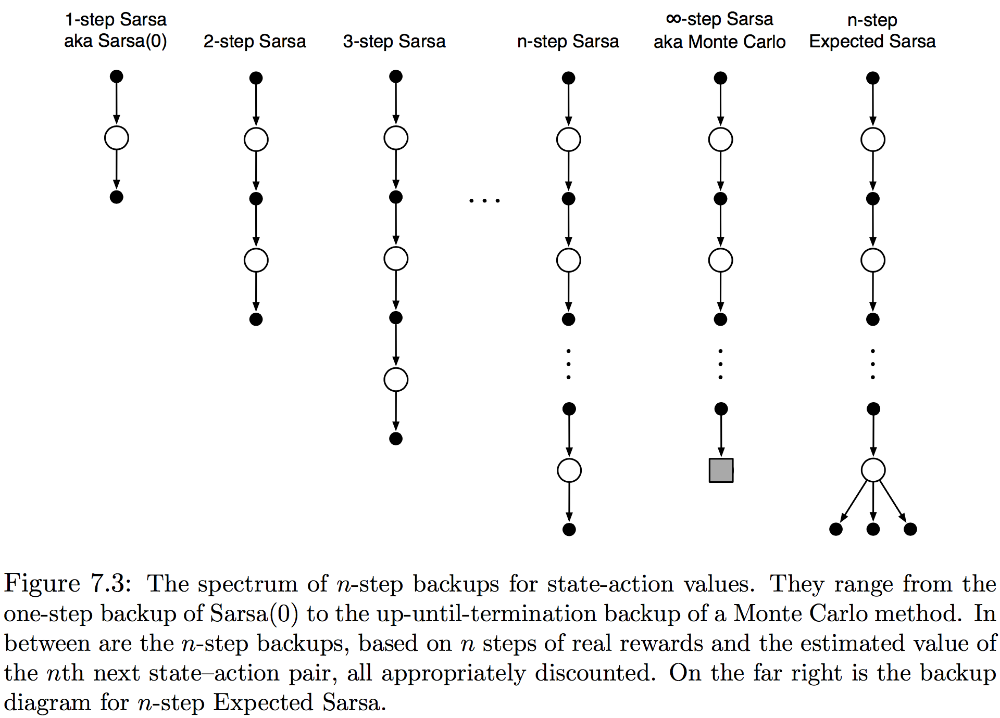
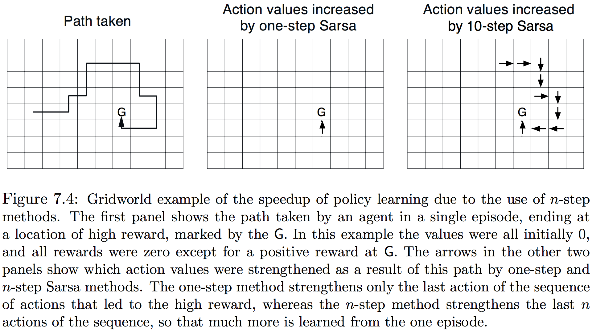

本章将统一前面两章展示的方法。无论MC或单步TD方法不可能总是最好，多步TD方法扩展了两者，因此可以平滑地从一个到另一个转换。它们张成了一个MC方法在一端单步TD另一端的光谱，通常中间的方法比两端表现更优。多步TD的另一好处是它解放了时间步的严苛，使用单步方法同一步内确定行动改变的频率和自举完成的时间间隔。许多应用希望能快速更新以考虑所有的改变，但自举在状态发生显著或可辨改变的时间长度才发挥最好。多步方法能使自举在较长时间间隔发生。多步方法通常与**合格追踪(eligibility trace)**有关。如往常一样，先考虑预测问题然后是控制问题，即先考虑多步方法如何在帮助预测固定策略作为状态函数的回报，然后扩展到行动价值和控制方法。

##### 7.1 𝑛-步TD预测

在MC和TD之间的方法空间是什么呢？考虑从𝜋生成的样本小节中评估$v_\pi$，MC方法为每个状态基于此状态到节末观测到激励的整个序列执行更新；而单步TD方法的更新则仅基于下一个激励，引导(bootstrapping)下一步状态的价值作为剩余激励的代表(proxy)。一种中间方法就是基于中间个数的激励更新。图7.1描绘出了$v_\pi$的𝑛-步更新谱：

使用𝑛-步备份的方法依然是TD方法，因为它依然是根据与后面估计的差异来改变前面的估计。这种将时间差分扩展到𝑛步的方法称为**𝑛-步TD方法**。更正式地，将应用到状态$S_t$更新视为状态-激励序列$S_t,R_{t+1},S_{t+1},\dots,R_T, S_T$的结果。MC方法中$v_\pi(S_t)$的估计在所有回报的方向上更新：
$$
G_t \dot= R_{t+1} + \gamma R_{t+2} + \gamma^2R_{t+3} + \cdots + \gamma^{T-t-1}R_T
$$
𝑇 是节的最后一步。称这个量为**更新目标(the target of the backup)**。一步更新的目标称为**一步回报(one-step return)**：
$$
G_{t:t+1} \dot=R_{t+1} + \gamma V_t(S_{t+1})
$$
$G_{t:t+1}$的下标表示这是使用时间𝑡到𝑡+1的截断回报。在两步之后这样做也有同样的含义，两步备份的目标就是两步回报：
$$
G_{t:t+2} \dot= R_{t+1} + \gamma R_{t+2} + \gamma^2V_{t+1}(S_{t+2})
$$
同样，任意𝑛步备份的目标就是**𝑛-步回报**，定义为对满足𝑛 ≥ 1并且0 ≤ 𝑡 ≤ 𝑇-𝑛所有的𝑛, 𝑡：
$$
G_{t:t+n} \dot= R_{t+1} + \gamma R_{t+2} + \cdots + \gamma^{n-1}R_{t+n} + \gamma^nV_{t+n-1}(S_{t+n})\tag{7.1}
$$
所有的$n$步回报可以认为是全回报的近似，在$n$步后被截断然后用$V_{t+n-1}(S_{t+n})$修正剩余项。若$t+n\ge T$（即$n$步回报到达或超出终止点），则$n$-步回报就是普通的全回报($G_{t:t+n}\dot=G_t\text{ if }t+n\ge T$)。注意$n$-步回报涉及从$t$到$t+1$转移时还不可得的未来激励和状态，能得到的最早时间是$t+n$，因此使用$n$-步回报的状态-价值学习算法就是：
$$
V_{t+n}(S_t) \dot= V_{t+n-1}(S_t) + \alpha\Big[ G_{t:t+n} - V_{t+n-1}(S_t) \Big]\tag{7.2}
$$
而所有其他状态价值保持不变时，$V_{t+n}(s)=V_{t+n-1}(s),\forall s\neq S_t$。称这个算法为**$n$步TD(n-step TD)**。注意在每节前$n-1$步没有做任何变化，作为弥补等量更新会在节末，即终止后和下一节开始前完成。完整的伪代码如下：
$$
\bbox[5px,border:2px solid]
{\begin{aligned}
  &\underline{\mathbf{n\text-step\ TD\ for\ estimating\ }V\approx v_\pi}\\
  \\
  &\text{Initialize }V(s)\text{ arbitrarily },s\in\mathcal S\\
  &\text{Parameters: step size }\alpha\in(0,1],\text{ a positive integer n}\\
  &\text{All store and access operations (for }S_t\text{ and }R_t\text{) can take their index mod n}\\
  \\
  &\text{Repeat (for each episode):}\\
  &\qquad \text{Initialize and store }S_0\neq \text{terminal}\\
  &\qquad T \leftarrow \infty\\
  &\qquad \text{For }t=0,1,2,\dots\text{:}\\
  &\qquad|\qquad\text{if }t < T,\text{ then:}\\
  &\qquad|\qquad\qquad \text{Take an action according to }\pi(\bullet\mid S_t)\\
  &\qquad|\qquad\qquad \text{Observe and store next reward as }R_{t+1}\text{ and the next state as }S_{t+1}\\
  &\qquad|\qquad\qquad \text{If }S_{t+1}\text{ is terminal, then }T \leftarrow t+1\\
  &\qquad|\qquad \tau \leftarrow t-n+1\quad(\tau\text{ is the time whose states's estimate is being updated})\\
  &\qquad|\qquad\text{if }\tau\ge0\text{:}\\
  &\qquad|\qquad\qquad G\leftarrow\sum_{i=\tau+1}^{\min(\tau+n, T)}\gamma^{i-\tau-1}R_i\\
  &\qquad|\qquad\qquad \text{If }\tau+n < T, \text{then: }G\leftarrow G+\gamma^nV(S_{\tau+n})\qquad\qquad\qquad(G_{\tau:\tau+n})\\
  &\qquad|\qquad\qquad V(S_\tau) \leftarrow V(S_\tau) + \alpha[G - V(S_\tau)]\\
  &\qquad \text{Until }\tau=T-1
\end{aligned}}
$$
**练习7.1**：第6章中曾写道若若价值估计不逐步改变(6.6)，则MC误差能写为TD误差的和(6.5)。推广先前的结论，展示(7.2)中的n-步误差也能写为TD误差的和（同样价值估计不变）。

**练习7.2（编程）**：使用n-步方法，价值估计逐步改变，因此使用TD误差和（见上一个练习）代替(7.2)中误差的算法实际会不太一样。会变好还是变糟？设计并编写一个小的试验来经验地回答。

n-步回报使用价值函数$V_{t+n-1}$来修正$R_{t+n}$后失去的激励，它们的一个重要特性是在最坏-状态情况下，它们的期望保证是比$V_{t+n-1}$更优的估计。也即对所有$n\ge 1$，期待n-步回报最糟的误差保证小于或等于$V_{t+n-1}$下最坏误差的$\gamma^n$倍：
$$
\max_a \Big| \mathbb E_\pi[G_{t:t+n}\mid S_t=s] - v_\pi(s) \Big| \le \gamma^n\max_s\Big| V_{t+n-1}(s) - v_\pi(s) \Big|\tag{7.3}
$$
这被称为n-步回报的**误差减小特性(error reduction property)**，用这个特性就能展现在一些合适的技术条件下，所有n-步TD方法收敛到正确的预测。因此n-步TD方法就形成了一个可行方法族，其中一步TD和MC是两端成员。

**示例7.1 随机游走的$n$步TD方法**：考虑将$n$-步TD方法应用在示例6.2描述的随机游走任务上。假设第一个节从中心$\mathtt C$开始直接向右经$\mathtt{D, E}$到达右边终止点，获得1的回报。所有状态的估计价值以中间值$V(s)=0.5$开始，作为这个经验的结果，单步方法会改变最后的状态估计$V(\mathtt E)$为1；两步方法会增加终结前两个状态$V(\mathtt D)$和$V(\mathtt E)$都为1；三步或任意$n>2$的n-步方法都会将三个访问过的状态的价值都增加到1。

那么怎样的n值更好。图7.2展示了在一个更大的19个状态的随机游走任务上（左边结果为-1，其余0，本章作为运行示例）一个简单经验测试结果。每个参数设定的衡量是节末19个状态的预测和它们真实价值间方根平方差，然后在整个试验前10节和100次重复上求均值。注意n值在中间的方法表现最好。这展示了TD和MC方法扩展到的n-步方法是怎样能潜在比两个端点方法表现得更好的。

**练习7.3**：为何本章示例使用更大（19个状态代替5个）的随机游走？更小的随机游走是否会将优势转移到另一个$n$？在这个更大游走中将将左端结果由0变为-1呢？是否造成最优$n$值的差异？

##### 7.2 𝑛-步Sarsa

𝑛-步方法怎样用于控制呢？本节以直接的方式结合n-步方法和Sarsa产生一个on-policy控制方法，称为𝑛-步Sarsa，上一章描述的初始版本此后称为**单步Sarsa**或**Srasa(0)**。主要思想是**先将状态转换为行动**（状态-行动对），**再使用一个𝜀-贪心算法**。𝑛-步Sarsa的备份图（图7.3）与𝑛-步TD（图7.1）的十分相似，除了Sarsa都是以行动开始和结束。

定义估计行动价值的𝑛-步回报：
$$
G_{t:t+n}\dot=R_{t+1} + \gamma R_{t+2} + \cdots+\gamma^{n-1}R_{t+n} + \gamma^nQ_{t+n-1}(S_{t+n}, A_{t+n}), \qquad n\ge 1, 0\le t<T-n\tag{7.4}
$$
若𝑡+𝑛≥𝑇，则$G_{t:t+n}\dot=G_t$。因此自然的算法就是：
$$
Q_{t+n}(S_t,A_t)\dot=Q_{t+n-1}(S_t,A_t) + \alpha\Big[ G_{t:t+n} - Q_{t+n-1}(S_t,A_t) \Big],\qquad 0\le t<T\tag{7.5}
$$
而其他状态的价值保持不变，$Q_{t+n}(s,a)=Q_{t+n-1}(s,a)$，对所有满足$s\neq S_𝑡\text{ or }a\neq A_t$的𝑠,𝑎。这就是被称为**𝑛-步Sarsa**的算法。完整伪代码如下：
$$
\bbox[5px,border:2px solid]
{\begin{aligned}
  &\underline{\mathbf{n\text-step\ Sarsa\ for\ estimating\ }Q\approx q_*,\mathbf{\ or\ }Q\approx q_\pi\ \mathbf{for\ a\ given\ }\pi}\\
  \\
  &\text{Initialize }Q(s,a)\text{ arbitrarily },\forall s\in\mathcal S,\ a\in\mathcal A\\
  &\text{Initialize }\pi\text{ to be }\varepsilon\text{-greedy with respect to }Q,\text{ or to a fixed given policy}\\
  &\text{Parameters: step size }\alpha\in(0,1],\text{ small }\varepsilon>0,\ \text{ a positive integer n}\\
  &\text{All store and access operations (for }S_t, A_t,\text{ and }R_t\text{) can take their index mod n}\\
  \\
  &\text{Repeat (for each episode):}\\
  &\qquad \text{Initialize and store }S_0\neq \text{terminal}\\
  &\qquad \text{Select and store an action }A_0\sim\pi(\bullet\mid S_0)\\
  &\qquad T \leftarrow \infty\\
  &\qquad \text{For }t=0,1,2,\dots\text{:}\\
  &\qquad|\qquad\text{if }t < T,\text{ then:}\\
  &\qquad|\qquad\qquad \text{Take action }A_t\\
  &\qquad|\qquad\qquad \text{Observe and store next reward as }R_{t+1}\text{ and the next state as }S_{t+1}\\
  &\qquad|\qquad\qquad \text{If }S_{t+1}\text{ is terminal, then:}\\
  &\qquad|\qquad\qquad\qquad T \leftarrow t+1\\
  &\qquad|\qquad\qquad \text{else:}\\
  &\qquad|\qquad\qquad\qquad \text{Select and store an action }A_{t+1}\sim\pi(\bullet\mid S_{t+1})\\
  &\qquad|\qquad \tau \leftarrow t-n+1\quad(\tau\text{ is the time whose states's estimate is being updated})\\
  &\qquad|\qquad\text{if }\tau\ge0\text{:}\\
  &\qquad|\qquad\qquad G\leftarrow\sum_{i=\tau+1}^{\min(\tau+n, T)}\gamma^{i-\tau-1}R_i\\
  &\qquad|\qquad\qquad \text{If }\tau+n < T, \text{then: }G\leftarrow G+\gamma^nQ(S_{\tau+n}, A_{\tau+n})\qquad\qquad\qquad(G_{\tau:\tau+n})\\
  &\qquad|\qquad\qquad Q(S_\tau,A_\tau) \leftarrow Q(S_\tau,A_\tau) + \alpha[G - Q(S_\tau, A_\tau)]\\
  &\qquad|\qquad\qquad \text{If }\pi\text{ is being learned, then ensure that }\pi(\bullet\mid S_\tau)\text{ is }\varepsilon\text{-greedy wrt }Q\\
  &\qquad \text{Until }\tau=T-1
\end{aligned}}
$$
而解释相比单步方法它能加速学习的原因的示例在图7.4给出：

关于期望Sarsa的𝑛-步版本的备份图在图7.3的最右侧；与𝑛-步Sarsa的非常相似，除了最后一个元素的是一束策略𝜋下由自身概率加权的所有行动。算法能用像𝑛-步Sarsa一样的方程描述，除了𝑛-步回报定义为：
$$
G_{t:t+n}\dot=R_{t+1} + \gamma R_{t+2} + \cdots+\gamma^{n-1}R_{t+n} + \gamma^n\sum_a\pi(a\mid S_{t+n})Q_{t+n-1}(S_{t+n}, a)\tag{7.6}
$$
对所有满足𝑛 ≥ 1和0 ≤ 𝑡 ≤ 𝑇-𝑛的𝑛和𝑡。

##### 7.3 基于重要性采样的𝑛-步off-policy学习

Off-policy学习就是通过遵循行为策略𝑏学习策略𝜋的价值函数。通常𝜋是当前行动-价值函数的贪心策略，𝑏则更具探索性，可以是𝜀-贪心。要使用𝑏的数据必须考虑两个策略的差异，使用被采取行动它们采取的相对概率。在𝑛步方法中，回报在𝑛步上构建。比如，要构造简单的𝑛步TD版本，时间𝑡的更新（实际在时间𝑡+𝑛做）可以简单地由$\rho_{t:t+n-1}$权衡：
$$
V_{t+n}(S_t) \dot= V_{t+n-1}(S_t) + \alpha\rho_{t:t+n-1}[G_{t:t+n} - V_{t+n-1}(S_t)],\qquad0\le t <T\tag{7.7}
$$
其中$\rho_{t:t+n-1}$，被称为重要性采样率，是两个策略下采取从$A_t$到$A_{t+n-1}$的𝑛个行动的相对概率：
$$
\rho_{t:h} = \prod_{k=t}^{\min(h,T-1)} \frac{\pi(A_k\mid S_k)}{b(A_k\mid S_k)}\tag{7.8}
$$
若有行动在𝜋中采用的概率远大于𝑏，这会增大随后给定回报的权重。它是𝜋的典型因此合乎情理，但却很少被𝜋选择因此很少出现在数据中，作为弥补在出现时必须给它过大权重。若事实上两个策略相同（则变为on-policy）则重要性采样率总是1。因此新的更新(7.7)可以推广并完全取代先前的𝑛步TD更新。同样，先前的𝑛-步Sarsa更新也可以被一个简单的off-policy形式，即对0≤𝑡≤𝑇：
$$
Q_{t+n}(S_t,A_t) \dot= Q_{t+n-1}(S_t, A_t) + \alpha\rho_{t+1:t+_n-1}[G_{t:t+n} - Q_{t+n-1}(S_t, A_t)],\tag{7.9}
$$
注意这里重要性采样的开始比𝑛-步Sarsa晚一步。这是因为这里更新的是状态-行动对。不必关注会选择行为的概率，既然已经选择了它就要完全用随后行为的重要性采样从所发生的学习。完整算法的伪代码如下：
$$
\bbox[5px,border:2px solid]
{\begin{aligned}
  &\underline{\mathbf{n\text-step\ Sarsa\ for\ estimating\ }Q\approx q_*,\mathbf{\ or\ }Q\approx q_\pi\ \mathbf{for\ a\ given\ }\pi}\\
  \\
  &\text{Input: an arbitrarily behavior policy }b\text{ such that }b(a\mid s)>0,\forall s\in\mathcal S,a\in\mathcal A\\
  &\text{Initialize }Q(s,a)\text{ arbitrarily },\forall s\in\mathcal S,\ a\in\mathcal A\\
  &\text{Initialize }\pi\text{ to be }\varepsilon\text{-greedy with respect to }Q,\text{ or to a fixed given policy}\\
  &\text{Parameters: step size }\alpha\in(0,1],\text{ small }\varepsilon>0,\ \text{ a positive integer n}\\
  &\text{All store and access operations (for }S_t, A_t,\text{ and }R_t\text{) can take their index mod n}\\
  \\
  &\text{Repeat (for each episode):}\\
  &\qquad \text{Initialize and store }S_0\neq \text{terminal}\\
  &\qquad \text{Select and store an action }A_0\sim b(\bullet\mid S_0)\\
  &\qquad T \leftarrow \infty\\
  &\qquad \text{For }t=0,1,2,\dots\text{:}\\
  &\qquad|\qquad\text{if }t < T,\text{ then:}\\
  &\qquad|\qquad\qquad \text{Take action }A_t\\
  &\qquad|\qquad\qquad \text{Observe and store next reward as }R_{t+1}\text{ and the next state as }S_{t+1}\\
  &\qquad|\qquad\qquad \text{If }S_{t+1}\text{ is terminal, then:}\\
  &\qquad|\qquad\qquad\qquad T \leftarrow t+1\\
  &\qquad|\qquad\qquad \text{else:}\\
  &\qquad|\qquad\qquad\qquad \text{Select and store an action }A_{t+1}\sim b(\bullet\mid S_{t+1})\\
  &\qquad|\qquad \tau \leftarrow t-n+1\quad(\tau\text{ is the time whose states's estimate is being updated})\\
  &\qquad|\qquad\text{if }\tau\ge0\text{:}\\
  &\qquad|\qquad\qquad \rho\leftarrow\sum_{i=\tau+1}^{\min(\tau+n-1, T-1)}\frac{\pi(A_i\mid S_i)}{b(A_i\mid S_i)}\qquad\qquad\qquad\qquad\qquad\qquad(\rho_{\tau+1:t+n-1})\\
  &\qquad|\qquad\qquad G\leftarrow\sum_{i=\tau+1}^{\min(\tau+n, T)}\gamma^{i-\tau-1}R_i\\
  &\qquad|\qquad\qquad \text{If }\tau+n < T, \text{then: }G\leftarrow G+\gamma^nQ(S_{\tau+n}, A_{\tau+n})\qquad\qquad\qquad(G_{\tau:\tau+n})\\
  &\qquad|\qquad\qquad Q(S_\tau,A_\tau) \leftarrow Q(S_\tau,A_\tau) + \alpha\rho[G - Q(S_\tau, A_\tau)]\\
  &\qquad|\qquad\qquad \text{If }\pi\text{ is being learned, then ensure that }\pi(\bullet\mid S_\tau)\text{ is }\varepsilon\text{-greedy wrt }Q\\
  &\qquad \text{Until }\tau=T-1
\end{aligned}}
$$
𝑛-步期望Sarsa的off-policy版本使用Sarsa像上面一样的更新规则，除了重要性采样率少一个因子。也即上面等式会用$\rho_{t+1:t+n-2}$来代替$\rho_{t+1:t+n-1}$，并且也会用期望Sarsa版的𝑛-步回报(7.6)。因为在期望Sarsa中，所有可能的行动都会在最后一个状态考虑，实际采取的没有影响，也不必修正。

##### 7.4 \*每激励off-policy方法

前一节展示的多步off-policy方法确实非常简洁清晰，但可能不是效率最高的。一种更精巧的方法是使用像5.9节介绍的**每一激励(per-reward)**重要性采样的思想。先注意常规多步回报(7.1)，像所有回报一样可以写为递归形式：
$$
G_{t:h} = R_{t+1} + \gamma G_{t+1:h}
$$

所有结果的经验，包括第一个激励$R_{t+1}$和下个状态$S_{t+1}$必须用时间𝑡的重要性采样率$\rho_t=\frac{\pi(A_t\mid S_t)}{b(A_t\mid S_t)}$加权。假定时间𝑡的行动永远不会被𝜋选中，ze$\rho_t=0$，则简单加权会导致𝑛-步回报也为0，这用作目标策略时会导致高方差。因此使用一个替代𝑛-步回报的off-policy定义为：
$$
G_{t:h} \dot= \rho_t(R_{t+1}+\gamma G_{t+1:h}) + (1-\rho_t)V(S_t),\qquad t<h\le T\tag{7.10}
$$
其中$V(S_t)$是$S_{t+1}$价值的某个估计，并且$G_{t:t}\dot=V(S_t)$（对精确用于$V(S_t)$的时间步估计是有点模糊的，因为选择依赖于特定算法的概率）。现若$\rho_t=0$，目标与估计一样不发生变化。重要性采样率为0表示要忽视这个样本，因此使得估计不变似乎是适当的结果。注意第二个额外的项并不改变期待更新，第二项的期望期望0。同样注意off-policy定义(7.10)是先前𝑛-步回报的on-policy定义(7.1)的严格推广，因这两个在on-policy情形上是等价的。

对一个传统𝑛-步方法，与(7.10)结合使用的学习规则是𝑛-步TD更新(7.2)，除了嵌入在𝐺中，没有明确的重要性采样率。这种情况下，近似价值函数在时间索引上有ℎ-1=𝑡+𝑛-1。

**练习7.4**：写出off-policy状态-价值预测的伪代码。