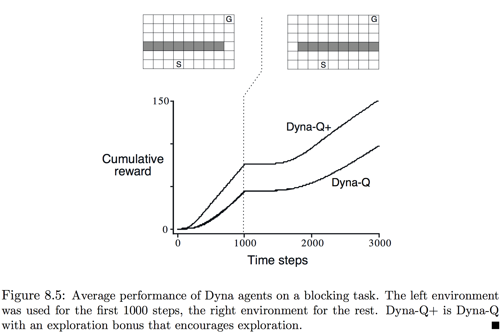
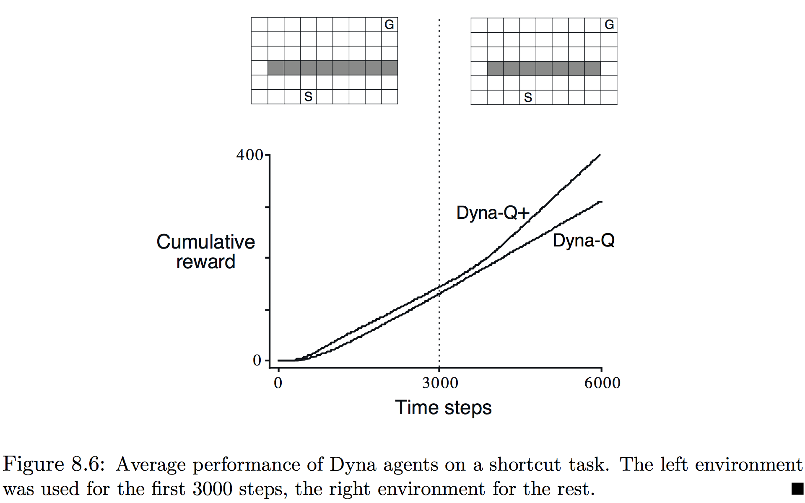
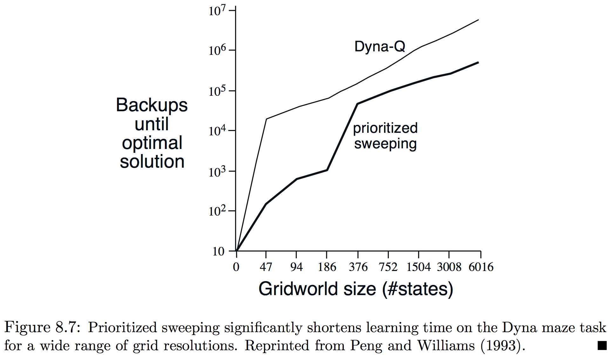
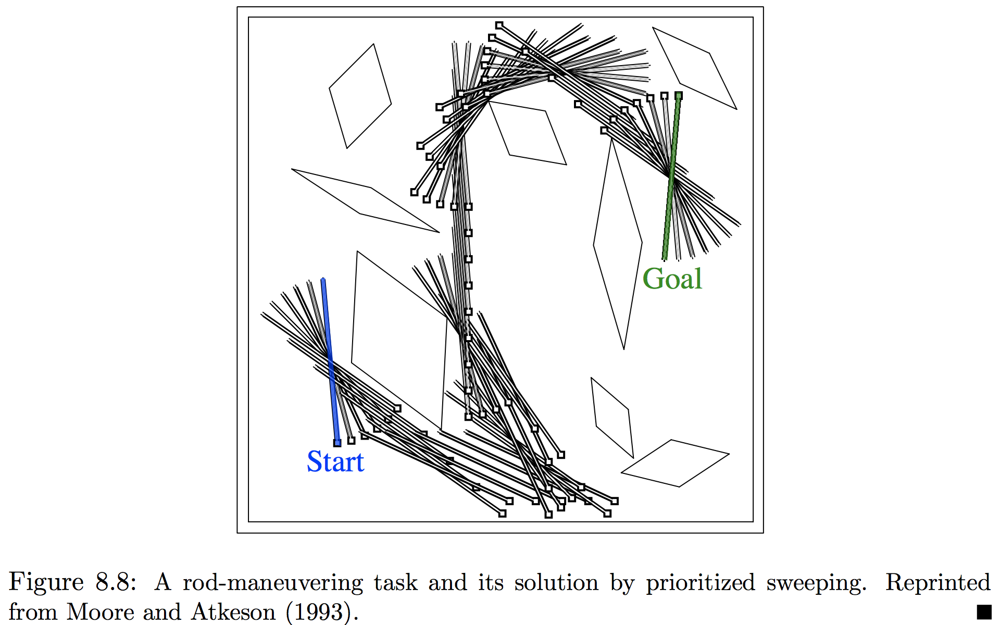
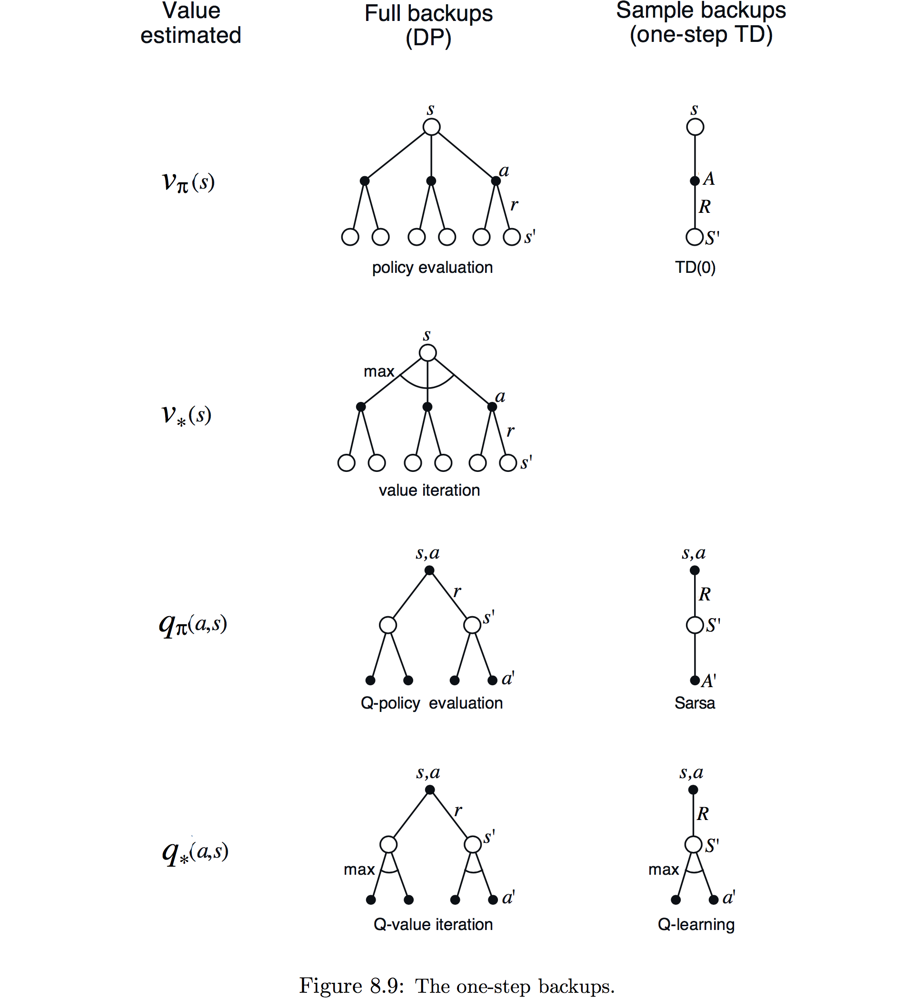
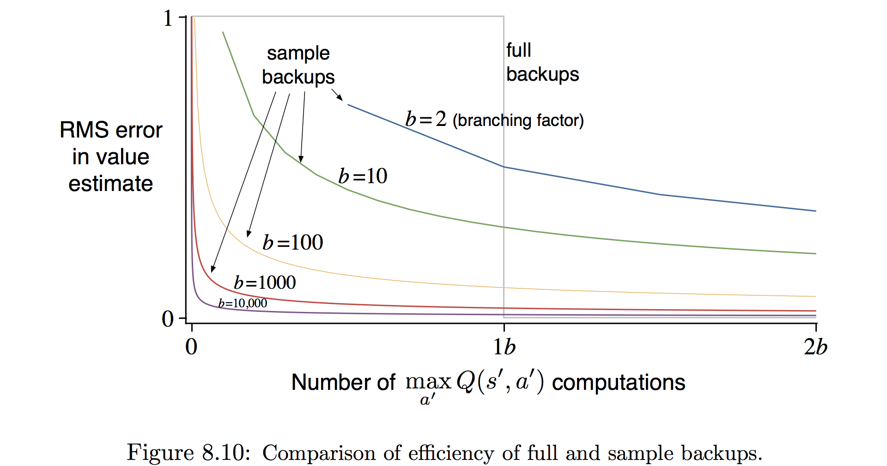

本章建立强化学习方法的统一观点，这些方法有的需要一个环境的模型，比如动态规划和启发式搜索；有的可以不用模型使用，比如蒙特卡洛和时间差分方法。这些分别被称为**基于模型(model-based)**和**无模型(model-free)**的强化学习方法。基于模型的方法依赖于**规划(planning)**作为主要部分，而无模型方法则主要依赖于**学习(learning)**。尽管两类方法有一些真实差异，但也有很大的相似性。尤其是这两种方法的核心都是价值函数的计算。更重要的是，所有这些方法都基于前向观察未来事件，计算备份值，然后使用它来更新一个近似价值函数。先前本书将MC和TD方法展示为两种不同的方法，然后又演示了如何使用𝑛-步方法将它们统一起来。本章的目标是将基于模型和无模型的方法同样地集成起来。

##### 8.1 模型与规划

模型指任何代理能用于预测环境会怎样反馈其行为的事物。给定状态和行动，模型由此产生下个状态和激励的预测。若模型是随机的，则会有一些可能的下个状态和激励，每个都有某种发生的概率。一些模型产生所有的可能性和它们的概率，这些称为分布模型；其他模型仅尝试其可能性中的一个，通过可能性抽取，这些称为采样模型。动态规划中假设的模型——MDP动态$p(s',r\mid s,a)$——是一个分布模型；第五章中21点示例则是采样模型。分布模型强于采样模型，因其能用于产生样本；但在许多应用中，采样模型比分布模型更容易获得。

模型能够用于模拟或仿真经验。给定一个开始状态和行动，抽样模型给出一种可能的转移，而分布模型产生用发生概率加权的所有可能转移。给定一个开始状态和策略，抽样模型能够产生一整个节，而分布模型能够产生所有可能的节和它们的概率。在每种情况下，都称模型用于模拟环境并产生了模拟的经验。

这里词语**规划**被用来表示任何接受模型为输入、产生或改善用来与所建模的环境交互的策略：
$$
\begin{CD}
\text{model} @>\text{planning}>> \text{policy} 
\end{CD}
$$
在人工智能中，按照定义有两种不同的规划方法。**状态空间规划(state-place planning)**，包含了本书采取的方法，被视为主要是在状态空间中对一个目标最优策略或最优路径的搜索。行动引起状态到状态的转移，而价值函数在状态上计算。在被称为**规划空间规划(plan-space planning)**中，规划变为规划空间上的搜索。运算从一个规划变换到另一个，而如果有价值函数的话，则定义在规划空间。规划空间规划包含进化算法和“偏序规划”，很难有效应用于随机序列决策问题，因此不会更深入地考虑。

本章所展示的统一观点是所有状态空间规划方法都满足一个共同结构，这个结构在学习方法中也出现，它的两个基本思想是：(1) 所有状态-空间规划方法都涉及计算价值函数作为改善策略的中间步骤；(2) 它们通过应用于模拟经验的备份来计算价值函数。˙这种共同结构可以表示为：
$$
\begin{CD}
\text{model} @>>> \text{simulated experience} @>\text{backups}>> \text{values} @>>> \text{policy}  
\end{CD}
$$
显然动态规划是满足这个结构的。本章认为其他状态空间规划方法也满足，区别仅在于它们所使用的备份类型、它们备份的顺序以及备份信息多久获得。用这种方式考虑规划方法强调了它们与学习方法之间的联系，学习和规划方法的核心都在于基于更新操作的价值函数估计。区别在于规划使用由模型产生的模拟经验，而学习使用环境产生的实际经验。当然这些差异导致了许多其他的差异，比如性能的评测方法和经验产生的灵活性。但共同结构意味着许多思想和算法可以在规划和学习之间迁移。尤其是在许多情况下对关键的备份步骤学习方法可以用规划方法代替。学习方法仅需要经验作为输入，但在许多情况下可以像实际经验一样使用模拟经验。下面的伪代码展示了一个基于单步表𝑄-学习和来自抽样模型样本的规划方法的示例。这种方法被称为**单步随机样本表𝑄-学习(random sample one-step tabular 𝑄-learning)**，在单步表𝑄-学习对真实环境收敛到最优策略相同的条件下（每个状态-许多对必需在Step1被选中无数次，而𝛼必需随时间适当减小），收敛到模型的最优策略。
$$
\bbox[25px,border:2px solid]
{
\begin{aligned}
&\underline{\mathbf{Random\text-sample\space one\text-step\space tabular\ Q\text-planning}}\\
\\
&\text{Do forever: }\\
&\qquad\text{1. Select a state}, S\in\mathcal S,\text{ and an action, }A\in\mathcal A(s),\text{ at random}\\
&\qquad\text{2. Send }S,A\text{ to a sample model, and obtain}\\
&\qquad\qquad\text{a sample next reward, }R,\text{ and a sample next state, }S'\\
&\qquad\text{3. Apply one-step tabular Q-learning to }S, A, R, S'\text{:}\\
&\qquad\qquad Q(S,A) \leftarrow Q(S,A) + \alpha\left[R + \gamma\max_aQ(S',a) - Q(S,A)\right]\\
\end{aligned}
}
$$
另外本章的第二个主题是在微小步中规划的益处，他使得规划能在任何时间以很小的资源浪费被中断或重定向，而这是高效混合规划与活动和与模型学习的关键要求。在非常小步骤的规划可能是最有效的方法，即便在单纯的规划问题中只要问题太大而无法精确解决。

##### 8.2 戴纳(Dyna)：集成规划、活动和学习

当规划在线与环境交互完成时，会出现一些有趣的问题。交互而得的信息可能改变模型以及因此与规划的交互。可能想要以某种方式定制当前所考虑、或者预期不久后的状态或决策的规划过程。若决策制定和模型学习都是耗费计算的过程，则能够获得的计算可能需要在它们之间划分。为开始这个问题的探索，本节展示Dyna-Q，一个集成了在线规划代理所需所有函数的框架。仅为了展示思想和激发直觉，因此Dyna-Q中出现的所有函数都是简单、几乎琐碎的形式。在一个规划代理中，实际经验至少有两个作用：用于改善模型和使用前面章节讨论的方法直接改变价值函数和策略。前一个称为**模型学习(model-lerning)**，后一个称为**直接强化学习(direct RL)**。经验、模型、价值和策略之间可能的关系如图8.1所示，注意注意经验可以直接或间接通过模型改善价值函数，

直接或间接方法都有优势和劣势。间接方法经常更全地使用有限的经验，因此能够用较少的经验去的较好的策略；另一方面直接方法更简单，并且不受设计模型偏差的影响。许多人认为间接方法总是优于直接方法，然而其他人认为直接方法对大多数人的学习更重要。我们认为这两者之间的区别被这些争论夸大了，承认这两边的相似性能够获得更多的洞悉。

戴纳-𝑄包含了图8.1所示的所有过程——规划、活动、模型学习和直接RL——所有的都连续发生。规划方法是图8.1给出的单步随机抽样表𝑄-学习方法；直接RL方法是单步表𝑄-学习；模型学习方法同样也基于表并且假定环境是确定性的。在每次转移$S_t,A_t\rightarrow R_{t+1},S_{t+1}$，模型为$S_t,A_t$记录表格条目时，就确定会有预测$R_{t+1},S_{t+1}$。因此，如果用已出现过的状态-行动对咨询模型，它简单地返回最后一次观测到的下个状态和激励。在规划期间，𝑄-规划算法仅从前面见过的状态-行为对中随机抽样，因此模型不会被咨询到一个没有信息的状态-行动对。

戴纳代理的总体结构（戴纳算法仅是它的一个特例）在图8.2中展示。中间的栏代表代理和环境之间的基本交互，会引起一个真实经验的轨迹。图中的左边箭头表示在真实经验上操作来改善价值函数和策略的直接强化学习，右边的则是基于模型的过程。模型从实际经验中学习并产生模拟经验。我们使用**搜索控制(search control)**来表示为模型产生的模拟经验选择开始状态和行动的过程。最后，在模拟经验上像实际发生的那样应用强化学习方法来实现规划。通常，就像在Dyna-𝑄中那样，从实际经验中的学习和从模拟经验中的规划都使用相同的强化学习方法。因此，强化学习方法就是学习和规划的“最终共同路径”。在拥有相同的机制、仅是经验来源不同这种意义上，学习和规划就深深地集成了起来。

概念上，规划、活动、模型学习与直接RL同时发生并在Dyna代理中并行。不过为在串行计算机中的正确和实现，我们完全指定它们在一个时间步内发生的顺序。在Dyna-𝑄中，活动、模型学习和直接RL过程所需计算极少，假定只消耗时间的一小部分；每步剩余的时间都被分到本身时计算密集的规划过程中。假定每一步在完成活动、模型学习和直接RL之后，还有时间完成𝑄-规划算法𝑛个迭代（1-3步）。在下面Dyna-𝑄算法的伪代码中，$Model(s,a)$表示状态-行动对(𝑠,𝑎)的（预测的下个状态和激励）的内容。直接RL、模型学习和规划分别由步骤(d)、(e)和(f)实现。若省略(e)、(f)，剩余的算法就是单步-表𝑄-学习。
$$
\bbox[25px,border:2px solid]
{
\begin{aligned}
&\underline{\mathbf{Tabular\ Dyna\text-Q}}\\
\\
&\text{Initialize }Q(s,a)\text{ and }Model(s,a)\text{ for all }s\in\mathcal S\text{ and }a\in\mathcal A(s)\\
&\text{Do forever: }\\
&\qquad\text{(a) }S\leftarrow\text{current (nonterminal) state}\\
&\qquad\text{(b) }A\leftarrow\varepsilon\text{-greedy}(S,Q)\\
&\qquad\text{(c) Execute actions }A\text{; observe resultant reward, }R\text{, and state, }S'\\
&\qquad\text{(d) }Q(S,A) \leftarrow Q(S,A) + \alpha\left[R + \gamma\max_aQ(S',a) - Q(S,A)\right]\\
&\qquad\text{(e) }Model(S,A)\leftarrow R,S'\text{ (assuming deterministic enviroment)}\\
&\qquad\text{(f) Repeat }n\text{ times:}\\
&\qquad\qquad S\leftarrow\text{random previously observed state}\\
&\qquad\qquad A\leftarrow\text{random action previously taken in }S\\
&\qquad\qquad R,S' \leftarrow Model(S,A)\\
&\qquad\qquad Q(S,A) \leftarrow Q(S,A) + \alpha\left[R + \gamma\max_aQ(S',a) - Q(S,A)\right]\\
\end{aligned}
}
$$
**示例8.1 Dyna迷宫**：考虑图8.3中的简单迷宫。在47个状态中的每个都有4个行动$\mathtt{up}$、$\mathtt{down}$、$\mathtt{left}$和$\mathtt{right}$。每个都将代理带到相应临近状态，除非被障碍物或边缘阻挡，在这种情况下位置就保持不变。所有的移动都是0，除非到达目标状态$\mathtt{(G)}$，此时激励为+1。到达目标状态后，代理会到开始状态$\mathtt{(S)}$开始新的一轮游戏。这是一个折扣、分段的任务，其中𝛾=0.95。

图8.3的主要部分展示了一个Dyna-𝑄代理应用到迷宫任务试验的平均学习曲线。初始的行动价值为0，步长参数𝛼=0.1，探索参数𝜀=0.1。在贪心选择行动时，若有平局则随机选择。代理在规划的步数𝑛上变化，它们执行了每个真实步。对于每个𝑛，曲线展示了30个重复试验每节代理到达目标采取步数的均值。在每次重复中，随机数发生器的初始种子在算法上保持不变。因此，第一节对所有的值𝑛都相同（大约1700步），其数据未在图上显示。第一个节后，所有𝑛的值都有了改善，但对更大的值更快。当𝑛=0时，代理是非规划的，仅用直接RL（单步表𝑄-学习）。这是目前为止这个问题上最慢的代理，尽管参数值（𝛼和𝜀）已优化过。非规划的代理使用了大约25个节来达到(𝜀-)最优表现，尽管𝑛=5的代理使用了大约5个节，𝑛=50的代理3个节。

图8.4展示了为何规划代理能比非规划如此快地找到解法。展示的是𝑛=0和𝑛=50的代理在第二节中途找到的策略。没有规划(𝑛=0)，每节仅额外增加一步到策略，因此目前也就一步（最后的）学习到了。使用规划后，同样第一个节只学习了一步，但第二节期间发展出了一个大范围的策略，以至于到节结束时，几乎就要会到起始状态。策略由规划过程建立，而代理依然还在开始状态附近徘徊。到第三个节结束时，代理就会找到完整的最优策略并实现完美的表现。

在Dyna-𝑄中，学习和规划都是由同一个算法完成，在实际经验中学习，然后在模拟经验中规划。因规划递增地进行，混合规划和活动就并不重要，它们都会尽快的进行。代理总是会反馈和慎重的，即刻对最后的感知信息作出反应，并且总是已在隐蔽地规划。同样隐蔽不间断的是模型学习的过程。在获得新信息后，模型更新得更加符合实际。随着模型的改变，持续的规划过程会逐渐计算出一种新的行为方式来适应新模型。

**练习8.1**：图8.4中的非规划方法看起来特别差因其是一种单步方法；一个使用多步引导的方法会表现得更好。第7章中的多步引导方法能表现得像Dyna方法一样好吗？解释原因。

##### 8.3 当模型是错误的

前面章节展示的迷宫中，模型的改变相对适当。模型从空开始，然后仅填充恰好正确的信息填充。但通常而言不可能这么幸运。模型可能会不正确，因为环境是随机的并且只观测到有限的样本，或者模型用泛化得有缺陷的函数近似学得，或者仅仅his环境已经改变了而其新行为还未观测到。当模型不正确时，规划过程很可能计算一个次优策略。在一些情况下，这个次优策略会很快引向建模错误的发现和修正。当模型就预测比实际可能更大激励或更优状态转移而言是最优时这种倾向就会发生。规划的策略尝试开发这种机会并在这样做时发现这些机会并不存在。

**示例8.2 阻塞迷宫**：一个展示相对较小类建模错误并从中恢复的示例展现在图8.5中。初始时，从起始到右边障碍到目标有一个短路径，如图左上部所示；1000步后，短路径被“阻塞”，一个长路径沿着障碍左侧打开，如图右上部所示。下部分的图展示了一个Dyna-𝑄代理和一个即将描述的加强Dyna-𝑄+代理的平均累积激励。图表的第一部分显示两种代理都在1000步内找到了短路径；当环境改变后，曲线变平，指示一段时间代理未获得激励，因它们在障碍后面徘徊。但一段时间后，它们能够找到新的开口和最优路径。

当环境变得比以前更好时会出现更大的难题，而原来的正确策略没有揭示这种改善。这种情况下如果有建模误差的话，很长时间都无法检测到。

**示例8.3 捷径迷宫**：迷宫示例展示的这种环境变化导致的问题展现在图8.6中。初始时的最优策略是穿过障碍物左侧（图左上部）。然而3000步后，一条更短的路径沿着障碍右侧打开，而不影响更长的那条路径（图右上部）。图表展示普通的Dyna-𝑄代理从未转向捷径，事实上，它从未意识到它的存在。模型说不存在捷径，因此规划得越多越不可能步入右边并找到它。即便使用𝜀-贪心策略，代理也不太可能采取如此多的探索行动去发现捷径。

这里的一般问题是另一种版本的探索和开发间的冲突。在规划中，探索意味着尝试改善模型的行动，而开发表示以当前给定模型的最优方式表现。我们行为代理探索来发现环境的改变，但也并非多到大大降低其表现。在前面探索／开发冲突中，很可能并不存在既完美又实用的方法，但简单的启发方法通常就有效。

Dyna-𝑄+代理实用一种这样的启发方法解决了捷径迷宫。这种代理为每个状态-动作对追踪距离上次实际与环境交互已有多久。时间过去得越多，则这对动态发生变化因此模型变得不正确的概率就越大（可以假定）。为鼓励长期未试的行为，一种特殊的激励津贴给到包含这种行动的模拟经验。尤其是，如果一个转移的模型激励是𝑟，并且又有𝜏步未被尝试，则在规划备份中这个转移产生$r+\kappa\sqrt{\tau}$，𝜅为一个很小的量。这就鼓励代理测试所有可获得的状态转移并且甚至是寻找长序列的行动以实现这种测试。当然所有这些测试都有代价，但在许多情况下，就像捷径迷宫，这种计算好奇值得额外的尝试。

**练习8.2**：为何有探索红利的Dyna代理，Dyna-𝑄+在阻塞和捷径试验中第一阶段像第二阶段一样表现更优？

**练习8.3**：图8.6细致的检查显示Dyna-Q+和Dyna-Q的差异在试验的第一部分稍稍变小了。原因何在？

**练习8.4（编程）**：上面描述的探索红利实际上改变了状态和行动的估计值。这是必要的吗？假定红利$\kappa\sqrt\tau$单单在行动选择，而不在备份中使用，也即总是选择$Q(S_t,a)+\tau\sqrt{\tau(S_t,a)}$最大的行为。实施一个网格世界的试验来测试和显示这种替代方法的长处和劣势。

##### 8.4 优先级扫描

在前面展示的Dyna代理中，模拟经验在从所有前面经历过的状态-行动对中均匀选择的开始，但均匀选择通常并不是最佳的，若模拟转移和备份聚集在一些特定行为-状态对，则规划能够高效得多。比如考虑第一个迷宫任务（图8.4）在第二节发生的情况，在开始时，只有直接引到目标的状态-行动对才有正值，其他对的值依然都是0。这就表示备份几乎所有的转移并没有意义，因为它们只是将代理从一个0价值状态带到另一个，因此备份就没有任何效果。仅沿着正好到目标前一个、或者从目标出来的状态的转移备份才会改变一些价值。若模拟转移均匀地产生，则在蹒跚到有效备份之前会做许多无用的。随着规划推进，有效备份的区域会扩大，但规划依然远没有在能做得最好的地方聚焦高效。在更大的问题中状态会多到无聚焦搜索极其低下哦，那才是我们真实的目标。

这个示例表明搜索能够通过从目标状态反向工作以有效地聚焦。当然我们并非想要真正使用任何特定到目标状态思想的方法，而是希望对一般激励函数有效的方法。目标状态仅是一种便于模拟直觉的特殊情况。一般而言，我们希望不仅从目标状态还有任何价值改变的状态反向工作。假定给定模型价值是初始正确的，就像在迷宫任务中它们是发现目标的前一个。假定现在代理发现了环境中的一个变化并向上或向下改变了一个状态的估计值。通常，这意味着许多其他状态的价值也应该被改变，但唯一有效的单步备份是直接引到价值已经改变状态的行动的备份。如果这些行动的价值被更新，则前驱状态的价值也会轮次改变。如果这样，则引到它们的行动就需要被备份，然后它们的前驱状态也可能发生变化。这样就能从任意价值已经改变的状态反向工作，执行有效更新或者终结后向传播，这种一般思想被称为规划计算的**反向聚焦(backward focusing)**。

当有效更新的前沿反向传播时，经常会增长很快，产生很多有效更新的状态-行动对。但并非所有的都等价有效。一些状态的价值可能改变很多，而一些可能改变很少。那些改变很多状态的前驱状态-行动对很可能也改变很多。在随机环境中，转移概率估计的变化也会促成改变规模和备份哪对紧迫性的变化。很自然可以按照紧急性的度量区分优先级，并按照优先级顺序执行，这就是优先级扫描背后的思想。维护一个若备份估计值会改变较大的状态-行动对的队列，按照改变规模的大小区分。当队列的顶端对备份后，就会计算对其每个前驱对的影响。若影响大于某个小的阈值，这样的对就会用新的优先级重新插入到队列（若在队列中有这些对先前的条目，则插入仅导致更高优先级的条目留在队列中）。通过这种方法变化的影响就会有效地后向传播直到静止。随机条件下完整算法如下：
$$
\bbox[25px,border:2px solid]
{
\begin{aligned}
&\underline{\mathbf{Prioritized\ sweeping\ for\ a\ deterministic\ enviroment}}\\
\\
&\text{Initialize }Q(s,a)\text{ and }Model(s,a)\text{ for all }s\in\mathcal S\text{ and }a\in\mathcal A(s)\\
&\text{Do forever: }\\
&\qquad\text{(a) }S\leftarrow\text{current (nonterminal) state}\\
&\qquad\text{(b) }A\leftarrow\varepsilon\text{-greedy}(S,Q)\\
&\qquad\text{(c) Execute actions }A\text{; observe resultant reward, }R\text{, and state, }S'\\
&\qquad\text{(d) }Model(S,A)\leftarrow R,S'\\
&\qquad\text{(e) }P\leftarrow \left\vert R + \gamma\max_aQ(S',a) - Q(S,A) \right\vert\\
&\qquad\text{(f) if }P>\theta\text{, then insert }S,A\text{ into }PQueue\text{ with priority }P\\
&\qquad\text{(g) Repeat }n\text{ times, while }PQueue\text{ is not empty:}\\
&\qquad\qquad S,A\leftarrow first(PQueue)\\
&\qquad\qquad R,S' \leftarrow Model(S,A)\\
&\qquad\qquad Q(S,A) \leftarrow Q(S,A) + \alpha\left[R + \gamma\max_aQ(S',a) - Q(S,A)\right]\\
&\qquad\qquad\text{Repeat, for all }\bar S,\bar A \text{ predicted to lead to }S\text{:}\\
&\qquad\qquad\qquad \bar R \leftarrow \text{predicted reward for }\bar S, \bar A, S\\
&\qquad\qquad\qquad P\leftarrow \left\vert R + \gamma\max_aQ(S,a) - Q(\bar S,\bar A) \right\vert\\
&\qquad\qquad\qquad \text{if }P>\theta\text{, then insert }\bar S,\bar A\text{ into }PQueue\text{ with priority }P
\end{aligned}
}
$$
**示例8.4 迷宫上的优先级扫描**：优先级扫描能急遽地提升迷宫任务找到最优方法的速度，通常是5到10倍的因子。典型的示例如图8.7所示，这些是一序列与图8.3所示相同结构的迷宫任务的数据，除了网格的分辨率不同。优先级扫描对非优先级的Dyna-𝑄保持一种决定性的优势。两个系统每次环境交互都至多做𝑛=5次备份。

**示例8.5 操作杆**：这个任务的目标是在一个有限四边形工作空间内用最少的步骤操作杆绕过一些变扭放置的障碍物到目标位置（见图8.8）。杆能沿着其长轴或长轴正交轴平移，或绕中心在一个方向旋转。每次移动的距离大约为工作空间的1/20。旋转增量是10度。平移是确定的并被量化到20×20个位置中的一个。图中展示了障碍物和用优先级扫描发现的从初始到目标的最短路径。问题依然是确定性的，但有4个行动和14400歌潜在状态（由于障碍物有一些无法到达）。对于非优先级的方法而言，这个问题已是太过庞大。

将优先级扫描扩展到随机环境非常直接。模型通过保持每个状态-行动对已经历过的次数和下个状态是什么来维护。则很自然对每个对不像前面看到那样用采样更新，而是使用全更新，将所有可能的下个状态和发生概率都考虑进去。它只是一种分配计算以提高规划效率的方法，并且很可能不是最好的。优先级扫描的一个缺陷是它使用全备份，这在随机环境中会低概率的转移上浪费大量计算。就像下一节展示的那样，尽管有采样引入的方差，但采样备份在许多情况下都能以更少的计算更接近真实价值函数。采样备份能赢是因为它们将全部更新计算分解成更小的片断——对应到单个转移——这就是它能更仔细地专注在有最大效果的片。在“小备份”中这个思想被采用到可能是其逻辑的极限。这些是沿着单个转移的备份，就像采样备份，但基于无采样的转移的概率，就像在全备份中。通过选择小备份完成的顺序，可能极大改善规划的效率超过优先级排序的可能。

本章已提出所有的状态空间规划都能视为备份的序列，仅是备份的类型，全或采样，大或小，和备份完成的顺序不同。本节已经强调了反向聚焦，但仅是一种战略。比如，另一种可能是关注从当前策略常访问状态到达的它的简单程度的状态，可能被称为**前向聚焦**。

##### 8.5 全备份与采样备份

前面章节的示例给出了结合学习和规划方法概率范围的思想，本章的余下内容会分析一些涉及到的组成思想，从全和采样备份的相对优势开始。本书的大部分都已是关于不同种类的更新，并且已经讲很多类。目前先关注单步更新，它们主要沿着三个二元维度变化。前两个维度是它们是备份状态价值还是行动价值和它们评估的是最优策略还是任意给定的策略。这两个维度产生4类更新近似4类价值函数：$q_*,v_*,q_\pi$和$v_\pi$。另一个二元维度是更新是考虑全部可能发生事件的全更新还是考虑可能会发生的单个样本的采样更新。这三个维度产生了8类，其中其中对应特定的算法，如图8.9所示（第8种情况似乎并不对应任何的有效更新）。这些单步备份中的任何一个都能用在规划算法中。先前讨论的Dyna-𝑄代理使用$q_*$样本更新，但也可以使用$q_*$全备份，或者全或者采样的$v_\pi$更新。Dyna-AC系统使用$v_\pi$采样更新连同一个学习策略结构。对于随机问题，总是由使用一种全备份的优先级扫描完成。

在第6章中介绍单步采样更新时，将其展现为全备份的替代。在缺少分布模型时，无法实现全备份，但可以通过对环境中的转移采样或一个采样模型来完成采样备份。这个观点隐含着如果可能，全备份比采样备份更可取。但真的是这样吗？全备份确实能产生更好的估计因为它们不会受样本误差的侵蚀，但也需要更多计算，而计算在规划中通常是有限的资源。为适当地评估全备份和采样备份对于规划的相对优点，必需对它们的不同的计算需求做控制。

具体而言，考虑近似$q_*$的样本备份和全备份，以及离散状态和行动、近似价值函数𝑄的查询表表示、形式为估计动态$\hat p(s',r\mid s,a)$的模型的特殊情形。一个状态-行动对𝑠,𝑎的全备份是：
$$
Q(s,a) \leftarrow \sum_{s',r}\hat p(s',r\mid s,a)\left[ r + \gamma\max_{a'}Q(s',a') \right] \tag{8.1}
$$
给定从模型中抽取的下个状态和激励𝑆'和𝑅，就是类似𝑄-学习的更新：
$$
Q(s,a) \leftarrow Q(s,a) + \alpha\left[ R+\gamma\max_{a'}Q(S',a')-Q(s,a) \right] \tag{8.2}
$$
其中𝛼是通常的正步长参数。到环境是随机的程度时，全备份和采样备份的差异就十分显著，特别是那种给定一个状态和行动，有许多可能的下个状态会以不同的概率发生。若下个状态只有一种可能，则上面给出的全备份和采样备份就是等价的（取𝛼=1）。若下个状态有很多种，就会有显著的差异。全备份是一个产生新𝑄(𝑠,𝑎)的精确计算，新𝑄(𝑠,𝑎)正确性仅受后继状态的𝑄(𝑠',𝑎')限制，采样备份另外还会受采样误差的影响。更一方面，采样备份的计算更便宜，，因为它只考虑下个状态中的一种而非全部。实践中，备份操作要求的计算量通常会受评估𝑄的状态-许多对的数目所支配。对一个特定的开始对𝑠,𝑎，令𝑏为**分支因子**（**branching factor**，也就是下个状态𝑠'可能的数目，其中$\hat p(s'\mid s,a)>0$）。则这个对的全备份粗略地说需要采样备份计算的𝑏倍。

若有足够的时间完成全备份，则得到的估计通常优于𝑏采样备份的，因为没有采样误差。但若时间并不充裕，则采样备份总是更可取的，因为它们至少用少于𝑏次的备份改善了价值估计。有许多状态-行为对的大型问题中则经常是后一种情况。在这么多的行为-状态对下，将它们全部备份会消耗很长的时间。在那之前，许多状态-许多对中的一些样本备份远比一些对的全备份好。给定一单位计算力量，将其投入到一些全备份或𝑏倍的采样备份那个更好呢？

图8.10展示了启发这个问题一个答案的分析结果。它将估计误差显示为各种分支因子𝑏计算全备份和采样备份时间的函数，考虑的情况是所有𝑏个后继状态是等可能的以及初始估计的误差为1。下个状态的价值假定是正确的，因此全备份在完成后将误差减小到0。这种情况下，采样备份按照$\sqrt{\frac{b-1}{bt}}$减小误差，其中𝑡是已执行的采样备份数目（假定采样平均，即𝛼=1/𝑡）。观察到的关键结果是对于大小适中的𝑏，用𝑏个备份的很小部分就能使误差急遽下降。在这些情况中，许多状态-行动对能够使它们的价值有惊人的改善，到在全备份影响的几个百分点内，同时一个状态行动对能完全备份。

图8.10展示的采样备份优势很可能是实际效果的低估。在实际问题中，后继状态的价值也需要通过备份来更新。通过使估计更早变得更精确，采样更新会有第二个优势——从后继状态更新的值会更精确。这些结果说明在随机分支因子很大且有很多状态要精确解决的问题上采样备份比全备份更可取。

##### 8.6 轨迹采样

本节比较两种分配备份的方式。从动态规划获得的方法是在整个状态（或状态-行动空间）执行扫描，每次扫描都备份每个状态（或状态-行动对）一次。在大型任务上这是有困难的，因为可能甚至没有时间完成一次扫描。在许多任务中状态的大多数都是不相关的，因为它们只会在非常差的策略或极小的概率才会被访问。穷举(exhaustive)扫描暗含将相同时间投入到状态空间的所有部分而分关注在需要的地方。就像在第4章中讨论的，穷举扫描和它们暗指的的等同对待所有状态未必是动态规划的特性。原则上，备份可以以任何方式分配（为保证收敛，所有的状态和状态-行动对必须在极限时被访问无数次），但实际上穷举扫描经常被使用。

第二种方法是按照某种分布从状态或状态-空间采样。可以均匀采样，就像Dyna-𝑄代理所做，但会有穷举搜索同样的问题。更好的是按照on-policy-policy分布分配备份。这种分布的好处是易于产生；简单地遵循当前策略与模型交互。在分段任务中，代理在一个开始状态（或按照开始状态分布）开始，然后模拟直到终止状态。在连续任务中，代理从任何位置开始并一直模拟。在这两种情况下，样本主题转移和激励由模型给定，样本行动由当前策略给定。换句话说，代理明确模拟单独的轨迹并对沿途所遇的状态或状态-行动对执行备份。这种产生经验和备份的方法被称为**轨迹采样(trajectory sampling)**。

除了通过轨迹采样，很难相处任何依照on-policy分布分配备份的有效方法。若有on-policy分布的明确表达，就可以扫描所有状态，按照on-policy分布权衡每个状态的备份，但也有所有穷举扫描的计算代价问题。或许可以从分布中采样并更新单个状态-行动对，但即便这个能高效完成，那相对轨迹采样它又提供了什么好处呢？即便是知道on-policy分布的确切形式也是不可能的。无论何时策略改变分布也会改变，而计算分布的计算量比得上一个完整的策略更新。这样其他可能性的考虑使得轨迹采样既高效又优雅。那备份的on-policy分布是否好呢？直觉上这是一个好的选择，至少优于均匀分布。比如，在学习围棋时会学习实际游戏中可能出现的位置，而非棋子的任意位置。后者可能是有效状态，但精确计算它们价值又是与评估实际游戏位置不同的技能。无论是否用到函数近似，都可以期待on-policy专注于显著改善规划速度。

聚焦on-policy分布可以是有益的因它使得代理忽视空间中大量、不感兴趣的部分，或者可能是有害的因为它使得空间原来相同的部分再三地备份。我们实施了一个实验经验地测评效果，为了