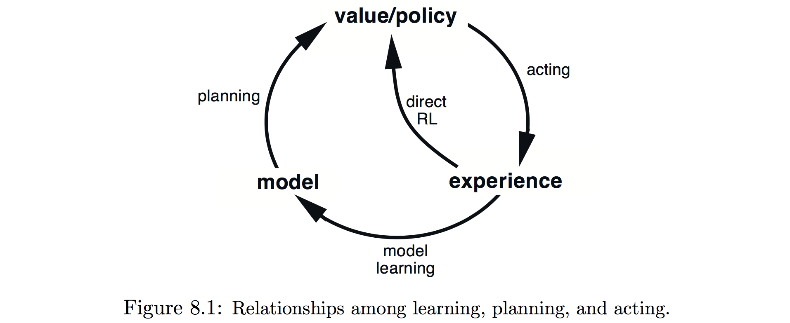
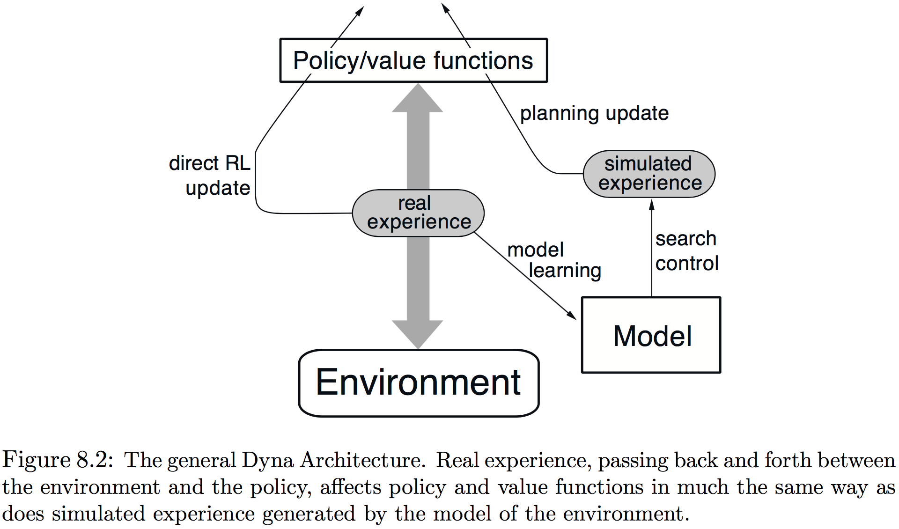
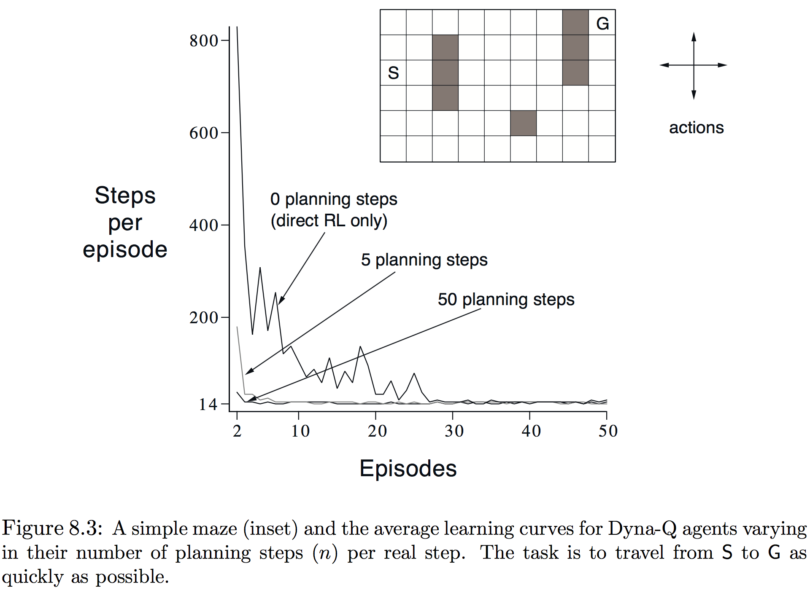
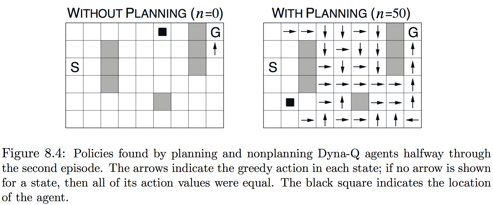

本章建立强化学习方法的统一观点，这些方法有的需要一个环境的模型，比如动态规划和启发式搜索；有的可以不用模型使用，比如蒙特卡洛和时间差分方法。这些分别被称为**基于模型(model-based)**和**无模型(model-free)**的强化学习方法。基于模型的方法依赖于**规划(planning)**作为主要部分，而无模型方法则主要依赖于**学习(learning)**。尽管两类方法有一些真实差异，但也有很大的相似性。尤其是这两种方法的核心都是价值函数的计算。更重要的是，所有这些方法都基于前向观察未来事件，计算备份值，然后使用它来更新一个近似价值函数。先前本书将MC和TD方法展示为两种不同的方法，然后又演示了如何使用𝑛-步方法将它们统一起来。本章的目标是将基于模型和无模型的方法同样地集成起来。

##### 8.1 模型与规划

模型指任何代理能用于预测环境会怎样反馈其行为的事物。给定状态和行动，模型由此产生下个状态和激励的预测。若模型是随机的，则会有一些可能的下个状态和激励，每个都有某种发生的概率。一些模型产生所有的可能性和它们的概率，这些称为分布模型；其他模型仅尝试其可能性中的一个，通过可能性抽取，这些称为采样模型。动态规划中假设的模型——MDP动态$p(s',r\mid s,a)$——是一个分布模型；第五章中21点示例则是采样模型。分布模型强于采样模型，因其能用于产生样本；但在许多应用中，采样模型比分布模型更容易获得。

模型能够用于模拟或仿真经验。给定一个开始状态和行动，抽样模型给出一种可能的转移，而分布模型产生用发生概率加权的所有可能转移。给定一个开始状态和策略，抽样模型能够产生一整个节，而分布模型能够产生所有可能的节和它们的概率。在每种情况下，都称模型用于模拟环境并产生了模拟的经验。

这里词语**规划**被用来表示任何接受模型为输入、产生或改善用来与所建模的环境交互的策略：
$$
\begin{CD}
\text{model} @>\text{planning}>> \text{policy} 
\end{CD}
$$
在人工智能中，按照定义有两种不同的规划方法。**状态空间规划(state-place planning)**，包含了本书采取的方法，被视为主要是在状态空间中对一个目标最优策略或最优路径的搜索。行动引起状态到状态的转移，而价值函数在状态上计算。在被称为**规划空间规划(plan-space planning)**中，规划变为规划空间上的搜索。运算从一个规划变换到另一个，而如果有价值函数的话，则定义在规划空间。规划空间规划包含进化算法和“偏序规划”，很难有效应用于随机序列决策问题，因此不会更深入地考虑。

本章所展示的统一观点是所有状态空间规划方法都满足一个共同结构，这个结构在学习方法中也出现，它的两个基本思想是：(1) 所有状态-空间规划方法都涉及计算价值函数作为改善策略的中间步骤；(2) 它们通过应用于模拟经验的备份来计算价值函数。˙这种共同结构可以表示为：
$$
\begin{CD}
\text{model} @>>> \text{simulated experience} @>\text{backups}>> \text{values} @>>> \text{policy}  
\end{CD}
$$
显然动态规划是满足这个结构的。本章认为其他状态空间规划方法也满足，区别仅在于它们所使用的备份类型、它们备份的顺序以及备份信息多久获得。用这种方式考虑规划方法强调了它们与学习方法之间的联系，学习和规划方法的核心都在于基于更新操作的价值函数估计。区别在于规划使用由模型产生的模拟经验，而学习使用环境产生的实际经验。当然这些差异导致了许多其他的差异，比如性能的评测方法和经验产生的灵活性。但共同结构意味着许多思想和算法可以在规划和学习之间迁移。尤其是在许多情况下对关键的备份步骤学习方法可以用规划方法代替。学习方法仅需要经验作为输入，但在许多情况下可以像实际经验一样使用模拟经验。下面的伪代码展示了一个基于单步表𝑄-学习和来自抽样模型样本的规划方法的示例。这种方法被称为**单步随机样本表𝑄-学习(random sample one-step tabular 𝑄-learning)**，在单步表𝑄-学习对真实环境收敛到最优策略相同的条件下（每个状态-许多对必需在Step1被选中无数次，而𝛼必需随时间适当减小），收敛到模型的最优策略。
$$
\bbox[25px,border:2px solid]
{
\begin{aligned}
&\underline{\mathbf{Random\text-sample\space one\text-step\space tabular\ Q\text-planning}}\\
\\
&\text{Do forever: }\\
&\qquad\text{1. Select a state}, S\in\mathcal S,\text{ and an action, }A\in\mathcal A(s),\text{ at random}\\
&\qquad\text{2. Send }S,A\text{ to a sample model, and obtain}\\
&\qquad\qquad\text{a sample next reward, }R,\text{ and a sample next state, }S'\\
&\qquad\text{3. Apply one-step tabular Q-learning to }S, A, R, S'\text{:}\\
&\qquad\qquad Q(S,A) \leftarrow Q(S,A) + \alpha\left[R + \gamma\max_aQ(S',a) - Q(S,A)\right]\\
\end{aligned}
}
$$
另外本章的第二个主题是在微小步中规划的益处，他使得规划能在任何时间以很小的资源浪费被中断或重定向，而这是高效混合规划与活动和与模型学习的关键要求。在非常小步骤的规划可能是最有效的方法，即便在单纯的规划问题中只要问题太大而无法精确解决。

##### 8.2 戴纳(Dyna)：集成规划、活动和学习

当规划在线与环境交互完成时，会出现一些有趣的问题。交互而得的信息可能改变模型以及因此与规划的交互。可能想要以某种方式定制当前所考虑、或者预期不久后的状态或决策的规划过程。若决策制定和模型学习都是耗费计算的过程，则能够获得的计算可能需要在它们之间划分。为开始这个问题的探索，本节展示Dyna-Q，一个集成了在线规划代理所需所有函数的框架。仅为了展示思想和激发直觉，因此Dyna-Q中出现的所有函数都是简单、几乎琐碎的形式。在一个规划代理中，实际经验至少有两个作用：用于改善模型和使用前面章节讨论的方法直接改变价值函数和策略。前一个称为**模型学习(model-lerning)**，后一个称为**直接强化学习(direct RL)**。经验、模型、价值和策略之间可能的关系如图8.1所示，注意注意经验可以直接或间接通过模型改善价值函数，

直接或间接方法都有优势和劣势。间接方法经常更全地使用有限的经验，因此能够用较少的经验去的较好的策略；另一方面直接方法更简单，并且不受设计模型偏差的影响。许多人认为间接方法总是优于直接方法，然而其他人认为直接方法对大多数人的学习更重要。我们认为这两者之间的区别被这些争论夸大了，承认这两边的相似性能够获得更多的洞悉。

戴纳-𝑄包含了图8.1所示的所有过程——规划、活动、模型学习和直接RL——所有的都连续发生。规划方法是图8.1给出的单步随机抽样表𝑄-学习方法；直接RL方法是单步表𝑄-学习；模型学习方法同样也基于表并且假定环境是确定性的。在每次转移$S_t,A_t\rightarrow R_{t+1},S_{t+1}$，模型为$S_t,A_t$记录表格条目时，就确定会有预测$R_{t+1},S_{t+1}$。因此，如果用已出现过的状态-行动对咨询模型，它简单地返回最后一次观测到的下个状态和激励。在规划期间，𝑄-规划算法仅从前面见过的状态-行为对中随机抽样，因此模型不会被咨询到一个没有信息的状态-行动对。

戴纳代理的总体结构（戴纳算法仅是它的一个特例）在图8.2中展示。中间的栏代表代理和环境之间的基本交互，会引起一个真实经验的轨迹。图中的左边箭头表示在真实经验上操作来改善价值函数和策略的直接强化学习，右边的则是基于模型的过程。模型从实际经验中学习并产生模拟经验。我们使用**搜索控制(search control)**来表示为模型产生的模拟经验选择开始状态和行动的过程。最后，在模拟经验上像实际发生的那样应用强化学习方法来实现规划。通常，就像在Dyna-𝑄中那样，从实际经验中的学习和从模拟经验中的规划都使用相同的强化学习方法。因此，强化学习方法就是学习和规划的“最终共同路径”。在拥有相同的机制、仅是经验来源不同这种意义上，学习和规划就深深地集成了起来。

概念上，规划、活动、模型学习与直接RL同时发生并在Dyna代理中并行。不过为在串行计算机中的正确和实现，我们完全指定它们在一个时间步内发生的顺序。在Dyna-𝑄中，活动、模型学习和直接RL过程所需计算极少，假定只消耗时间的一小部分；每步剩余的时间都被分到本身时计算密集的规划过程中。假定每一步在完成活动、模型学习和直接RL之后，还有时间完成𝑄-规划算法𝑛个迭代（1-3步）。在下面Dyna-𝑄算法的伪代码中，$Model(s,a)$表示状态-行动对(𝑠,𝑎)的（预测的下个状态和激励）的内容。直接RL、模型学习和规划分别由步骤(d)、(e)和(f)实现。若省略(e)、(f)，剩余的算法就是单步-表𝑄-学习。
$$
\bbox[25px,border:2px solid]
{
\begin{aligned}
&\underline{\mathbf{Tabular\ Dyna\text-Q}}\\
\\
&\text{Initialize }Q(s,a)\text{ and }Model(s,a)\text{ for all }s\in\mathcal S\text{ and }a\in\mathcal A(s)\\
&\text{Do forever: }\\
&\qquad\text{(a) }S\leftarrow\text{current (nonterminal) state}\\
&\qquad\text{(b) }A\leftarrow\varepsilon\text{-greedy}(S,Q)\\
&\qquad\text{(c) Execute actions }A\text{; observe resultant reward, }R\text{, and state, }S'\\
&\qquad\text{(d) }Q(S,A) \leftarrow Q(S,A) + \alpha\left[R + \gamma\max_aQ(S',a) - Q(S,A)\right]\\
&\qquad\text{(e) }Model(S,A)\leftarrow R,S'\text{ (assuming deterministic enviroment)}\\
&\qquad\text{(f) Repeat }n\text{ times:}\\
&\qquad\qquad S\leftarrow\text{random previously observed state}\\
&\qquad\qquad A\leftarrow\text{random action previously taken in }S\\
&\qquad\qquad R,S' \leftarrow Model(S,A)\\
&\qquad\qquad Q(S,A) \leftarrow Q(S,A) + \alpha\left[R + \gamma\max_aQ(S',a) - Q(S,A)\right]\\
\end{aligned}
}
$$
**示例8.1 Dyna迷宫**：考虑图8.3中的简单迷宫。在47个状态中的每个都有4个行动$\mathtt{up}$、$\mathtt{down}$、$\mathtt{left}$和$\mathtt{right}$。每个都将代理带到相应临近状态，除非被障碍物或边缘阻挡，在这种情况下位置就保持不变。所有的移动都是0，除非到达目标状态$\mathtt{(G)}$，此时激励为+1。到达目标状态后，代理会到开始状态$\mathtt{(S)}$开始新的一轮游戏。这是一个折扣、分节的任务，其中𝛾=0.95。

图8.3的主要部分展示了一个Dyna-𝑄代理应用到迷宫任务试验的平均学习曲线。初始的行动价值为0，步长参数𝛼=0.1，探索参数𝜀=0.1。在贪心选择行动时，若有平局则随机选择。代理在规划的步数𝑛上变化，它们执行了每个真实步。对于每个𝑛，曲线展示了30个重复试验每节代理到达目标采取步数的均值。在每次重复中，随机数发生器的初始种子在算法上保持不变。因此，第一节对所有的值𝑛都相同（大约1700步），其数据未在图上显示。第一个节后，所有𝑛的值都有了改善，但对更大的值更快。当𝑛=0时，代理是非规划的，仅用直接RL（单步表𝑄-学习）。这是目前为止这个问题上最慢的代理，尽管参数值（𝛼和𝜀）已优化过。非规划的代理使用了大约25个节来达到(𝜀-)最优表现，尽管𝑛=5的代理使用了大约5个节，𝑛=50的代理3个节。

图8.4展示了为何规划代理能比非规划如此快地找到解法。展示的是𝑛=0和𝑛=50的代理在第二节中途找到的策略。没有规划(𝑛=0)，每节仅额外增加一步到策略，因此目前也就一步（最后的）学习到了。使用规划后，同样第一个节只学习了一步，但第二节期间发展出了一个大范围的策略，以至于到节结束时，几乎就要会到起始状态。策略由规划过程建立，而代理依然还在开始状态附近徘徊。到第三个节结束时，代理就会找到完整的最优策略并实现完美的表现。

在Dyna-𝑄中，学习和规划都是由同一个算法完成，在实际经验中学习，然后在模拟经验中规划。因规划递增地进行，混合规划和活动就并不重要，它们都会尽快的进行。代理总是会反馈和慎重的，即刻对最后的感知信息作出反应，并且总是已在隐蔽地规划。同样隐蔽不间断的是模型学习的过程。在获得新信息后，模型更新得更加符合实际。随着模型的改变，持续的规划过程会逐渐计算出一种新的行为方式来适应新模型。

**练习8.1**：图8.4中的非规划方法看起来特别差因其是一种单步方法；一个使用多步引导的方法会表现得更好。第7章中的多步引导方法能表现得像Dyna方法一样好吗？解释原因。

##### 8.3 当模型是错误的